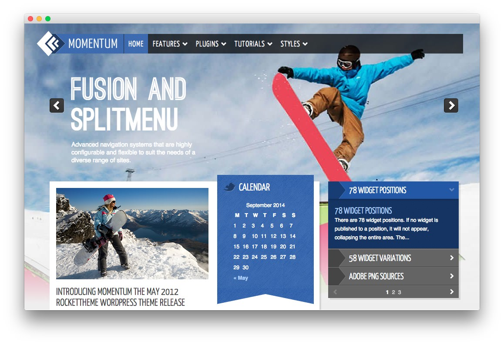
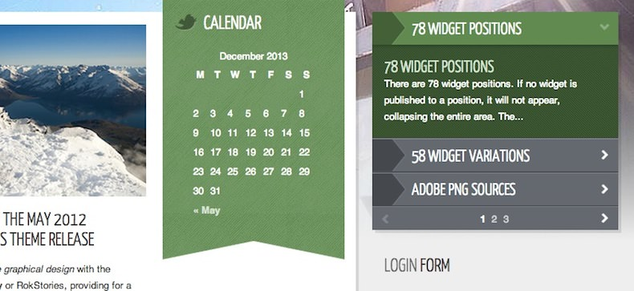
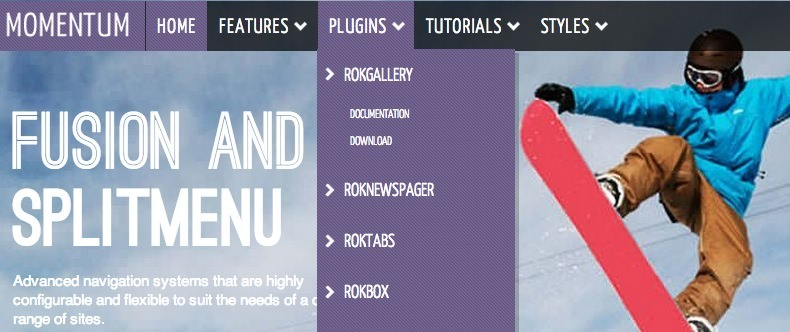

---

title: Momentum description: Your Guide to Using the Momentum Theme for WordPress breadcrumb: /wordpress:WordPress/!themes:Themes/momentum:Momentum

---

Introduction
------------

Momentum combines an intricate graphical design with the intuitive dynamics of RokGallery, providing for a full scale background image, which is configured via the RokGallery admin interface and widget settings. The logo and menu are perfectly blended, stylistically.

Requirements
------------

- Gantry 4 Framework
- FF, Safari, Chrome, Opera, IE8+
- PHP 5.2.17+ (5.3+ recommended)
- WordPress 3.x

> > NOTE: An updated version of RokCommon is required for Momentum to work properly. For more details on the Gantry Framework, please visit its [Dedicated Website](http://www.gantry-framework.org/).

Key Features
------------

- 960 Fixed Layout
- 6 Preset Styles
- 78 Widget Positions
- 58 Widget Variations
- Fusion-Menu and Split-Menu
- Custom Typography
- iPhone/Android Theme
- iPhone Menu Option

### Widget Style

The widget class suffixes complement the developed and refined overall design appearance, by adding focus to the widget blocks, such as the ribbon style with its double pointed bottom graphic. Sharp triangular visual elements are available for widget titles.

### Fusion Menu

The Fusion Menu is an advanced, CSS based menu system, which offers a wide range of per menu options, such as: inline subtext, icons, custom column widths and number, as well as control over how menu items are distributed between columns.
