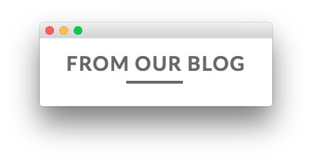

Main Top Section
-----

Here is the widget breakdown for the Main Top section:

#### Text

This section of the page is a standard text widget. You will need to enter the following in the main text field.

~~~ .html
&nbsp;
~~~

Here is a breakdown of options changes you will want to make to match the demo.

* Set the **Title** to `From Our Blog`.
* Switch the **Widget Variations** setting to **RT-Center**.
* Enter `fp-maintop title6 rt-modtitle-only rt-modtitle-uppercase` in the **Custom Variations** field.
* Leaving everything else at its default setting, select **Save**.
