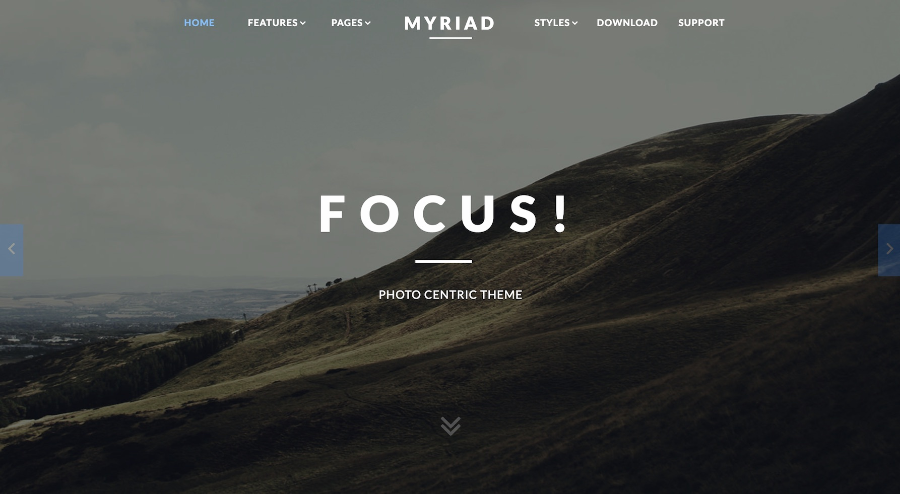

Introduction
-----

Myriad centers around photography, providing an elegantly designed, visual space for the display of full width gallery items and slideshows. The structure allows for the promotion of images, whilst maintaining a refined style for more conservative appearances.

Requirements
-----
* PHP 5.5.9+
* Curl
* OpenSSL Libraries
* Multibyte String Support

>> NOTE: Gantry v5.4.19+ is required for Myriad to work correctly. For more details on the Gantry Framework, please visit its [Dedicated Website](http://gantry.org).

Key Features
-----

### Included Particles

* Branding
* Case Studies
* Contact
* Contact Form
* Content List
* Copyright
* Custom HTML
* Features Slider
* Headlines
* Horizontal Menu
* Image Grid
* Info List
* Lists
* Login Form
* Logo
* Menu
* Mobile Menu
* Newsletter
* Promo Image
* Search
* Simple Counter
* Social
* Strips Slider
* Tab Image
* Testimonials
* To Top
* WordPress Posts 

### Theme Features

* Responsive Layout
* 6 Preset Styles
* Block Variations
* Custom Typography
* Unlimited Positions
* Popup Module
* Custom Particles
* Social Icons
* Mobile Menu
* Coming Soon Page
* Font Awesome Icons
* Chart.js 

### Gantry Core Features

* YAML-based Configuration
* Twig Templating
* Powerful Particle System
* Visual Menu Editor
* MegaMenu Support
* Off-Canvas Panel
* Ajax Admin
* Layout Manager
* Inheritance System
* Fluid Width Option
* Fixed Width Option
* SCSS Support
* Sophisticated Fields
* Unlimited Undo/Redo
* Styles Panel

## Content Animations

The theme makes uses of animated effects to add depth and character to content, without compromising on usability and professionalism. A series of bounce and slide effects are built into Myriad, as triggered by scroll events, with an option to disable them.

## Color Chooser

Myriad has an extensive Color Chooser in the theme manager to provide intricate controls for each section, inclusive of overlay type, text color, background color, as well as accent colors. Edit preexisting or create new presets.

## Responsive

Myriad is a responsive theme which means it adapts to the viewing device's width, such as mobile, tablet or desktop. Mobile modes have a unique menu to aid usability. Support classes can also be used to display or hide various types of content for each device.