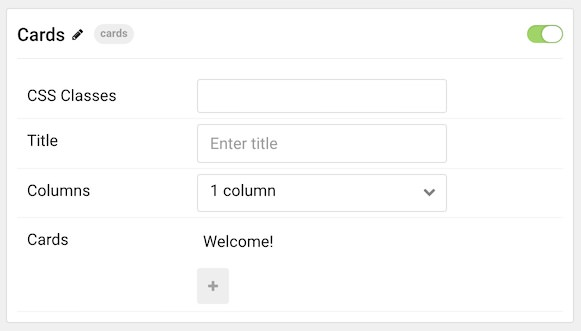

## Introduction

The **Cards** particle is an excellent particle for displaying text content in a clean, modern way.

Here are the topics covered in this guide:

* [Configuration](#configuration)
    - [Main Options](#main-options)
    - [Item Options](#item-options)

## Configuration

### Main Options 

These options affect the main area of the particle, and not the individual items within. You can set the title of the particle, as well as give it an introductory paragraph here.

| Option      | Description                                                               |
| :-----      | :-----                                                                    |
| CSS Classes | Set the CSS class(es) you would like to have apply at the particle level. |
| Title       | Enter a title for the particle that appears on the front end.             |
| Columns     | Select a number of columns to display.                                    |

### Item Options

These items make up the individual featured items in the particle.

| Option      | Description                                               |
| :-----      | :-----                                                    |
| Item Name   | Enter a title for the item that appears on the front end. |
| Headline    | Enter headline text.                                      |
| Description | Enter description text.                                   |
| Image       | Select an image.                                          |
| Signature   | Enter an image to use for the signature.                  |
| Full Name   | Enter a full name.                                        |
| Tag         | Enter tag text.                                           |

