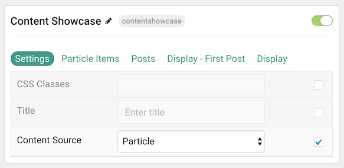
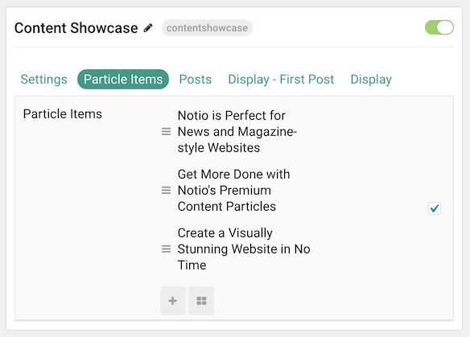
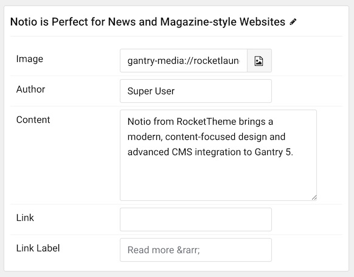
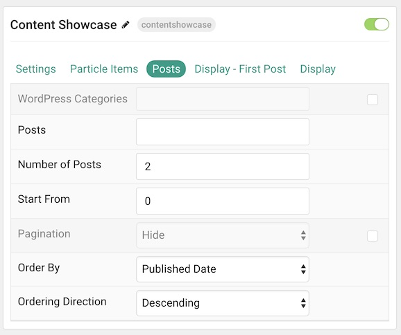
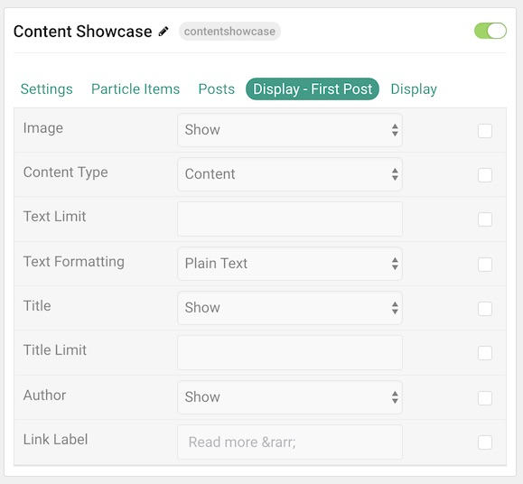
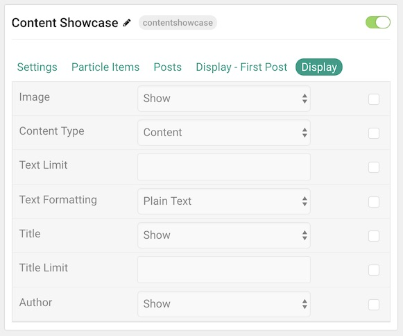

## Introduction

The **Content Showcase** particle displays posts in a modern arrangement including: titles, links, images, and more.

Here are the topics covered in this guide:

* [Configuration](#configuration)
    - [Main Options](#main-options)
    - [Particle Item Options](#particle-item-options)
    - [Posts Options](#posts-options)
    - [Display First Post](#display-first-post)
    - [Display](#display)

## Configuration

### Main Options 

These options affect the main area of the particle, and not the individual items within. You can set the title of the particle here.

| Option         | Description                                                                                                              |
| :-----         | :-----                                                                                                                   |
| Particle Name  | This is the name of the particle used for back end management. It does not appear on the front end.                      |
| CSS Classes    | Enter any CSS class(es) you wish to have apply to the particle.                                                          |
| Title          | Enter a title for the particle. This will appear on the front end.                                                       |
| Content Source | Choose between **Particle** and **WordPress** as the content source. This determines where your content will generate from. |

### Particle Item Options

These items make up the individual featured items in the particle. Items in this section will only appear if **Particle** is selected as the **Content Source**.

| Option     | Description                                                      |
| :-----     | :-----                                                           |
| Item Name  | This is the name of the item. This only appears in the back end. |
| Image      | Select an image to go along with the item.                       |
| Author     | Enter an author name to display.                                 |
| Content    | Enter content to display.                                        |
| Link       | Enter a link you want the item to link to.                       |
| Link Label | Enter a label for the link to act as the read more text.         |

### Posts

| Option             | Description                                                                                  |
| :-----             | :-----                                                                                       |
| Categories         | Select the categories of posts this particle will display.                                |
| Posts              | Select the number of posts you would like the particle to fetch.                          |
| Number of Posts    | Enter the maximum number of posts to display.                                             |
| Start From         | Enter offset specifying the first post to return. The default is '0' (the first post). |
| Pagination         | **Enable** or **Disable** pagination.                                                        |
| Order By           | Choose the type of factor to order by.                                                       |
| Ordering Direction | Choose between **Ascending** and **Descending** as the post ordering method.              |

### Display First Post

This section sets what appears in the first post.

| Option          | Description                                                                                  |
| :-----          | :-----                                                                                       |
| Image           | Display the image assigned to the post's **Intro**, **Full** or **None**.                 |
| Content Type    | Choose between **Content**, **Excerpt**, and **Hide** as the source of content for the item. |
| Text Limit      | Enter the maximum number of characters in the text to display.                               |
| Text Formatting | Choose between **Plain Text** and **HTML** text formatting.                                  |
| Title           | **Show** or **Hide** the post's title.                                                    |
| Title Limit     | Enter the maximum number of characters in the title to display.                              |
| Date            | Enter a date for the item.                                                                   |
| Date Format     | Select the format you want the date to be displayed in.                                      |
| Author          | **Show** or **Hide** author information.                                                     |
| Link Label      | Enter a label for the link to act as the read more text.                                     |

### Display

This section configures how posts other than the first one are displayed.

| Option          | Description                                                                                  |
| :-----          | :-----                                                                                       |
| Image           | Display the image assigned to the post's **Intro**, **Full** or **None**.                 |
| Content Type    | Choose between **Content**, **Excerpt**, and **Hide** as the source of content for the item. |
| Text Limit      | Enter the maximum number of characters in the text to display.                               |
| Text Formatting | Choose between **Plain Text** and **HTML** text formatting.                                  |
| Title           | **Show** or **Hide** the post's title.                                                    |
| Title Limit     | Enter the maximum number of characters in the title to display.                              |
| Date            | Enter a date for the item.                                                                   |
| Date Format     | Select the format you want the date to be displayed in.                                      |
| Author          | **Show** or **Hide** author information.                                                     |
