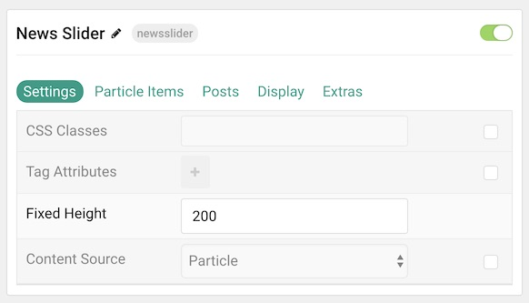
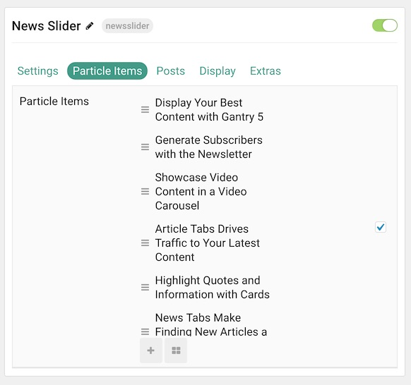
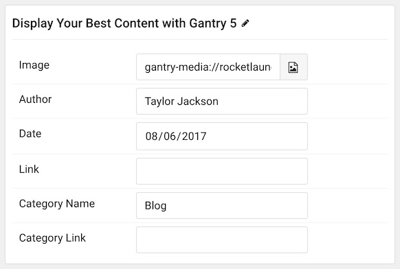
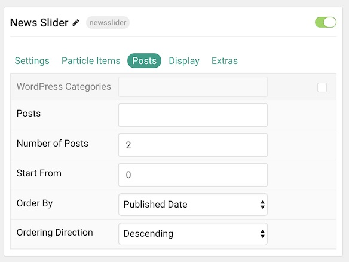
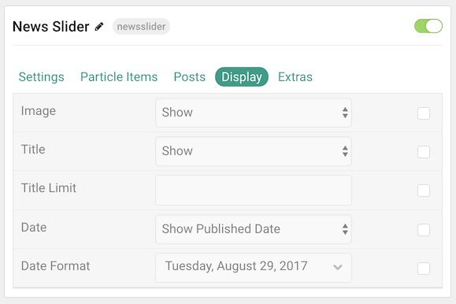

## Introduction

The **News Slider** particle is an excellent way to showcase featured posts and content on your site.

Here are the topics covered in this guide:

* [Configuration](#configuration)
    - [Main Options](#main-options)
    - [Particle Item Options](#particle-item-options)
    - [Posts Options](#articles)
    - [Display](#display)
    - [Extras](#extras)

## Configuration

### Main Options 

These options affect the main area of the particle, and not the individual items within. You can set the title of the particle here.

| Option         | Description                                                                                                                 |
| :-----         | :-----                                                                                                                      |
| Particle Name  | This is the name of the particle used for back end management.                                                              |
| CSS Classes    | Enter any CSS class(es) you wish to have apply to the particle.                                                             |
| Tag Attributes | Use this feature to add tag attributes to your particle.                                                                    |
| Fixed Height   | Enter a height (in pixels) to fix for the particle. This feature enables scrolling.                                         |
| Content Source | Choose between **Particle** and **WordPress** as the content source. This determines where your content will generate from. |

### Particle Item Options

These items make up the individual featured items in the particle. Items in this section will only appear if **Particle** is selected as the **Content Source**.

| Option        | Description                                                                |
| :-----        | :-----                                                                     |
| Item Name     | This is the name of the item. This only appears in the back end.           |
| Image         | Select an image to go along with the item.                                 |
| Author        | Enter an author name to display.                                           |
| Date          | Enter a date to display.                                                   |
| Link          | Enter a link you want the item to link to.                                 |
| Category Name | Input the name of the category you wish to have displayed in the particle. |
| Category Link | Enter a link (URL) that selecting the category will take you to.           |

### Posts

| Option               | Description                                                                                                  |
| :-----               | :-----                                                                                                       |
| WordPress Categories | Select the categories of posts this particle will display.                                                |
| Posts                | Select the number of posts you would like the particle to fetch.                                          |
| Number of Posts      | Enter the maximum number of posts to display.                                                             |
| Start From           | Enter offset specifying the first post to return. The default is '0' (the first post).                 |
| Order By             | Choose the type of factor to order by.                                                                       |
| Ordering Direction   | Choose between **Ascending** and **Descending** as the post ordering method.                              |

### Display

This section configures how posts are displayed.

| Option          | Description                                                                  |
| :-----          | :-----                                                                       |
| Image           | Display the image assigned to the post's **Intro**, **Full** or **None**. |
| Title           | **Show** or **Hide** the post's title.                                    |
| Title Limit     | Enter the maximum number of characters in the title to display.              |
| Date            | Enter a date for the item.                                                   |
| Date Format     | Select the format you want the date to be displayed in.                      |

### Extras

| Option   | Description                                                                  |
| :-----   | :-----                                                                       |
| Image    | Display the image assigned to the post's **Intro**, **Full** or **None**. |
| Author   | **Show** or **Hide** author information.                                     |
| Category | Choose to **Show**, **Show With Link**, or **Hide** post categories.      |