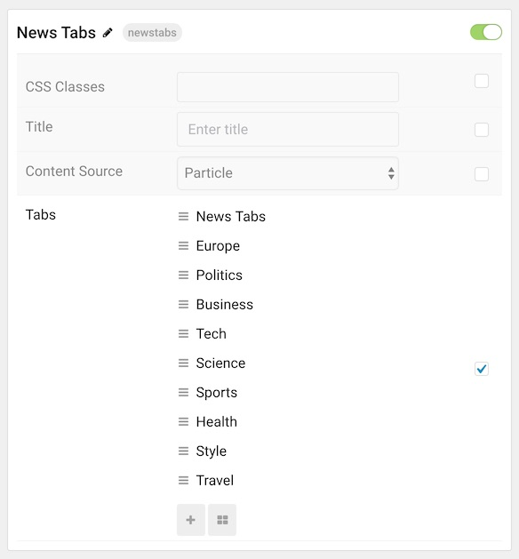
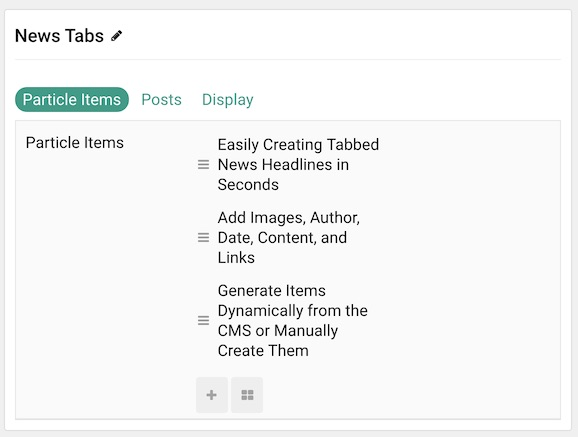
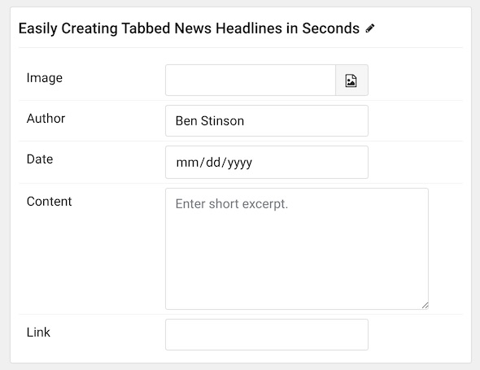
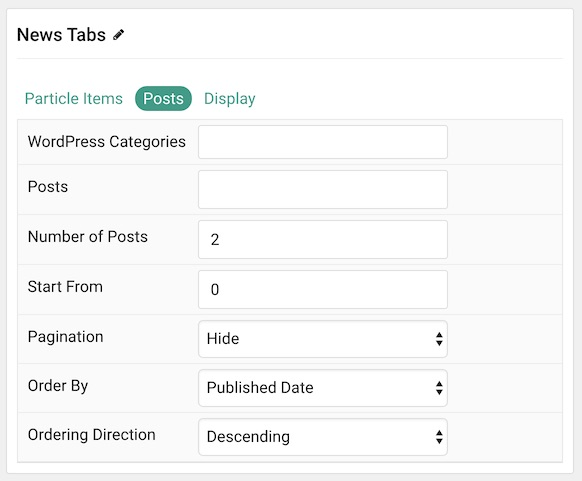
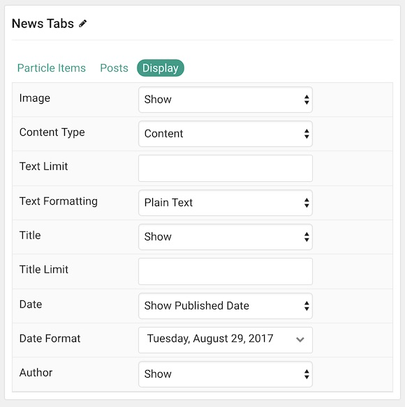

## Introduction

The **News Tabs** particle displays post titles in elegant, easy-to-navigate tabs.

Here are the topics covered in this guide:

* [Configuration](#configuration)
    - [Main Options](#main-options)
    - [Tabs](#tabs)
      + [Particle Items](#particle-items)
      + [Posts](#posts)
      + [Display](#display)

## Configuration

### Main Options 

These options affect the main area of the particle, and not the individual items within. You can set the title of the particle here.

| Option         | Description                                                                                                                 |
| :-----         | :-----                                                                                                                      |
| Particle Name  | This is the name of the particle used for back end management. It does not appear on the front end.                         |
| CSS Classes    | Enter any CSS class(es) you wish to have apply to the particle.                                                             |
| Title          | Enter a title for the particle. This will appear on the front end.                                                          |
| Content Source | Choose between **Particle** and **WordPress** as the content source. This determines where your content will generate from. |

### Tabs

Each tab acts like a category, giving you the ability to create lists of posts in multiple different sections in the particle.

### Particle Items

| Option    | Description                                                      |
| :-----    | :-----                                                           |
| Item Name | This is the name of the item. This only appears in the back end. |
| Image     | Select an image to go along with the item.                       |
| Author    | Enter an author name to display.                                 |
| Date      | Enter a date to display.                                         |
| Content   | Enter content to display.                                        |
| Link      | Enter a link you want the item to link to.                       |

### Posts

| Option               | Description                                                                                  |
| :-----               | :-----                                                                                       |
| WordPress Categories | Select the categories of posts this particle will display.                                |
| Posts                | Select the number of posts you would like the particle to fetch.                          |
| Number of Posts      | Enter the maximum number of posts to display.                                             |
| Start From           | Enter offset specifying the first post to return. The default is '0' (the first post). |
| Pagination           | **Hide** or **Show** pagination.                                                             |
| Order By             | Choose the type of factor to order by.                                                       |
| Ordering Direction   | Choose between **Ascending** and **Descending** as the post ordering method.              |

### Display

This section configures how posts other than the first one are displayed.

| Option          | Description                                                                  |
| :-----          | :-----                                                                       |
| Image           | Display the image assigned to the post's **Intro**, **Full** or **None**. |
| Article Text    | **Show** or **Hide** post text.                                           |
| Text Limit      | Enter the maximum number of characters in the text to display.               |
| Text Formatting | Choose between **Plain Text** and **HTML** text formatting.                  |
| Title           | **Show** or **Hide** the post's title.                                    |
| Title Limit     | Enter the maximum number of characters in the title to display.              |
| Date            | Enter a date for the item.                                                   |
| Date Format     | Select the format you want the date to be displayed in.                      |
| Author          | **Show** or **Hide** author information.                                     |
