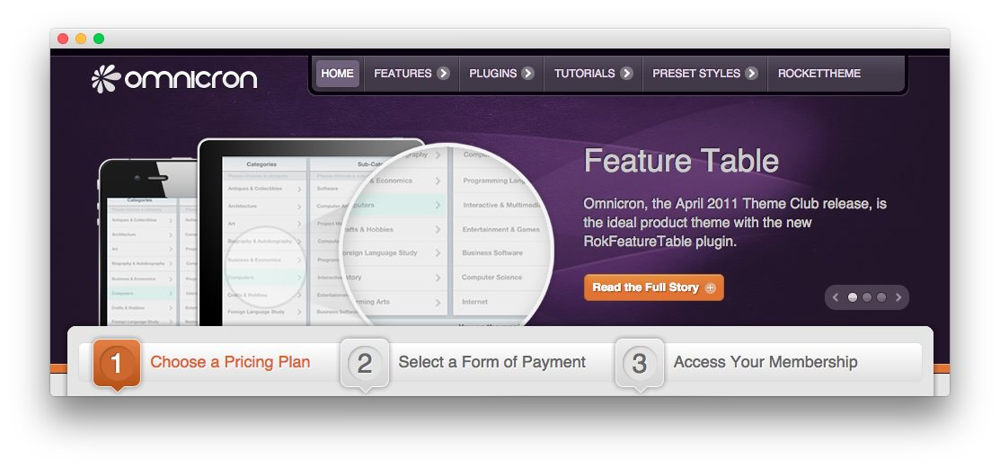
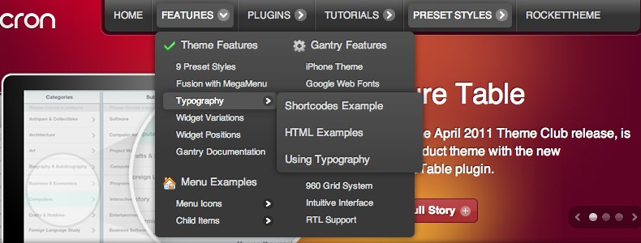

Introduction
------------

Omnicron is the ideal choice for any product related site, as well as broader purposes, based on its rounded, colorful appearance and the inclusion of the new RokFeatureTable widget. The diverse widget suffixes allow for stylistic focus of particular products.

Requirements
------------

* Gantry 4 Framework
* FF, Safari, Chrome, Opera, IE8+
* PHP 5.4+
* WordPress 3.2+, 4.0+

> > NOTE: An updated version of RokCommon is required for Omnicron to work properly. For more details on the Gantry Framework, please visit its [Dedicated Website](http://www.gantry.org/).

Key Features
------------

* 960 Fixed Layout
* 9 Preset Styles
* 68 Widget Positions
* 24 Widget Variations
* Fusion-Menu and Split-Menu
* Custom Typography
* iPhone Theme
* iPhone Menu
* Background Level Configuration

### Mobile Theme

Omnicron is available in a fixed layout, with a separate mobile layout for iPhone devices. These mobile layouts can be configured via our Gantry admin. We also include a set of position aliases that provide you additional control over your mobile content.

### Fusion Menu

The Fusion Menu is an advanced, CSS based menu system, which offers a wide range of per menu options, such as: inline subtext, icons, and custom column widths, as well as control over how menu items are distributed between columns.
