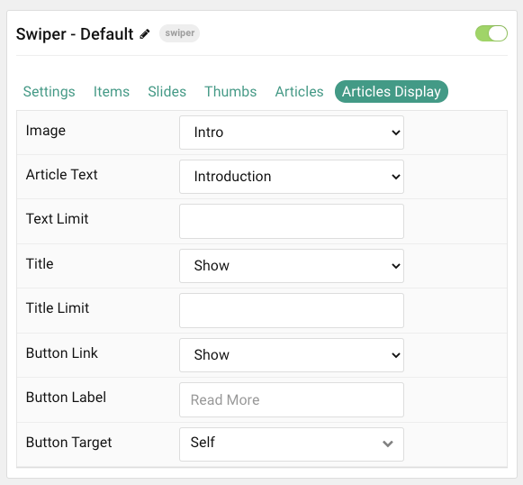

## Introduction

The **Swiper** particle is an incredibly versatile and modern touch slider available with the Orion theme!

Here are the topics covered in this guide:

- [Introduction](#introduction)
- [Configuration](#configuration)
  - [Settings](#settings)
  - [Particle Item Options](#particle-item-options)
  - [Slides Options](#slides-options)
  - [Thumbs Options](#thumbs-options)
  - [Posts](#posts)
  - [Display](#display)

## Configuration

### Settings

These options affect the main area of the particle, and not the individual items within.

| Option                | Description                                                                                         |
| :-------------------- | :-------------------------------------------------------------------------------------------------- |
| Particle Name         | This is the name of the particle used for back end management. It does not appear on the front end. |
| Content Source        | Choose between **Particle** and **WordPress** as the content source for the particle.                  |
| Slide Height          | Set the minimal height of each slide.                                                               |
| Slide Height (Mobile) | Set the minimal height of each slide on mobile devices.                                             |
| Prev/ Next            | **Enable** or **Disable** arrows navigation.                                                        |
| Pagination            | Choose between **Dots**, **Progress Bar**, or **None**.                                             |
| Autoplay              | **Enable** or **Disable** autoplay for the particle.                                                |
| Autoplay Timeout      | Set the time (in milliseconds) between slides in autoplay mode.                                     |
| Loop                  | **Enable** or **Disable** looping slides.                                                           |
| Speed                 | Set the transition speed (in milliseconds).                                                         |
| Touch Move            | **Enable**, **Disable**, or **Mobile Only** touch movements.                                        |
| Overlay Color         | Select the color of the overlay for the slider items.                                               |
| Direction             | Choose between a **Vertical** and **Horizontal** slider animation.                                  |
| Effect                | Choose an effect. Options include: **Slide**, **Fade**, **Flip**, or **Cover Flow**.                |

### Particle Item Options

These items make up the individual featured items in the particle. Items in this section will only appear if **Particle** is selected as the **Content Source**.

| Option           | Description                                                            |
| :--------------- | :--------------------------------------------------------------------- |
| Item Name        | This is the name of the item. It is used only for backend management.  |
| CSS Classes      | Enter any CSS class(es) you wish to have apply to the item.            |
| Image            | Select a background image to appear in the particle.                   |
| BG Color         | Select the color of the background for each item if image is not used. |
| Animation        | Select the animation applied to the image as it is displayed.          |
| Duration         | Enter the duration (in milliseconds) of the animation.                 |
| Video Background | Select a video to appear as the background for the slide.              |
| Title            | Enter a title for the slide.                                           |
| Text             | Enter a description for the slide.                                     |
| Thumb Class      | Enter any CSS class(es) you want to have apply to the thumbnail.       |
| Thumb Title      | If Thumbnails are enabled, enter a title for the Thumb.                |
| Thumb Image      | Select an image to appear as the thumbnail.                            |
| Button Text      | Enter the text for a button.                                           |
| Button Link      | Enter the URL for the button.                                          |
| Link Target      | Enter the target window for the button link to open in.                |

### Slides Options

These options are for configuring amount of Slides to display and the space between them in Mobile, Tablet, Desktop, etc. Only available when using the Slide and Cover Flow Effect in Particle settings.

>> NOTE: Mobile, Tablet, Desktop, Large Desktop breakpoints are determined via your Styles panel -> Breakpoints.

| Option           | Description                              |
| :--------------- | :--------------------------------------- |
| Slides Per View  | Number of slides per view.               |
| Slides Per Group | Number of slides per transition.         |
| Space Between    | Amount of space between each thumb (px). |

### Thumbs Options

These options are for configuring amount of Thumbs to display and the space between them in Mobile, Tablet, Desktop, etc. Other options include navigation and where you want them to display (top or bottom).

>> NOTE: Mobile, Tablet, Desktop, Large Desktop breakpoints are determined via your Styles panel -> Breakpoints.

| Option          | Description                                               |
| :-------------- | :-------------------------------------------------------- |
| Thumbs          | **Enable** or **Disable** thumbs.                         |
| Thumbs Nav      | **Enable** or **Disable** thumbs navigation.              |
| Thumbs Layout   | Display Thumbs on either **Top** or **Bottom** of slider. |
| Thumbs Per View | Number of thumbs per view.                                |
| Space Between   | Amount of space between each thumb (px).                  |

### Posts

| Option             | Description                                                                            |
| :-----             | :-----                                                                                 |
| Categories         | Select the categories of posts this particle will display.                             |
| Posts              | Select the number of posts you would like the particle to fetch.                       |
| Sticky Posts       | Choose to **Hide** or **Show** Sticky posts.                                           |
| Number of Posts    | Enter the maximum number of posts to display.                                          |
| Start From         | Enter offset specifying the first post to return. The default is '0' (the first post). |
| Order By           | Choose the type of factor to order by.                                                 |
| Ordering Direction | Choose between **Ascending** and **Descending** as the post ordering method.           |

### Display

This section configures how articles are displayed.

| Option        | Description                                                                                   |
| :-----        | :-----                                                                                        |
| Image         | Choose to **Show** or **Hide** the post's image.                                              |
| Content Type  | Choose between **Content** or **Excerpt** as the content type. You can also **Hide** content. |
| Content Limit | Enter a character limit for post's content displayed in this particle.                        |
| Title         | Choose to **Show** or **Hide** the post's title.                                              |
| Title Limit   | Enter a character limit for post's title displayed in this particle.                          |
| Button Link   | Choose to **Enable** or **Disable** the post's link.                                          |
| Button Label  | Enter a label to appear in the button.                                                        |
| Button Target | Choose which window/tab the link opens to.                                                    |
