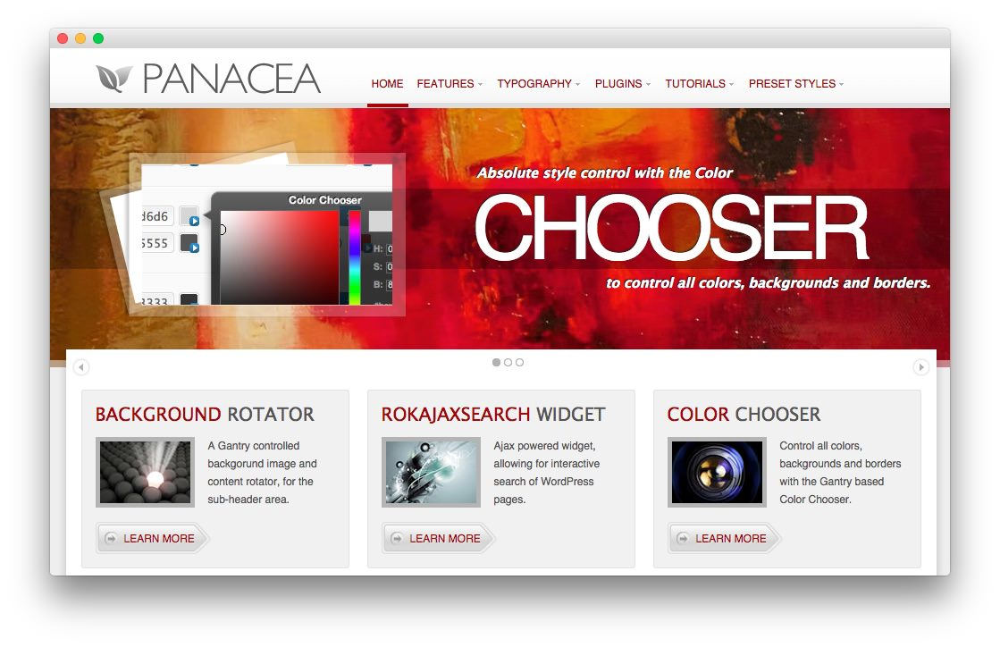
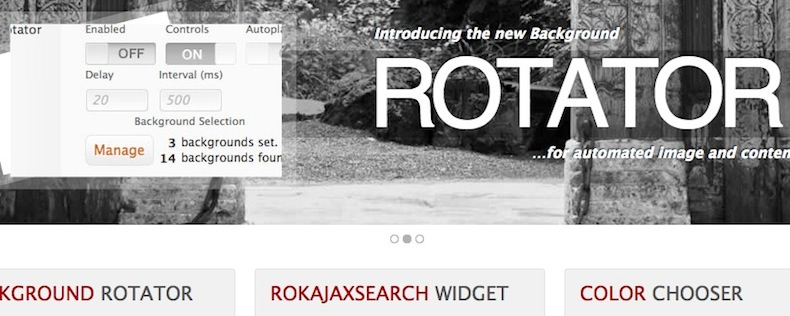
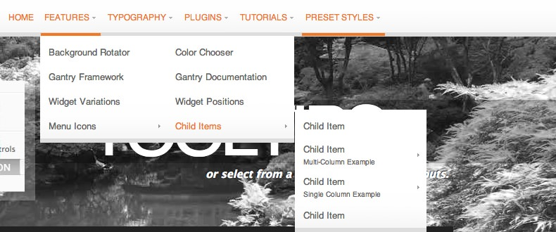

Introduction
------------

Panacea encapsulates stylistic freedom using its Color Chooser with 12 preset styles, allowing for easy style customization with just a few clicks. Offering an unconventional approach to such designs, combining ease of alteration with a mainstream appearance.

Requirements
------------

* Gantry 4 Framework
* FF, Safari, Chrome, Opera, IE8+
* PHP 5.4+
* WordPress 3.2+, 4.0+

> > NOTE: An updated version of RokCommon is required for Panacea to work properly. For more details on the Gantry Framework, please visit its [Dedicated Website](http://www.gantry.org/).

Key Features
------------

* 960 Fixed Layout
* 9 Preset Styles
* 68 Widget Positions
* 24 Widget Variations
* Fusion-Menu and Split-Menu
* Custom Typography
* iPhone Theme
* iPhone Menu
* Background Level Configuration

### Background Rotator

The Background Rotator is a Gantry Feature which offers basic background rotator functionality with content calling controls. Load posts from a set category and select images from the background manager to fully control the effect, it is very simple to use and edit.

### Fusion Menu

The Fusion Menu is effectively an advanced, CSS based menu system, which offers a wide range of per menu options, such as: inline subtext and icons as well as control over how menu items are distributed between columns.
