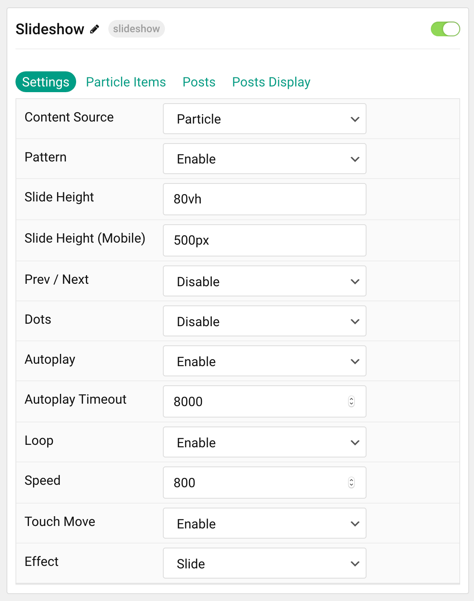
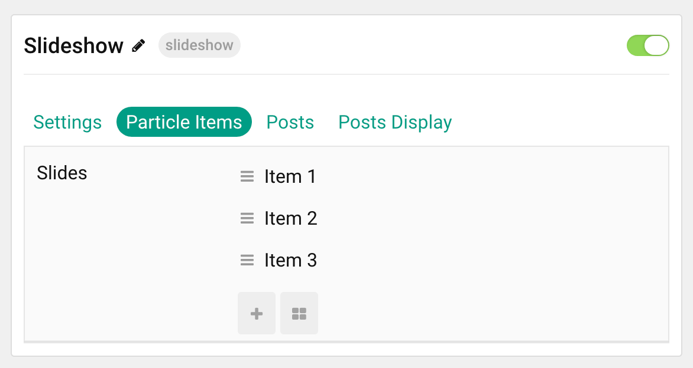
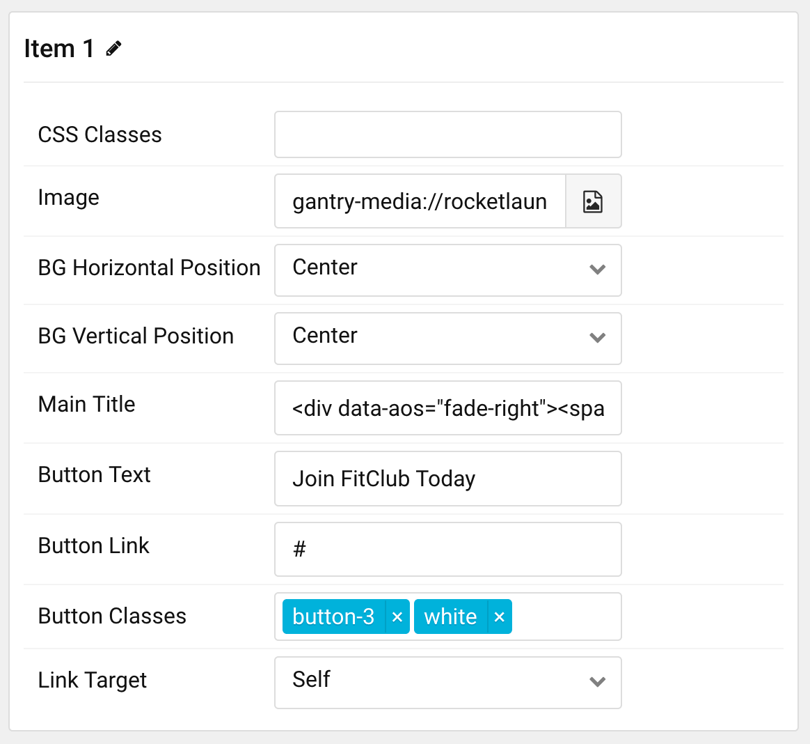
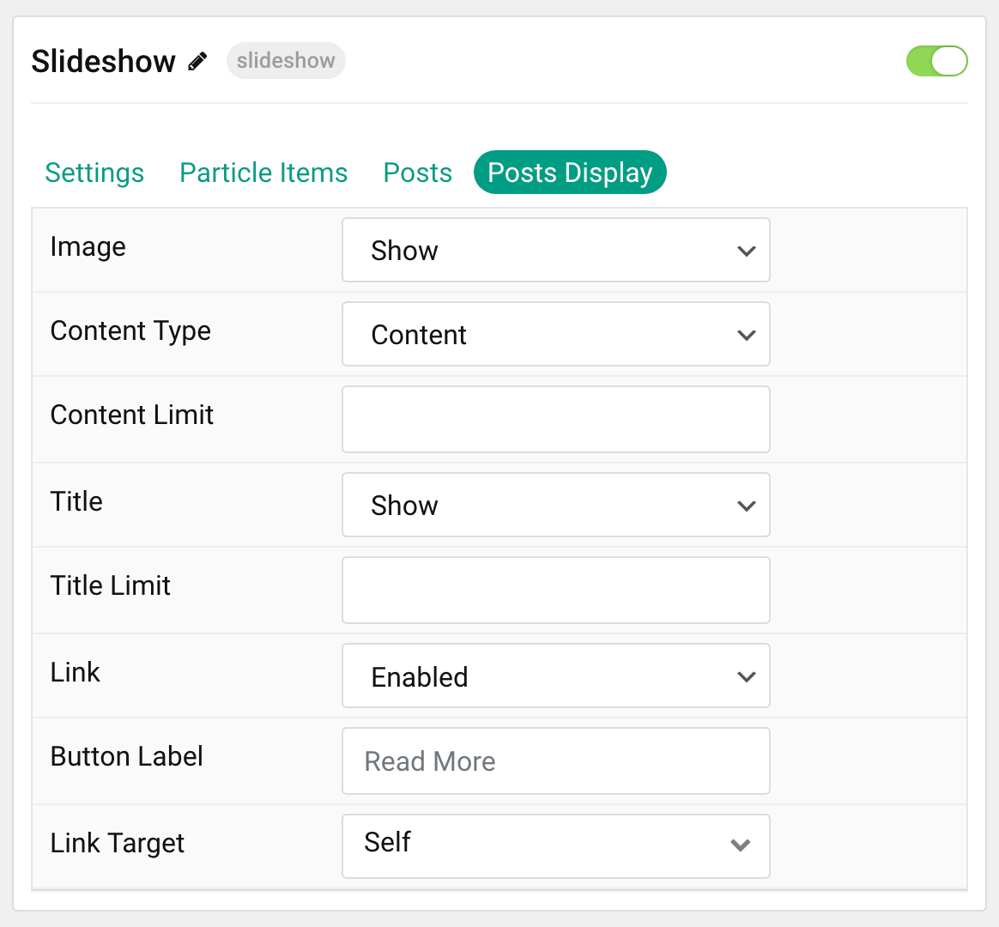

## Introduction

The **Slideshow** particle creates beautiful image slideshows that work perfectly at the top of your page.

Here are the topics covered in this guide:

- [Introduction](#introduction)
- [Configuration](#configuration)
  - [Settings](#settings)
  - [Particle Item Options](#particle-item-options)
  - [Posts](#posts)
  - [Display](#display)

## Configuration

### Settings

These options affect the main area of the particle, and not the individual items within. You can set the title of the particle, as well as give it an introductory paragraph here.

| Option                | Description                                                                                         |
| :-----                | :-----                                                                                              |
| Particle Name         | This is the name of the particle used for back end management. It does not appear on the front end. |
| Content Source        | Choose between **Particle** and **WordPress** as the Content Source.                                |
| Pattern               | Choose to **Enable** or **Disable** the pattern.                                                    |
| Slide Height          | Enter the desired slide height.                                                                     |
| Slide Height (Mobile) | Enter the desired slide height on mobile devices.                                                   |
| Prev / Next           | Choose to **Enable** or **Disable** the prev / next navigation.                                     |
| Dots                  | Choose to **Enable** or **Disable** dots navigation for the particle.                               |
| Autoplay              | Choose to **Enable** or **Disable** autoplay.                                                       |
| Autoplay Timeout      | Set the time between each transition during autoplay.                                               |
| Loop                  | Choose to **Enable** or **Disable** looping.                                                        |
| Speed                 | Set the transition speed between slides.                                                            |
| Touch Move            | Choose to **Enable** or **Disable** touch-based control of slide movements.                         |
| Effect                | Choose the animation effect to apply as items transition.                                           |

### Particle Item Options

These items make up the individual featured items in the particle. Items in this section will only appear if **Particle** is selected as the **Content Source**.

| Option                 | Description                                                                                 |
| :-----------------     | :------------------------------------------------------------------------------------------ |
| Item Name              | This is the name of the item. It is used only for backend organization and does not appear. |
| CSS Classes            | Enter any CSS class(es) you wish to have apply to the item.                                 |
| Image                  | Select an image to appear in the particle.                                                  |
| BG Horizontal Position | Choose between **Left**, **Center**, and **Right** for the background position.             |
| BG Vertical Position   | Choose between **Top**, **Center**, and **Bottom** for the background position.             |
| Main Title             | Enter a larger main title to appear on the front end.                                       |
| Button Text            | Enter the text to appear in the button.                                                     |
| Button Link            | Enter a URL the button will send users to.                                                  |
| Button Classes         | Enter any CSS class(es) you want to have apply to the button.                               |
| Button Link Target     | Enter a target window for the link.                                                         |

### Posts

| Option             | Description                                                                            |
| :-----             | :-----                                                                                 |
| Categories         | Select the categories of posts this particle will display.                             |
| Posts              | Select the number of posts you would like the particle to fetch.                       |
| Sticky Posts       | Choose to **Hide** or **Show** Sticky posts.                                           |
| Number of Posts    | Enter the maximum number of posts to display.                                          |
| Start From         | Enter offset specifying the first post to return. The default is '0' (the first post). |
| Order By           | Choose the type of factor to order by.                                                 |
| Ordering Direction | Choose between **Ascending** and **Descending** as the post ordering method.           |

### Display

This section configures how posts are displayed.

| Option        | Description                                                                                   |
| :-----        | :-----                                                                                        |
| Image         | Display the image assigned to the article's **Intro**, **Full** or **None**.                  |
| Content Type  | Choose between **Content** or **Excerpt** as the content type. You can also **Hide** content. |
| Content Limit | Enter a character limit for post's content displayed in this particle.                        |
| Title         | Choose to **Show** or **Hide** the post's title.                                              |
| Title Limit   | Enter a character limit for post's title displayed in this particle.                          |
| Link          | Choose to **Enable** or **Disable** the post's link.                                          |
| Button Label  | Enter a label to appear in the button.                                                        |
| Link Target   | Choose which window/tab the link opens to.                                                    |