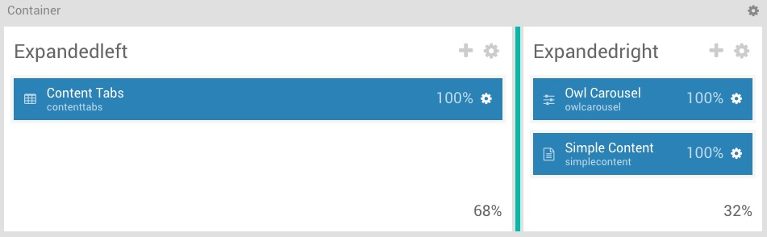
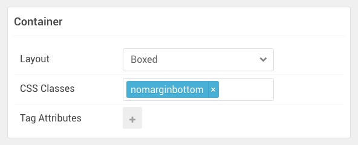

## Introduction

:   1. **Content Tabs** [5%, 3%, se]
    2. **Owl Carousel** [5%, 63%, se]
    3. **Simple Content** [55%, 67%, se]

The **Showcase** section includes three particles: **Content Tabs**, **Owl Carousel**, and **Simple Content**. The **Content Tabs** particle is assigned to the **ExpandedLeft** section, while the **Owl Carousel** and **Simple Content** particles are assigned to the **ExpandedRight** section.

Here is a breakdown of the widget(s) and particle(s) that appear in this section:

* [Content Tabs (particle)](#content-tabs-(particle))
* [Owl Carousel (particle)](#pricing-grid-(particle))
* [Simple Content (particle)](#simple-content-(particle))

## Container Settings

In this case, two sections are contained within a container. The container acts as a parent section, and the sections as blocks within that parent. Here are the settings used it in the container.

| Option           | Setting     |
| :--------------- | :---------- |
| Layout           | Boxed       |
| CSS Classes      | `g-compact` |
| Tag Attributes   | Blank       |

### Section Settings

The **ExpandedLeft** and **ExpandedRight** sections contain the particles used in our demo. We have included the settings used to create them below.

#### ExpandedLeft

##### Section Settings

| Option         | Setting          |
| :-----         | :-----           |
| Name           | `ExpandedLeft`   |
| CSS Classes    | `nomarginbottom` |
| Tag Attributes | Blank            |

##### Block Settings

| Option         | Setting   |
| :-----         | :-----    |
| CSS ID         | Blank     |
| CSS Classes    | Blank     |
| Variations     | Blank     |
| Tag Attributes | Blank     |
| Fixed Size     | Unchecked |
| Block Size     | `68%`     |

#### ExpandedRight

##### Section Settings

| Option         | Setting          |
| :-----         | :-----           |
| Name           | `ExapndedRight`  |
| CSS Classes    | `nomarginbottom` |
| Tag Attributes | Blank            |

##### Block Settings

| Option         | Setting                      |
| :-----         | :-----                       |
| CSS ID         | Blank                        |
| CSS Classes    | `nopaddingall` `nomarginall` |
| Variations     | No Margin, No Padding        |
| Tag Attributes | Blank                        |
| Fixed Size     | Unchecked                    |
| Block Size     | `32%`                        |

## Content Tabs (Particle)

### Particle Settings

| Option                     | Setting                                                                                                                                    |
| :-----                     | :-----                                                                                                                                     |
| Particle Name              | `Content Tabs`                                                                                                                             |
| CSS Classes                | Blank                                                                                                                                      |
| Title                      | Blank                                                                                                                                      |
| Animation Type             | Slide Left                                                                                                                                 |
| Duration                   | `500`                                                                                                                                      |
| Item 1 Name                | `Particles`                                                                                                                                |
| Item 1 Tab Name            | `Particles`                                                                                                                                |
| Item 1 Title               | `Particles`                                                                                                                                |
| Item 1 Subtitle            | Blank                                                                                                                                      |
| Item 1 Description         | Blank                                                                                                                                      |
| Subitem 1 Name             | `News Slider`                                                                                                                              |
| Subitem 1 Tag              | `News Slider`                                                                                                                              |
| Subitem 1 Dot Accent Color | Accent Color 1                                                                                                                             |
| Subitem 1 Dot Custom Color | Blank                                                                                                                                      |
| Subitem 1 Subtag Text      | `1`                                                                                                                                        |
| Subitem 1 Description      | `Highlight top headlines without taking up a lot of vertical space. This particle is perfect for breaking news and important information.` |

### Block Settings

| Option         | Setting   |
| :-----         | :-----    |
| CSS ID         | Blank     |
| CSS Classes    | Blank     |
| Variations     | Blank     |
| Tag Attributes | Blank     |
| Fixed Size     | Unchecked |
| Block Size     | `100%`    |

## Owl Carousel (Particle)

### Particle Settings

| Option                 | Setting                |
| :-----                 | :-----                 |
| Particle Name          | `Owl Carousel`         |
| CSS Classes            | Blank                  |
| Title                  | Blank                  |
| Layout                 | Standard               |
| Width                  | Full Width             |
| Out Animation          | `zoomOut`              |
| In Animation           | `fadeIn`               |
| Prev / Next            | Enable                 |
| Prev Text              | Blank                  |
| Next Text              | Blank                  |
| Dots                   | Disable                |
| Loop                   | Enable                 |
| Autoplay               | Enable                 |
| Autoplay Speed         | `5000`                 |
| Pause on Hover         | Enable                 |
| Footer Shadow          | Enable                 |
| Footer Shadow Color    | `#20232a`              |
| Item 1 Name            | `Business`             |
| Item 1 Image           | Blank                  |
| Item 1 Icon            | Blank                  |
| Item 1 Title           | `Business`             |
| Item 1 Description     | Blank                  |
| Item 1 Link            | Blank                  |
| Item 1 Link Text       | Blank                  |
| Item 1 Target          | Self                   |
| Item 1 Button Class    | Blank                  |

### Block Settings

| Option         | Setting              |
| :-----         | :-----               |
| CSS ID         | Blank                |
| CSS Classes    | `owlcarousel-offset` |
| Variations     | Blank                |
| Tag Attributes | Blank                |
| Fixed Size     | Checked              |
| Block Size     | `100%`               |

## Simple Content (Particle)

### Particle Settings

| Option                   | Setting          |
| :-----                   | :-----           |
| Particle Name            | `Simple Content` |
| CSS Classes              | Blank            |
| Title                    | Blank            |
| Item 1 Name              | `Simple Content` |
| Item 1 Layout Style      | Standard         |
| Item 1 Created Date      | `MAR 03, 2016`   |
| Item 1 Content Title     | `About Photon`   |
| Item 1 Author            | Blank            |
| Item 1 Main Content      | Blank            |
| Item 1 Read More Label   | `Read More`      |
| Item 1 Read More Link    | Blank            |
| Item 1 Read More Classes | `button`         |
| Item 1 Target            | Self             |

**Leading Content**

~~~ .html
All demo content is for sample purposes only, to represent a live site.
 
Note: Photon is built on the latest version of the Gantry 5 Framework.
~~~

### Block Settings

| Option         | Setting                                                                      |
| :-----         | :-----                                                                       |
| CSS ID         | Blank                                                                        |
| CSS Classes    | `moduletable` `nomarginall` `box-white` `g-offset-padding` `g-bottom-offset` |
| Variations     | `No Margin` `No Padding`                                                     |
| Tag Attributes | Blank                                                                        |
| Fixed Size     | Unchecked                                                                    |
| Block Size     | `100%`                                                                       |
