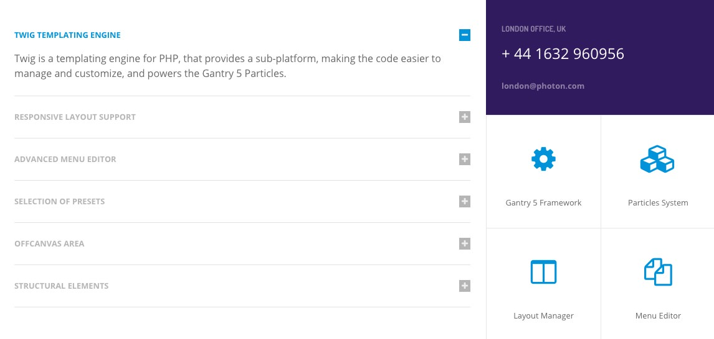
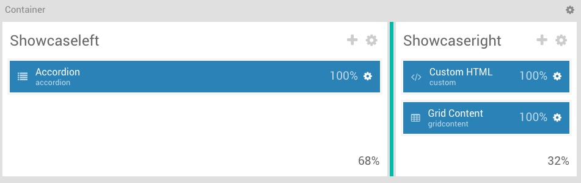
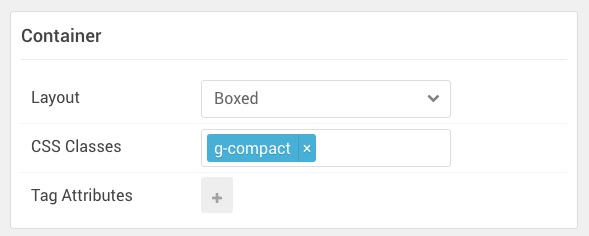

## Introduction

:   1. **Accordion** [8%, 5%, se]
    2. **Custom HTML** [8%, 70%, se]
    3. **Grid Content** [40%, 70%, se]

The **Showcase** section includes three particles: **Accordion**, **Custom HTML**, and **Grid Content**. The **Accordion** particle is assigned to the **Showcaseleft** section, while the **Custom HTML** and **Grid Content** particles are assigned to the **ShowcaseRight** section.

Here is a breakdown of the widget(s) and particle(s) that appear in this section:

* [ShowcaseLeft](#sectionleft)
	* [Accordion (particle)](#accordion-(particle))
* [ShowcaseRight](#sectionright)
	* [Custom HTML (particle)](#custom-html-(particle))
	* [Grid Content (Particle)](#grid-content-(particle))

## Container Settings

In this case, two sections are contained within a container. The container acts as a parent section, and the sections as blocks within that parent. Here are the settings used it in the container.

| Option           | Setting     |
| :--------------- | :---------- |
| Layout           | Boxed       |
| CSS Classes      | `g-compact` |
| Tag Attributes   | Blank       |

### Section Settings

The **ShowcaseLeft** and **ShowcaseRight** sections contain the particles used in our demo. We have included the settings used to create them below.

#### ShowcaseLeft

##### Section Settings

| Option         | Setting        |
| :-----         | :-----         |
| Name           | `ShowcaseLeft` |
| CSS Classes    | Blank          |
| Tag Attributes | Blank          |

##### Block Settings

| Option         | Setting   |
| :-----         | :-----    |
| CSS ID         | Blank     |
| CSS Classes    | Blank     |
| Variations     | Blank     |
| Tag Attributes | Blank     |
| Fixed Size     | Unchecked |
| Block Size     | `68%`     |

#### ShowcaseRight

##### Section Settings

| Option         | Setting         |
| :-----         | :-----          |
| Name           | `ShowcaseRight` |
| CSS Classes    | Blank           |
| Tag Attributes | Blank           |

##### Block Settings

| Option         | Setting                      |
| :-----         | :-----                       |
| CSS ID         | Blank                        |
| CSS Classes    | `nopaddingall` `nomarginall` |
| Variations     | Blank                        |
| Tag Attributes | Blank                        |
| Fixed Size     | Unchecked                    |
| Block Size     | `32%`                        |

## Accordion (Particle)

### Particle Settings

| Option                | Setting                                                                                                                                                 |
| :-----                | :-----                                                                                                                                                  |
| Particle Name         | `Accordion`                                                                                                                                             |
| CSS Classes           | Blank                                                                                                                                                   |
| Title                 | Blank                                                                                                                                                   |
| Item 1 Name           | `Twig Templating Engine`                                                                                                                                |
| Item 1 Description    | `Twig is a templating engine for PHP, that provides a sub-platform, making the code easier to manage and customize, and powers the Gantry 5 Particles.` |
| Item 1 Button Label   | Blank                                                                                                                                                   |
| Item 1 Button Link    | Blank                                                                                                                                                   |
| Item 1 Target         | Self                                                                                                                                                    |
| Item 1 Button Classes | Blank                                                                                                                                                   |

### Block Settings

| Option         | Setting   |
| :-----         | :-----    |
| CSS ID         | Blank     |
| CSS Classes    | Blank     |
| Variations     | Blank     |
| Tag Attributes | Blank     |
| Fixed Size     | Unchecked |
| Block Size     | `100%`    |

## Custom HTML (Particle)

### Particle Settings

| Option             | Setting       |
| :-----             | :-----        |
| Particle Name      | `Custom HTML` |
| Process Twig       | Unchecked     |
| Process Shortcodes | Unchecked     |

**Custom HTML**

~~~ .html
<h4>London Office, UK </h4>

+ 44 1632 960956

<a href="mailto:london@photon.com" class="email">london@photon.com</a>

~~~

### Block Settings

| Option         | Setting                                          |
| :-----         | :-----                                           |
| CSS ID         | Blank                                            |
| CSS Classes    | `widgettable` `box3` `nomarginall` `contactinfo` |
| Variations     | Blank                                            |
| Tag Attributes | Blank                                            |
| Fixed Size     | Unchecked                                        |
| Block Size     | `100%`                                           |

## Grid Content (Particle)

### Particle Settings

| Option             | Setting              |
| :-----             | :-----               |
| Particle Name      | `Grid Content`       |
| CSS Classes        | Blank                |
| Title              | Custom               |
| Description        | Blank                |
| Readmore Text      | Blank                |
| Readmore Link      |                      |
| Readmore Style     | Style 3              |
| Grid Column        | 2 Columns            |
| Item 1 Name        | `Gantry 5 Framework` |
| Item 1 Icon        | `fa fa-cog`          |
| Item 1 Icon Color  | Accent Color 1       |
| Item 1 Description | Blank                |
| Item 1 Link        | Blank                |

### Block Settings

| Option         | Setting                                    |
| :-----         | :-----                                     |
| CSS ID         | Blank                                      |
| CSS Classes    | `widgettable` `nomarginall` `nopaddingall` |
| Variations     | Blank                                      |
| Tag Attributes | Blank                                      |
| Fixed Size     | Unchecked                                  |
| Block Size     | `100%`                                     |

