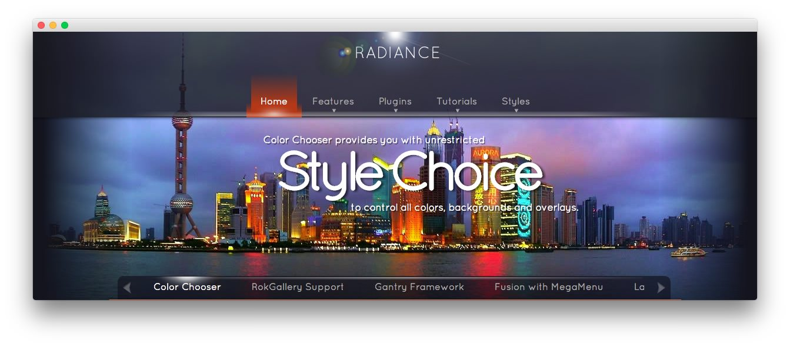
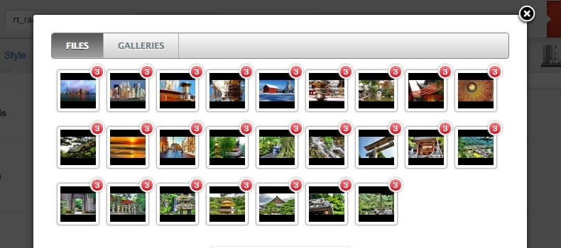
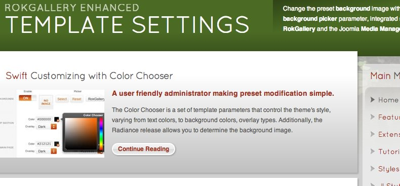

Introduction
------------

Radiance is a beautifully designed theme, based around the Color Chooser parameters, which allow for you to easily choose from a selection of background, text and link colors, as well as the overlay type for each section of the design.

Requirements
------------

- Gantry 4 Framework
- FF, Safari, Chrome, Opera, IE8+
- PHP 5.2.17+ (5.3+ recommended)
- WordPress 3.x

> > NOTE: An updated version of RokCommon is required for Radiance to work properly. For more details on the Gantry Framework, please visit its [Dedicated Website](http://www.gantry.org/).

Key Features
------------

- 960 Fixed Layout
- 6 Preset Styles
- 78 Widget Positions
- 54 Widget Variations
- Fusion-Menu and Split-Menu
- Custom Typography
- iPhone/Android Theme
- Mobile Menu

### Background Picket

The Color Chooser system in Radiance benefits from a Background Picker, an administrative interface that allows for the selection of an image. You can choose between an image loaded from the Media Library or through RokGallery, searchable by either file or gallery.

### Custom Font

The richness of Radiance is composited in part from its prolific use of custom fonts for varying title elements, ranging from content articles to widget titles and textual elements in the various extensions such as RokGallery; which adds character and uniqueness.
