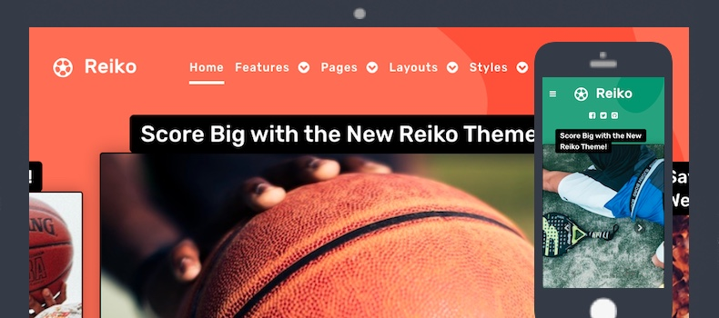

Introduction
-----

Reiko is the new sports-themed design from RocketTheme. Keep score with its exclusive scoreboard particle, build your team roster, and share news about your favorite sports. It will get you shouting GOOOOOOOOOAAALLL!!!

Requirements
-----

* PHP 5.4+
* Curl
* OpenSSL Libraries
* Multibyte String Support
* MySQL
* Gantry 5 Framework (Latest)

Key Features
-----

### Included Particles

* Block Content
* Branding
* Copyright
* Custom HTML
* Date
* Featured Videos
* Grid Statistic
* Heading
* Image Grid
* Info List
* Latest News
* Logo / Image
* Logos
* Media Quotes
* Menu
* Mobile Menu
* Newsletter
* Photo Collage
* Pricing Table
* Profile
* Score Block
* Search
* Simple Content
* Simple Counter
* Simple Menu
* Slideshow
* Social
* Table tabs
* Team
* To Top
* WordPress Posts
* Video 

### Theme Features

* Responsive Layout
* 4 Preset Styles
* Block Variations
* Custom Typography
* Unlimited Positions
* Popup Widget
* Custom Particles
* Social Icons
* Mobile Menu
* Coming Soon Page
* Font Awesome Icons 

### Gantry Core Features

* YAML-based Configuration
* Twig Templating
* Powerful Particle System
* Visual Menu Editor
* MegaMenu Support
* Off-Canvas Panel
* Ajax Admin
* Layout Manager
* Inheritance System
* Fluid Width Option
* Fixed Width Option
* SCSS Support
* Sophisticated Fields
* Unlimited Undo/Redo
* Styles Panel

## Typography

Typography is an important instrument in not only the site design, but how your content is portrayed and utilized by your visitors. Therefore, Reiko offers a rich selection of elegant typography to provide focus to varying content types.

## Responsive

Reiko is a responsive theme which means it adapts to the viewing device's width, such as mobile, tablet or desktop. Mobile modes have a unique menu to aid usability. Support classes can also be used to display or hide various types of content for each device.

## Inheritance

Reiko takes full advantage of Gantry’s new inheritance system, making it easier than ever to configure and manage your website through synced particles, atoms, sections, and layouts. Save time by using inheritance to avoid repetitive changes!
