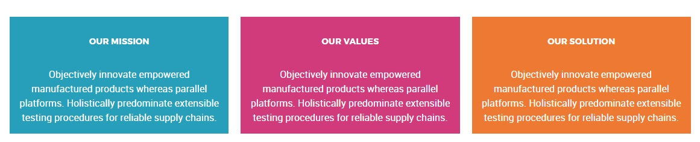
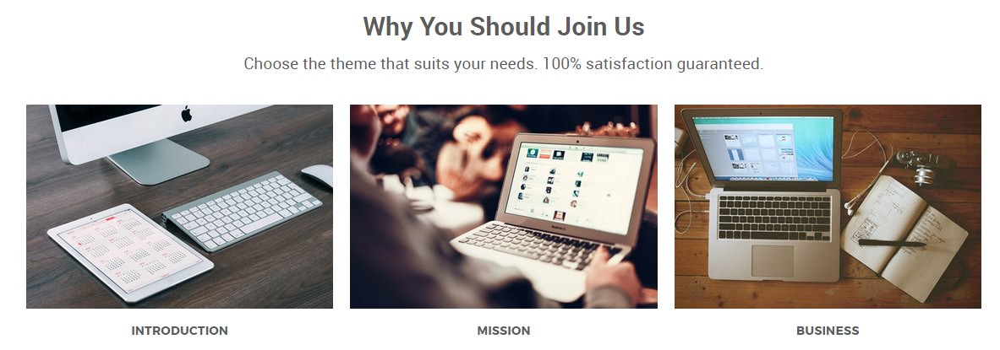
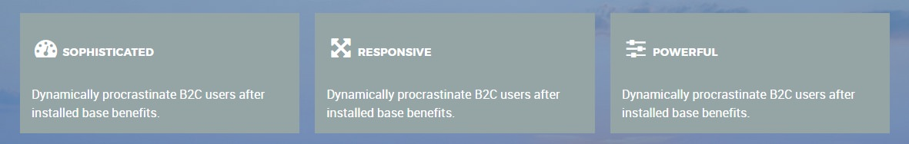
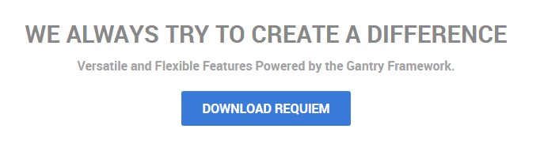

## Introduction

The **About Us** example page demonstrates how you can create a beautiful page with the Requiem theme. Here is some information to help you replicate this page as it appears in the demo.

## Widgets and Particles

Below is a brief rundown of the widgets and particles used to make up the demo page.

:   1. **Header - Custom HTML (Particle)** [10%, 45%, se]
    2. **Feature - Custom HTML (Particle)** [18%, 8%, se]
    3. **Mainbar - Page Content** [30%, 8%, se]
    4. **Plugin - Custom HTML (Particle)** [55%, 8%, se]
    5. **Bottom - Custom HTML (Particle)** [73%, 30%, se]

1. [Header](#header-section)
2. [Feature](#feature-section)
2. [Mainbar](#mainbar-section)
3. [Plugin](#extension-section)
4. [Bottom](#bottom-section)

## Header Section

This area of the page is an **Info List** particle. You will find the settings used in our demo below.

### Info List (Particle)

### Particle Settings

| Field                              | Setting                              |
| :-----                             | :-----                               |
| Particle Name                      | `About Us - Header`                  |
| CSS Classes                        | `center` `g-layercontent` `noborder` |
| Title                              | Blank                                |
| Intro                              | Blank                                |
| Grid Column                        | 1 Column                             |
| Info List Item 1 Name              | About Us                             |
| Info List Item 1 Image             | Blank                                |
| Info List Item 1 Image Location    | Left                                 |
| Info List Item 1 Text Style        | Header                               |
| Info List Item 1 Image Style       | Compact                              |
| Info List Item 1 Description       | `Who We Are`                         |
| Info List Item 1 Tag               | Blank                                |
| Info List Item 1 Sub Tag           | Blank                                |
| Info List Item 1 Label             | Blank                                |
| Info List Item 1 Link              | Blank                                |
| Info List Item 1 Icon              | Blank                                |
| Info List Item 1 Read More Classes | Blank                                |

### Block Settings

| Option         | Setting     |
| :----------    | :---------- |
| CSS ID         | Blank       |
| CSS Classes    | Blank       |
| Variations     | Blank       |
| Tag Attributes | Blank       |
| Fixed Size     | Unchecked   |
| Block Size     | `100%`      |

## Feature Section

This area of the page is a **Custom HTML** particle. You will find the settings used in our demo below.

### Custom HTML (Particle) 2

### Particle Settings

| Field         | Setting       |
| :-----        | :-----        |
| Particle Name | `Custom HTML` |

### Custom HTML

~~~ .html

  

    

      <h2 class="g-title">Our Mission</h2>

      
Objectively innovate empowered manufactured products whereas parallel platforms. Holistically predominate extensible testing procedures for reliable supply chains.

    

  

  

    

      <h2 class="g-title">Our Values</h2>

      
Objectively innovate empowered manufactured products whereas parallel platforms. Holistically predominate extensible testing procedures for reliable supply chains.

    

  

  

    

      <h2 class="g-title">Our Solution</h2>

      
Objectively innovate empowered manufactured products whereas parallel platforms. Holistically predominate extensible testing procedures for reliable supply chains.

    

  

~~~

### Block Settings

| Option         | Setting     |
| :----------    | :---------- |
| CSS ID         | Blank       |
| CSS Classes    | Blank       |
| Variations     | Blank       |
| Tag Attributes | Blank       |
| Fixed Size     | Unchecked   |
| Block Size     | `100%`      |

## Mainbar Section

The **Mainbar** section includes the **About Us** post, displayed through the **Page Content** particle. Here are the settings found in the **About Us** post.

| Option   | Setting        |
| :-----   | :-----         |
| Title    | `About Us`     |
| Alias    | `about-us`     |
| Status   | Published      |
| Featured | No             |
| Category | `Sample Pages` |

**Content Body**

~~~ .html

  

    

      

        <h2 class="g-layercontent-title">
          Why You Should Join Us
        </h2>
        

          Choose the theme that suits your needs. 100% satisfaction guaranteed.
        

      

    

  

  

    

      

        

          

            
            <h2 class="g-title">
              Introduction
            </h2>
          

        

        

          

            
            <h2 class="g-title">
              Mission
            </h2>
          

        

        

          

            
            <h2 class="g-title">
              Business
            </h2>
          

        

      

    

  

~~~

## Extension Section

This area of the page is a **Custom HTML** particle. You will find the settings used in our demo below.

### Custom HTML (Particle) 3

### Particle Settings

| Field              | Setting       |
| :-----             | :-----        |
| Particle Name      | `Custom HTML` |
| Process Shortcodes | Unchecked     |

### Custom HTML

~~~ .html

  

    

      <h2 class="g-title"> Sophisticated</h2>
      
Dynamically procrastinate B2C users after installed base benefits.

    

  

  

    

      <h2 class="g-title"> Responsive</h2>
      
Dynamically procrastinate B2C users after installed base benefits.

    

  

  

    

      <h2 class="g-title"> Powerful</h2>
      
Dynamically procrastinate B2C users after installed base benefits.

    

  

~~~

### Block Settings

| Option         | Setting     |
| :----------    | :---------- |
| CSS ID         | Blank       |
| CSS Classes    | Blank       |
| Variations     | Blank       |
| Tag Attributes | Blank       |
| Fixed Size     | Unchecked   |
| Block Size     | `100%`      |

## Bottom Section

This area of the page is a **Custom HTML** particle. You will find the settings used in our demo below.

### Custom HTML (Particle) 3

### Particle Settings

| Field              | Setting       |
| :-----             | :-----        |
| Particle Name      | `Custom HTML` |
| Process Shortcodes | Unchecked     |

### Custom HTML

~~~ .html

  <h2 class="g-layercontent-title">We Always Try to Create a Difference</h2>
  
Versatile and Flexible Features Powered by the Gantry Framework.

  <a href="http://www.rockettheme.com/wordpress/themes/requiem" class="button button-2">Download Requiem</a>

~~~

### Block Settings

| Option         | Setting          |
| :----------    | :----------      |
| CSS ID         | Blank            |
| CSS Classes    | `flush` `center` |
| Variations     | Blank            |
| Tag Attributes | Blank            |
| Fixed Size     | Unchecked        |
| Block Size     | `100%`           |