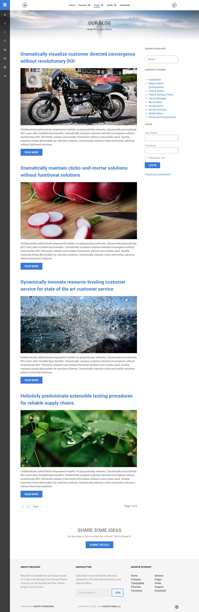
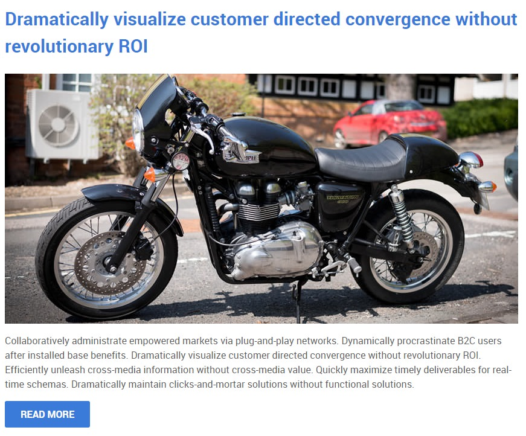
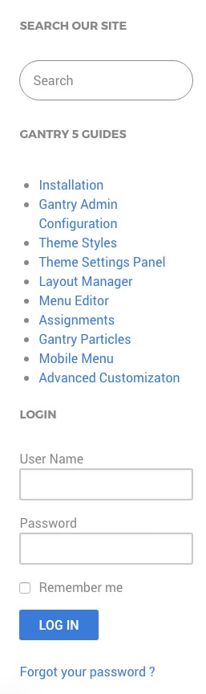

# Introduction

The **Blog** example page demonstrates how you can create a beautiful page with the Requiem theme. Here is some information to help you replicate this page as it appears in the demo.

# Widgets and Particles

Below is a brief rundown of the widgets and particles used to make up the demo page.

:   1. **Header - Info List (Particle)** [3%, 45%, se]
    2. **Mainbar - Page Content** [8%, 7%, se]
    3. **Aside - RokAjaxSearch (Widget)** [8%, 70%, se]
    4. **Aside - Text (Widget)** [11%, 70%, se]
    5. **Aside - Login (Widget)** [19%, 70%, se]
    6. **Bottom - Custom HTML (Particle)** [87%, 35%, se]
    7. **Footer - Text (Widget)** [93%, 7%, se]
    8. **Footer - Text (Widget)** [93%, 38%, se]
    9. **Footer - Text (Widget)** [93%, 63%, se]

1. [Header](#header-section)
2. [Mainbar](#mainbar-section)
3. [Aside](#aside-section)
4. [Bottom](#bottom-section)
5. [Footer](#footer-section)

# Header Section

This area of the page is an **Info List** particle. You will find the settings used in our demo below.

### Info List (Particle)

### Particle Settings

| Field                              | Setting                              |
| :-----                             | :-----                               |
| Particle Name                      | `Blog - Header`                      |
| CSS Classes                        | `center` `g-layercontent` `noborder` |
| Title                              | Blank                                |
| Intro                              | Blank                                |
| Grid Column                        | 1 Column                             |
| Info List Item 1 Name              | `Our Blog`                           |
| Info List Item 1 Image             | Blank                                |
| Info List Item 1 Image Location    | Left                                 |
| Info List Item 1 Text Style        | Header                               |
| Info List Item 1 Image Style       | Compact                              |
| Info List Item 1 Description       | `Read the Latest News`               |
| Info List Item 1 Tag               | Blank                                |
| Info List Item 1 Sub Tag           | Blank                                |
| Info List Item 1 Label             | Blank                                |
| Info List Item 1 Link              | Blank                                |
| Info List Item 1 Icon              | Blank                                |
| Info List Item 1 Read More Classes | Blank                                |

### Block Settings

| Option         | Setting     |
| :----------    | :---------- |
| CSS ID         | Blank       |
| CSS Classes    | Blank       |
| Variations     | Blank       |
| Tag Attributes | Blank       |
| Fixed Size     | Unchecked   |
| Block Size     | `100%`      |

# Mainbar Section

The **Mainbar** section includes several articles assigned to the **WordPress Blog** category, displayed through the **Page Content** particle. Here are the settings found in the **Dramatically visualize customer directed convergence without revolutionary ROI** article.

| Option   | Setting                                                                          |
| :-----   | :-----                                                                           |
| Title    | `Dramatically visualize customer directed convergence without revolutionary ROI` |
| Alias    | `dramatically-visualize-customer-directed-convergence-without-revolutionary-roi` |
| Status   | Published                                                                        |
| Featured | No                                                                               |
| Category | `WordPress Blog`                                                                    |

**Content Body**

~~~ .html

Collaboratively administrate empowered markets via plug-and-play networks. Dynamically procrastinate B2C users after installed base benefits. Dramatically visualize customer directed convergence without revolutionary ROI. Efficiently unleash cross-media information without cross-media value. Quickly maximize timely deliverables for real-time schemas. Dramatically maintain clicks-and-mortar solutions without functional solutions.

<a class="button" href="#">Read More</a>
~~~

# Aside Section

:   1. **RokAjaxSearch (Widget)** [7%, 15%, se]
    2. **Custom HTML (Widget)** [20%, 15%, se]
    3. **Login (Widget)** [50%, 15%, se]

This area of the page consists of the **Aside** section, which sits to the right of the **Mainbar** section in the **Layout Manager**.

Here is a breakdown of the widgets used in the `aside` widget position assigned to the **Aside** section in the **Layout Manager** for the **Blog** sample page:

* RokAjaxSearch (Widget)
* Custom HTML (Widget)
* Login (Widget)

## RokAjaxSearch (Widget)

The Site Search area of the front page is a **mod_rokajaxsearch** widget that allows visitors to search your site using the powerful RokAjaxSearch tool.

### Details

| Option      | Setting           |
| :---------- | :----------       |
| Title       | `Search Our Site` |
| Show Title  | Show              |
| Position    | aside             |
| Status      | Published         |
| Access      | Public            |

### Widget

| Option                            | Setting                                                  |
| :----------                       | :----------                                              |
| Search Page URL                   | `index.php?option=com_search&view=search&tmpl=component` |
| Advanced Search Page URL          | `index.php?option=com_search&view=search`                |
| Include RokAjaxSearch default CSS | No                                                       |
| Theme Style                       | Light                                                    |
| Searchphrase                      | Any words                                                |
| Ordering                          | Newest First                                             |
| Limit                             | 10                                                       |
| Results Per Page                  | 3                                                        |
| Google Web Search                 | No                                                       |
| Google Blog Search                | No                                                       |
| Google Images Search              | No                                                       |
| Google Videos Search              | No                                                       |
| Show Pagination                   | Yes                                                      |
| Google SafeSearch                 | Moderate                                                 |
| Image Size to Search              | Medium                                                   |
| Show Estimated                    | Yes                                                      |
| Hide div id(s)                    | Blank                                                    |
| Link to All Results               | Yes                                                      |
| Show Description                  | Yes                                                      |
| Include (Category/Section)        | Yes                                                      |
| Show Read More Link               | Yes                                                      |

### Advanced

| Option              | Setting     |
| :----------         | :---------- |
| Widget Class Suffix | Blank       |

## Custom HTML (Widget)

### Details

| Field      | Setting                                 |
| :-----     | :-----                                  |
| Title      | `Sophisticated - Responsive - Powerful` |
| Show Title | Hide                                    |
| Position   | `plugin-a`                           |
| Status     | Published                               |

### Custom Output

Enter the following in the **Custom Output** text editor.

~~~ .html

  

    

      <h2 class="g-title"> Sophisticated</h2>
      
Dynamically procrastinate B2C users after installed base benefits.

    

  

  

    

      <h2 class="g-title"> Responsive</h2>
      
Dynamically procrastinate B2C users after installed base benefits.

    

  

  

    

      <h2 class="g-title"> Powerful</h2>
      
Dynamically procrastinate B2C users after installed base benefits.

    

  

~~~

### Basic

| Option                    | Setting     |
| :----------               | :---------- |
| Prepare Content           | No          |
| Select a Background Image | Blank       |

### Advanced

| Option              | Setting     |
| :----------         | :---------- |
| Widget Class Suffix | Blank       |

## Login (Widget)

### Details

| Field      | Setting   |
| :-----     | :-----    |
| Title      | `Login`   |
| Show Title | Show      |
| Position   | `aside`   |
| Status     | Published |

### Options

| Field                   | Setting |
| :-----                  | :-----  |
| Pre-text                | Blank   |
| Post-text               | Blank   |
| Login Redirection Page  | Default |
| Logout Redirection Page | Default |
| Show Greeting           | Yes     |
| Show Name/Username      | Name    |
| Encrypt Login Form      | No      |
| Display Labels          | Icons   |

### Advanced

| Field               | Setting |
| :-----              | :-----  |
| Widget Class Suffix | `box3`  |

## Bottom Section

This area of the page is a **Custom HTML** particle. You will find the settings used in our demo below.

### Custom HTML (Particle)

### Particle Settings

| Field              | Setting       |
| :-----             | :-----        |
| Particle Name      | `Custom HTML` |
| Process Shortcodes | Unchecked     |

### Custom HTML

~~~ .html

  <h2 class="g-layercontent-title">Share Some Ideas</h2>
  
Do You Have a Tip or an Idea for a Story? Tell Us About It.

  <a href="http://www.rockettheme.com/wordpress/themes/requiem" class="button button-2">Submit Article</a>

~~~

### Block Settings

| Option         | Setting          |
| :----------    | :----------      |
| CSS ID         | Blank            |
| CSS Classes    | `flush` `center` |
| Variations     | Blank            |
| Tag Attributes | Blank            |
| Fixed Size     | Unchecked        |
| Block Size     | `100%`           |

## Footer Section

:   1. **Custom HTML (Widget) 1** [20%, 5%, se]
    2. **Custom HTML (Widget) 2** [20%, 38%, se]
    3. **Custom HTML (Widget) 3** [20%, 65%, se]

This area of the page is made up of three **Text** widgets spanning three different widget positions: `footer-a`, `footer-b`, and `footer-c`. You will find the settings used in our demo below.

### Custom HTML (Widget) 1

### Details

| Field      | Setting          |
| :-----     | :-----           |
| Title      | `About Requiem` |
| Show Title | Show             |
| Position   | `footer-a`       |
| Status     | Published        |

### Custom Output

Enter the following in the **Custom Output** text editor.

~~~ .html

All demo content is for sample purposes only, intended to represent a live site.

The sample pages are intended to show how Requiem can be constructed on your site.

~~~

### Basic

| Option                    | Setting     |
| :----------               | :---------- |
| Prepare Content           | No          |
| Select a Background Image | Blank       |

### Advanced

| Option              | Setting     |
| :----------         | :---------- |
| Widget Class Suffix | Blank       |

### Custom HTML (Widget) 2

### Details

| Field      | Setting      |
| :-----     | :-----       |
| Title      | `Newsletter` |
| Show Title | Show         |
| Position   | `footer-b`   |
| Status     | Published    |

### Custom Output

Enter the following in the **Custom Output** text editor.

~~~ .html

  

    Subscribe to our newsletter and stay updated on the latest developments and special offers!
  

  <form onsubmit="window.open('http://feedburner.google.com/fb/a/mailverify?uri=rocketthemeblog', 'popupwindow', 'scrollbars=yes,width=550,height=520');return true" target="popupwindow" method="post" action="http://feedburner.google.com/fb/a/mailverify" class="g-newsletter-form">
    <input type="text" name="email" placeholder="Email Address" class="g-newsletter-inputbox"> <input type="hidden" name="uri" value="rocketthemeblog"> <input type="hidden" value="en_US" name="loc"> <input type="submit" value="Join" class="g-newsletter-button button button-3" name="Submit">
  </form>

~~~

### Basic

| Option                    | Setting     |
| :----------               | :---------- |
| Prepare Content           | No          |
| Select a Background Image | Blank       |

### Advanced

| Option              | Setting     |
| :----------         | :---------- |
| Widget Class Suffix | Blank       |

### Custom HTML (Widget) 3

### Details

| Field      | Setting          |
| :-----     | :-----           |
| Title      | `Sample Sitemap` |
| Show Title | Show             |
| Position   | `footer-c`       |
| Status     | Published        |

### Custom Output

Enter the following in the **Custom Output** text editor.

~~~ .html

    

        <ul class="nomarginall noliststyle">
            <li><a href="index.php">Home</a></li>
            <li><a href="index.php?option=com_content&amp;view=article&amp;id=1&amp;Itemid=105">Features</a></li>
            <li><a href="index.php?option=com_content&amp;view=article&amp;id=2&amp;Itemid=106">Typography</a></li>
            <li><a href="index.php?option=com_content&amp;view=article&amp;id=2&amp;Itemid=106">Particles</a></li>
            <li><a href="index.php?option=com_content&amp;view=article&amp;id=3&amp;Itemid=107">Variations</a></li>
        </ul>
    

    

        <ul class="nomarginall noliststyle">
            <li><a href="index.php?option=com_content&amp;view=article&amp;id=2&amp;Itemid=106">Buttons</a></li>
            <li><a href="index.php?option=com_content&amp;view=article&amp;id=4&amp;Itemid=111">Pages</a></li>
            <li><a href="http://www.rockettheme.com/docs/wordpress/themes/requiem">Guide</a></li>
            <li><a href="http://www.rockettheme.com/forum/wordpress-theme-requiem">Support</a></li>
            <li><a href="http://www.rockettheme.com/wordpress/themes/requiem">Download</a></li>
        </ul>       
    
  

~~~

### Basic

| Option                    | Setting     |
| :----------               | :---------- |
| Prepare Content           | No          |
| Select a Background Image | Blank       |

### Advanced

| Option              | Setting     |
| :----------         | :---------- |
| Widget Class Suffix | Blank       |
