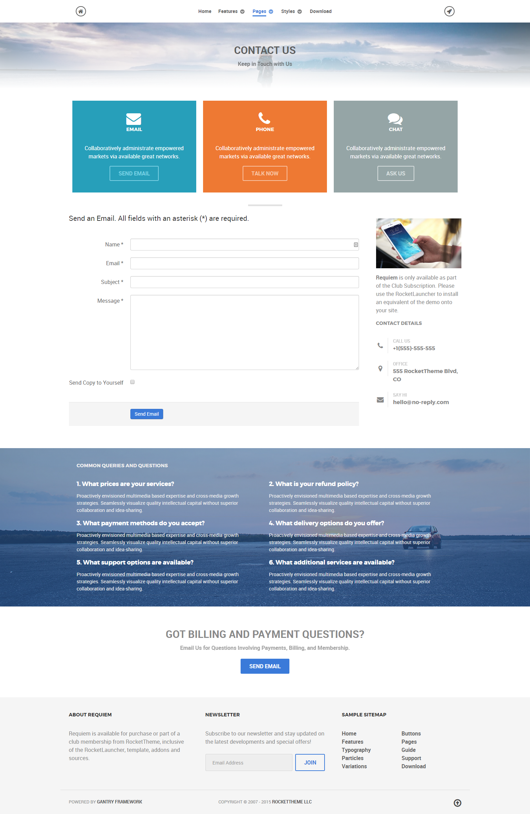
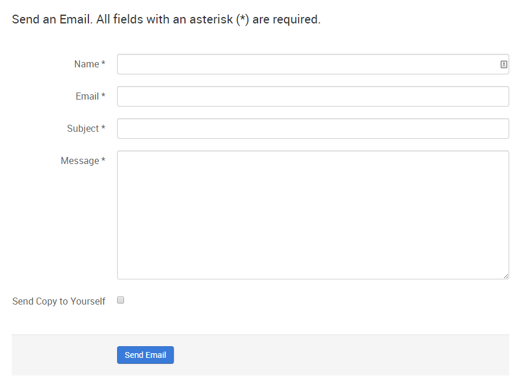
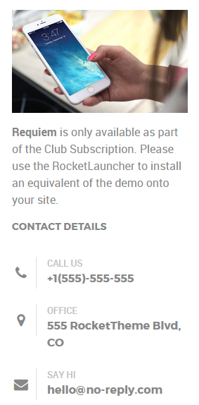

## Introduction

The **Contact** example page demonstrates how you can create a beautiful page with the Requiem theme. Here is some information to help you replicate this page as it appears in the demo.

## Widgets and Particles

Below is a brief rundown of the widgets and particles used to make up the demo page.

:   1. **Showcase - Custom HTML (Particle)** [8%, 40%, se]
    2. **Above - Custom HTML (Particle)** [14%, 5%, se]
    2. **Mainbar - Page Content** [26%, 5%, se]
    3. **Aside - Custom HTML (Widget)** [26%, 72%, se]
    4. **Extension - Custom HTML (Widget)** [57%, 5%, se]
    4. **Bottom - Custom HTML (Particle)** [79%, 30%, se]
    5. **Footer - Custom HTML (Widget)** [88%, 10%, se]
    6. **Footer - Custom HTML (Widget)** [88%, 38%, se]
    7. **Footer - Custom HTML (Widget)** [88%, 65%, se]

1. [Showcase](#showcase-section)
2. [Above](#above-section)
2. [Mainbar](#mainbar-section)
3. [Aside](#sidebar-section)
4. [Extension](#extension-section)
4. [Bottom](#bottom-section)
5. [Footer](#footer-section)

## Showcase Section

This area of the page is a **Custom HTML** particle. You will find the settings used in our demo below.

### Custom HTML (Particle)

### Particle Settings

| Field              | Setting       |
| :-----             | :-----        |
| Particle Name      | `Custom HTML` |
| Process Shortcodes | Unchecked     |

### Custom HTML

~~~ .html

  <h2 class="g-layercontent-title">Contact</h2>
  
Keep in Touch with Us

~~~

### Block Settings

| Option         | Setting          |
| :----------    | :----------      |
| CSS ID         | Blank            |
| CSS Classes    | `flush` `center` |
| Variations     | Blank            |
| Tag Attributes | Blank            |
| Fixed Size     | Unchecked        |
| Block Size     | `100%`           |

## Showcase Section

This area of the page is a **Custom HTML** particle. You will find the settings used in our demo below.

### Custom HTML (Particle)

### Particle Settings

| Field              | Setting       |
| :-----             | :-----        |
| Particle Name      | `Email - Phone - Chat` |
| Process Shortcodes | Unchecked     |

### Custom HTML

~~~ .html

  

    

      
      <h2 class="g-title">Email</h2>
      
Collaboratively administrate empowered markets via available great networks.

      <a class="button button-4" href="">Send Email</a>
    

  

  

    

      
      <h2 class="g-title">Phone</h2>
      
Collaboratively administrate empowered markets via available great networks.

      <a class="button button-4" href="">Talk Now</a>
    

  

  

    

      
      <h2 class="g-title">Chat</h2>
      
Collaboratively administrate empowered markets via available great networks.

      <a class="button button-4" href="">Ask Us</a>
    

  

~~~

### Block Settings

| Option         | Setting     |
| :----------    | :---------- |
| CSS ID         | Blank       |
| CSS Classes    | Blank       |
| Variations     | Blank       |
| Tag Attributes | Blank       |
| Fixed Size     | Unchecked   |
| Block Size     | `100%`      |

## Mainbar Section

The **Mainbar** section is set to `60`% width and both the **Sidebar** and **Aside** sections are set to `20`%.

The page's contact form is a **Contact Form** particle.

Settings used in our demo for each of these particles can be found below.

### Contact Form

#### Particle Settings

| Field            | Setting        |
| :-----           | :-----         |
| Particle Name    | `Contact Form` |
| CSS Classes      | Blank          |
| Header           | Blank          |
| Email Address    | Custom         |
| Enable reCAPTCHA | Unchecked      |
| Site Key         | Blank          |
| Secret Key       | Blank          |

#### Block Settings

| Field          | Setting |
| :-----         | :-----  |
| CSS ID         | Blank   |
| CSS Classes    | Blank   |
| Variations     | Blank   |
| Tag Attributes | Blank   |
| Block Size     | `100%`  |

## Aside Section

The **Aside** section is set to `20`% width.

This area of the page is a **Text** widget. You will find the settings used in our demo below.

### Custom HTML (Widget)

### Details

| Field      | Setting           |
| :-----     | :-----            |
| Title      | `Contact Details` |
| Show Title | Hide              |
| Position   | `aside`           |
| Status     | Published         |

### Custom Output

Enter the following in the **Custom Output** text editor.

~~~ .html

  

    

      

      
<strong>Requiem</strong> is only available as part of the Club Subscription. Please use the RocketLauncher to install an equivalent of the demo onto your site.

    

  
  

  

    

      <h2 class="g-title">Contact Details</h2>
      

        

          

          
Call Us

          
+1(555)-555-555

        

        

          

          
Office

          
555 RocketTheme Blvd, CO

        

        

          

          
Say Hi

          
hello@no-reply.com

        

      

    

  
   

~~~

### Basic

| Option                    | Setting     |
| :----------               | :---------- |
| Prepare Content           | No          |
| Select a Background Image | Blank       |

### Advanced

| Option              | Setting     |
| :----------         | :---------- |
| Widget Class Suffix | Blank       |

## Extension Section

This area of the page is an **Infolist** particle. You will find the settings used in our demo below.

### Info List (Particle)

### Particle Settings

| Field                           | Setting                                                                                                                                                                                   |
| :-----                          | :-----                                                                                                                                                                                    |
| Particle Name                   | `Common Queries and Questions`                                                                                                                                                            |
| CSS Classes                     | Blank                                                                                                                                                                                     |
| Title                           | `Common Queries and Questions`                                                                                                                                                            |
| Intro                           | Blank                                                                                                                                                                                     |
| Grid Column                     | 2 Columns                                                                                                                                                                                 |
| Info List Item 1 Name           | `What prices are your services ?`                                                                                                                                                         |
| Info List Item 1 Image          | Blank                                                                                                                                                                                     |
| Info List Item 1 Image Location | Left                                                                                                                                                                                      |
| Info List Item 1 Text Style     | Compact                                                                                                                                                                                   |
| Info List Item 1 Image Style    | Compact                                                                                                                                                                                   |
| Info List Item 1 Description    | `Proactively envisioned multimedia based expertise and cross-media growth strategies. Seamlessly visualize quality intellectual capital without superior collaboration and idea-sharing.` |
| Info List Item 1 Tag            | Blank                                                                                                                                                                                     |
| Info List Item 1 Sub Tag        | Blank                                                                                                                                                                                     |
| Info List Item 1 Label          | Blank                                                                                                                                                                                     |
| Info List Item 1 Link           | `#`                                                                                                                                                                                       |
| Info List Item 1 Icon           | Blank                                                                                                                                                                                     |
| Info List Item 1 CSS Classes    | Blank                                                                                                                                                                                     |

### Custom HTML

~~~ .html

  <h2 class="g-layercontent-title">Got Billing and Payments Questions?</h2>
  
Email Us for Questions Involving Payments, Billing, and Membership.

  <a href="http://www.rockettheme.com/wordpress/themes/requiem" class="button button-2">Send Email</a>

~~~

### Block Settings

| Option         | Setting     |
| :----------    | :---------- |
| CSS ID         | Blank       |
| CSS Classes    | Blank       |
| Variations     | Blank       |
| Tag Attributes | Blank       |
| Fixed Size     | Unchecked   |
| Block Size     | `100%`      |

## Bottom Section

This area of the page is a **Custom HTML** particle. You will find the settings used in our demo below.

### Custom HTML (Particle)

### Particle Settings

| Field              | Setting       |
| :-----             | :-----        |
| Particle Name      | `Custom HTML` |
| Process Shortcodes | Unchecked     |

### Custom HTML

~~~ .html

  <h2 class="g-layercontent-title">Got Billing and Payments Questions?</h2>
  
Email Us for Questions Involving Payments, Billing, and Membership.

  <a href="http://www.rockettheme.com/wordpress/themes/requiem" class="button button-2">Send Email</a>

~~~

### Block Settings

| Option         | Setting          |
| :----------    | :----------      |
| CSS ID         | Blank            |
| CSS Classes    | `flush` `center` |
| Variations     | Blank            |
| Tag Attributes | Blank            |
| Fixed Size     | Unchecked        |
| Block Size     | `100%`           |

## Footer Section

:   1. **Custom HTML (Widget) 1** [20%, 5%, se]
    2. **Custom HTML (Widget) 2** [20%, 38%, se]
    3. **Custom HTML (Widget) 3** [20%, 65%, se]

This area of the page is made up of three **Text** widgets spanning three different widget positions: `footer-a`, `footer-b`, and `footer-c`. You will find the settings used in our demo below.

### Custom HTML (Widget) 1

### Details

| Field      | Setting          |
| :-----     | :-----           |
| Title      | `About Requiem` |
| Show Title | Show             |
| Position   | `footer-a`       |
| Status     | Published        |

### Custom Output

Enter the following in the **Custom Output** text editor.

~~~ .html

All demo content is for sample purposes only, intended to represent a live site.

The sample pages are intended to show how Requiem can be constructed on your site.

~~~

### Basic

| Option                    | Setting     |
| :----------               | :---------- |
| Prepare Content           | No          |
| Select a Background Image | Blank       |

### Advanced

| Option              | Setting     |
| :----------         | :---------- |
| Widget Class Suffix | Blank       |

### Custom HTML (Widget) 2

### Details

| Field      | Setting      |
| :-----     | :-----       |
| Title      | `Newsletter` |
| Show Title | Show         |
| Position   | `footer-b`   |
| Status     | Published    |

### Custom Output

Enter the following in the **Custom Output** text editor.

~~~ .html

  

    Subscribe to our newsletter and stay updated on the latest developments and special offers!
  

  <form onsubmit="window.open('http://feedburner.google.com/fb/a/mailverify?uri=rocketthemeblog', 'popupwindow', 'scrollbars=yes,width=550,height=520');return true" target="popupwindow" method="post" action="http://feedburner.google.com/fb/a/mailverify" class="g-newsletter-form">
    <input type="text" name="email" placeholder="Email Address" class="g-newsletter-inputbox"> <input type="hidden" name="uri" value="rocketthemeblog"> <input type="hidden" value="en_US" name="loc"> <input type="submit" value="Join" class="g-newsletter-button button button-3" name="Submit">
  </form>

~~~

### Basic

| Option                    | Setting     |
| :----------               | :---------- |
| Prepare Content           | No          |
| Select a Background Image | Blank       |

### Advanced

| Option              | Setting     |
| :----------         | :---------- |
| Widget Class Suffix | Blank       |

### Custom HTML (Widget) 3

### Details

| Field      | Setting          |
| :-----     | :-----           |
| Title      | `Sample Sitemap` |
| Show Title | Show             |
| Position   | `footer-c`       |
| Status     | Published        |

### Custom Output

Enter the following in the **Custom Output** text editor.

~~~ .html

    

        <ul class="nomarginall noliststyle">
            <li><a href="index.php">Home</a></li>
            <li><a href="index.php?option=com_content&amp;view=article&amp;id=1&amp;Itemid=105">Features</a></li>
            <li><a href="index.php?option=com_content&amp;view=article&amp;id=2&amp;Itemid=106">Typography</a></li>
            <li><a href="index.php?option=com_content&amp;view=article&amp;id=2&amp;Itemid=106">Particles</a></li>
            <li><a href="index.php?option=com_content&amp;view=article&amp;id=3&amp;Itemid=107">Variations</a></li>
        </ul>
    

    

        <ul class="nomarginall noliststyle">
            <li><a href="index.php?option=com_content&amp;view=article&amp;id=2&amp;Itemid=106">Buttons</a></li>
            <li><a href="index.php?option=com_content&amp;view=article&amp;id=4&amp;Itemid=111">Pages</a></li>
            <li><a href="http://www.rockettheme.com/docs/wordpress/themes/requiem">Guide</a></li>
            <li><a href="http://www.rockettheme.com/forum/wordpress-theme-requiem">Support</a></li>
            <li><a href="http://www.rockettheme.com/wordpress/themes/requiem">Download</a></li>
        </ul>       
    
  

~~~

### Basic

| Option                    | Setting     |
| :----------               | :---------- |
| Prepare Content           | No          |
| Select a Background Image | Blank       |

### Advanced

| Option              | Setting     |
| :----------         | :---------- |
| Widget Class Suffix | Blank       |
