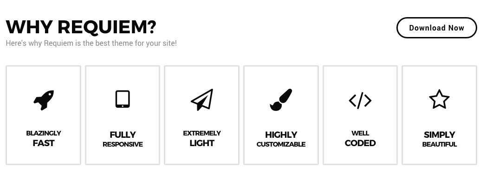
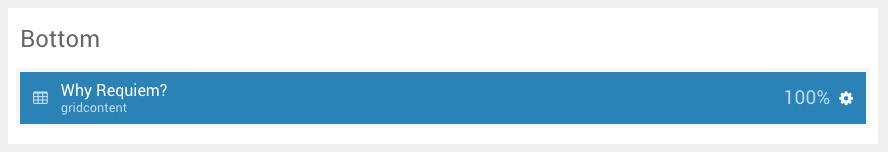
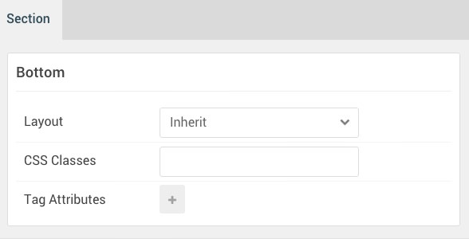
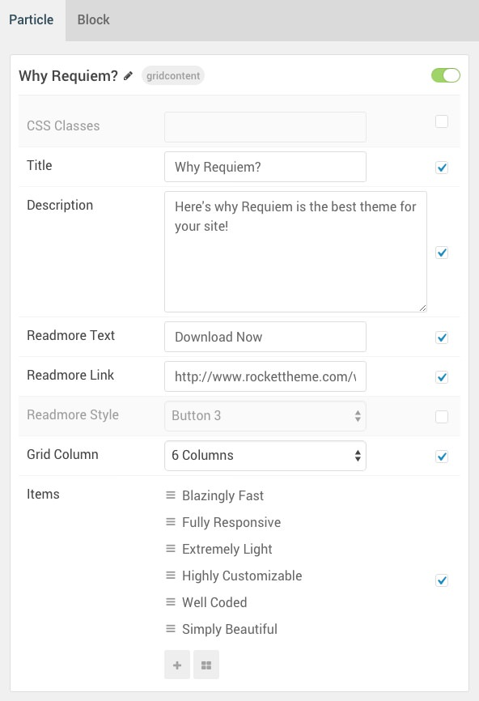
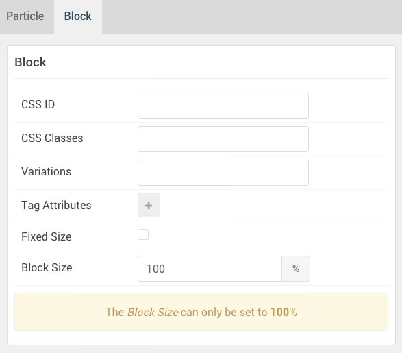

## Introduction

The **Bottom** section includes a single **Grid Content** particle.

Here is a breakdown of the widget(s) and particle(s) that appear in this section:

* [Grid Content (particle)](#grid-content-(particle))

## Section Settings

| Option         | Setting |
| :-----         | :-----  |
| Layout         | Inherit |
| CSS Classes    | Blank   |
| Tag Attributes | Blank   |

## Grid Content (Particle)

### Particle Settings

| Option                          | Setting                                               |
| :-----                          | :-----                                                |
| CSS Classes                     | Blank                                                 |
| Title                           | `Why Requiem?`                                        |
| Description                     | `Here's why Requiem is the best theme for your site!` |
| Readmore Text                   | `Download Now`                                        |
| Readmore Link                   | `http://www.rockettheme.com/wordpress/themes/requiem` |
| Readmore Style                  | Button 3                                              |
| Grid Column                     | 6 Columns                                             |
| Grid Content Item 1 Name        | `Blazingly Fast`                                      |
| Grid Content Item 1 Icon        | `fa fa-rocket fa-fw fa-3x`                            |
| Grid Content Item 1 Title Class | Style 2                                               |
| Grid Content Item 1 Title 1     | `Blazingly`                                           |
| Grid Content Item 1 Title 2     | `Fast`                                                |
| Grid Content Item 1 Description | Blank                                                 |
| Grid Content Item 1 Link        | `#`                                                   |

### Block Settings

| Option         | Setting   |
| :-----         | :-----    |
| CSS ID         | Blank     |
| CSS Classes    | Blank     |
| Variations     | Blank     |
| Tag Attributes | Blank     |
| Fixed Size     | Unchecked |
| Block Size     | `100%`    |
