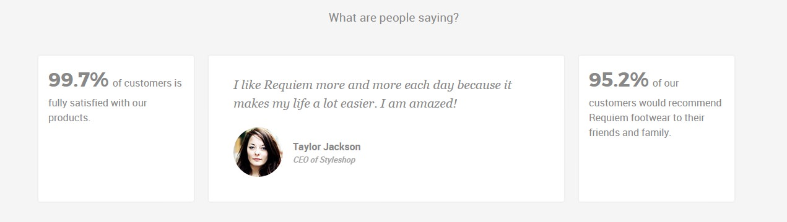
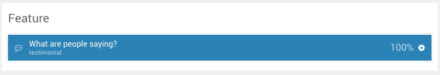
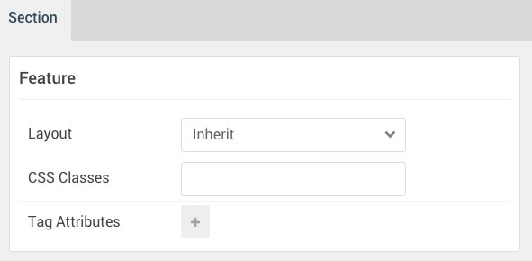
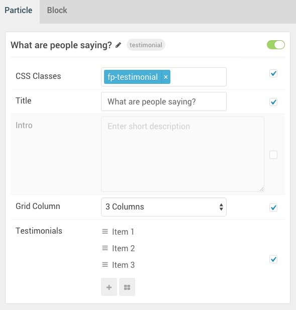
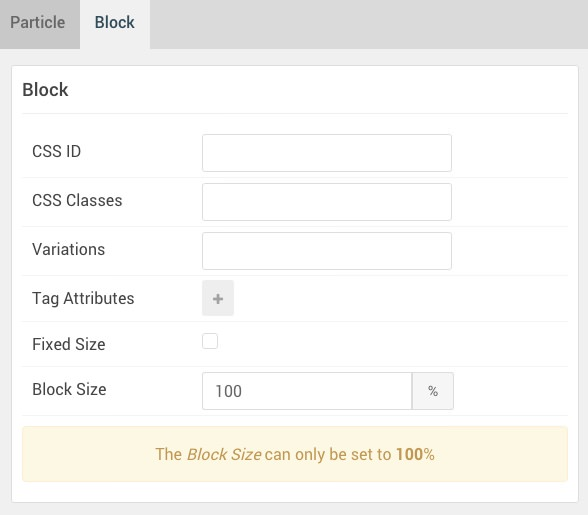

## Introduction

The **Feature** section includes a single **Testimonial** particle.

Here is a breakdown of the widget(s) and particle(s) that appear in this section:

* [Testimonial (particle)](#testimonial-(particle))

## Section Settings

| Option         | Setting |
| :-----         | :-----  |
| Layout         | Inherit |
| CSS Classes    | Blank   |
| Tag Attributes | Blank   |

## Testimonial (Particle)

### Particle Settings

| Option                      | Setting                                                                     |
| :-----                      | :-----                                                                      |
| CSS Classes                 | `fp-testimonial`                                                            |
| Title                       | Blank                                                                       |
| Intro                       | Blank                                                                       |
| Grid Column                 | 3 Columns                                                                   |
| Testimonials Item 1 Name    | `Item 1`                                                                    |
| Testimonials Item 1 Style   | Standard                                                                    |
| Testimonials Item 1 Image   | Blank                                                                       |
| Testimonials Item 1 Content | `<strong>99.7%</strong> of customers is fully satisfied with our products.` |
| Testimonials Item 1 Author  | Blank                                                                       |
| Testimonials Item 1 Company | Blank                                                                       |
| Testimonials Item 1 Link    | Blank                                                                       |

### Block Settings

| Option         | Setting   |
| :-----         | :-----    |
| CSS ID         | Blank     |
| CSS Classes    | Blank     |
| Variations     | Blank     |
| Tag Attributes | Blank     |
| Fixed Size     | Unchecked |
| Block Size     | `100%`    |

