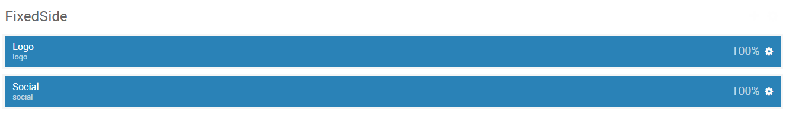

## Introduction

The **FixedSide** section includes two particles, each arranged in its own row in the section.

Here is a breakdown of the widget(s) and particle(s) that appear in this section:

* [Logo (particle)](#logo-(particle))
* [Social (particle)](#social-(particle))

## Section Settings

| Option         | Setting   |
| :-----         | :-----    |
| Section Width  | `25%`     |
| Layout         | Fullwidth |
| CSS Classes    | Blank     |
| Tag Attributes | Blank     |

## Logo (particle)

#### Particle Settings

| Option        | Setting            |
| :-----        | :-----             |
| Particle Name | `Logo`             |
| URL           | Blank              |
| Rel           | Blank              |
| Image         | Blank              |
| Alt           | Blank              |
| Text          | `R`                |
| CSS Classes   | `g-fixedside-logo` |

#### Block Settings

| Option         | Setting |
| :-----         | :-----  |
| CSS ID         | Blank   |
| CSS Classes    | Blank   |
| Variations     | Blank   |
| Tag Attributes | Blank   |
| Block Size     | `100%`  |

## Social (particle)

#### Particle Settings

| Option             | Setting               |
| :-----             | :-----                |
| CSS Classes        | `social`              |
| Title              | Blank                 |
| Target             | New Window            |
| Social Item 1 Name | `Twitter`             |
| Social Item 1 Icon | `fa fa-twitter fa-fw` |
| Social Item 1 Text | Blank                 |
| Social Item 1 Link | `#`                   |

#### Block Settings

| Option         | Setting |
| :-----         | :-----  |
| CSS ID         | Blank   |
| CSS Classes    | Blank   |
| Variations     | Blank   |
| Tag Attributes | Blank   |
| Block Size     | `100%`  |
