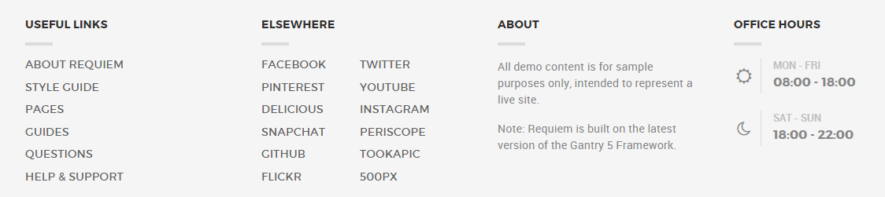
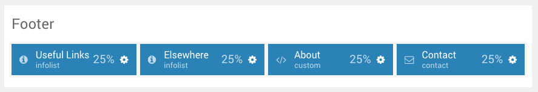
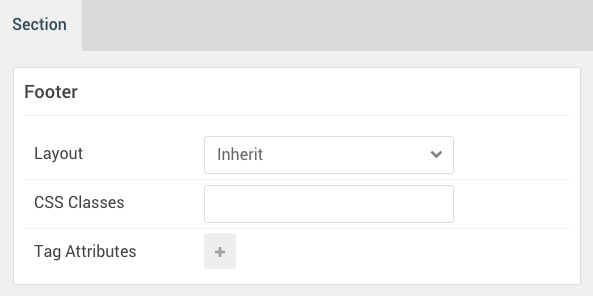

## Introduction

The **Footer** section include four particles.

Here is a breakdown of the widget(s) and particle(s) that appear in this section:

* [Info List (particle)](#info-list-(particle))
* [Info List (particle)](#info-list-(particle)-2)
* [Custom HTML (widget)](#custom-html-(particle))
* [Contact (particle)](#contact-(particle))

## Section Settings

| Option         | Setting |
| :-----         | :-----  |
| Layout         | Inherit |
| CSS Classes    | Blank   |
| Tag Attributes | Blank   |

## Info List (Particle)

### Particle Settings

| Option                             | Setting                                               |
| :-----                             | :-----                                                |
| CSS Classes                        | `g-gridmenu`                                          |
| Title                              | `Useful Links`                                        |
| Intro                              | Blank                                                 |
| Grid Column                        | 1 Column                                              |
| Info List Item 1 Name              | `About Requiem`                                       |
| Info List Item 1 Image             | Blank                                                 |
| Info List Item 1 Image Location    | Left                                                  |
| Info List Item 1 Text Style        | Compact                                               |
| Info List Item 1 Image Style       | Compact                                               |
| Info List Item 1 Description       | Blank                                                 |
| Info List Item 1 Tag               | Blank                                                 |
| Info List Item 1 Sub Tag           | Blank                                                 |
| Info List Item 1 Label             | Blank                                                 |
| Info List Item 1 Link              | `http://www.rockettheme.com/wordpress/themes/requiem` |
| Info List Item 1 Icon              | Blank                                                 |
| Info List Item 1 Read More Classes | Blank                                                 |

### Block Settings

| Option         | Setting            |
| :-----         | :-----             |
| CSS ID         | Blank              |
| CSS Classes    | `g-title-bordered` |
| Variations     | Blank              |
| Tag Attributes | Blank              |
| Fixed Size     | Unchecked          |
| Block Size     | `25%`              |

## Info List (Particle) 2

### Particle Settings

| Option                             | Setting      |
| :-----                             | :-----       |
| CSS Classes                        | `g-gridmenu` |
| Title                              | `Elsewhere`  |
| Intro                              | Blank        |
| Grid Column                        | 2 Columns    |
| Info List Item 1 Name              | `Facebook`   |
| Info List Item 1 Image             | Blank        |
| Info List Item 1 Image Location    | Left         |
| Info List Item 1 Text Style        | Compact      |
| Info List Item 1 Image Style       | Compact      |
| Info List Item 1 Description       | Blank        |
| Info List Item 1 Tag               | Blank        |
| Info List Item 1 Sub Tag           | Blank        |
| Info List Item 1 Label             | Blank        |
| Info List Item 1 Link              | `#`          |
| Info List Item 1 Icon              | Blank        |
| Info List Item 1 Read More Classes | Blank        |

### Block Settings

| Option         | Setting            |
| :-----         | :-----             |
| CSS ID         | Blank              |
| CSS Classes    | `g-title-bordered` |
| Variations     | Blank              |
| Tag Attributes | Blank              |
| Fixed Size     | Unchecked          |
| Block Size     | `25%`              |

## Custom HTML (Particle)

### Particle Settings

| Option             | Setting   |
| :-----             | :-----    |
| Process Shortcodes | Unchecked |

**Custom HTML**

~~~ .html
<h2 class="g-title">About</h2>

All demo content is for sample purposes only, intended to represent a live site.

Note: Requiem is built on the latest version of the Gantry 5 Framework.

~~~

### Block Settings

| Option         | Setting                      |
| :-----         | :-----                       |
| CSS ID         | Blank                        |
| CSS Classes    | `g-about` `g-title-bordered` |
| Variations     | Blank                        |
| Tag Attributes | Blank                        |
| Fixed Size     | Unchecked                    |
| Block Size     | `25%`                        |

## Contact (Particle)

### Particle Settings

| Option               | Setting             |
| :-----               | :-----              |
| CSS Classes          | `g-office-hours`    |
| Title                | Blank               |
| Contact Item 1 Name  | `Monday - Friday`   |
| Contact Item 1 Icon  | `fa fa-sun-o fa-fw` |
| Contact Item 1 Value | `08:00 - 18:00`     |
| Map Position         | Top                 |
| Maps                 | Blank               |

### Block Settings

| Option         | Setting            |
| :-----         | :-----             |
| CSS ID         | Blank              |
| CSS Classes    | `g-title-bordered` |
| Variations     | Blank              |
| Tag Attributes | Blank              |
| Fixed Size     | Unchecked          |
| Block Size     | `25%`              |

