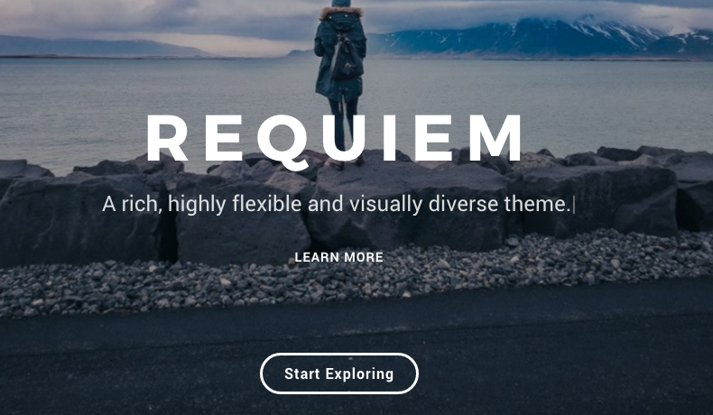
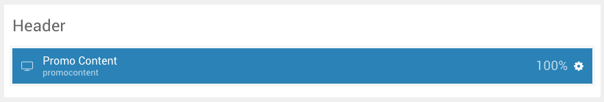
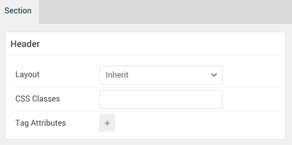
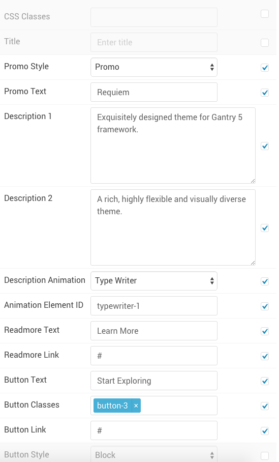
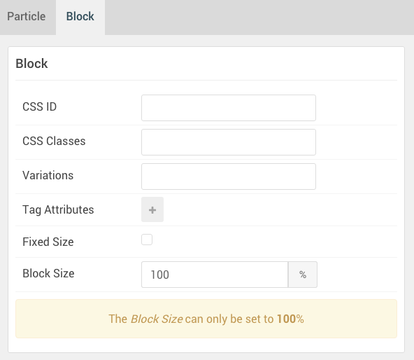

## Introduction

The **Header** section includes one **Promo Content** particle.

The background image found in our demo is set in the **Style** administrative panel. Just navigate to **Gantry 5 Admin > Styles** and scroll down to the **Header** section.

Here is a breakdown of the widget(s) and particle(s) that appear in this section:

* [Promo Content (particle)](#promo-content-(particle))

## Section Settings

| Option         | Setting |
| :-----         | :-----  |
| Layout         | Inherit |
| CSS Classes    | Blank   |
| Tag Attributes | Blank   |

## Promo Content (Particle)

#### Particle Settings

| Option                | Setting                                               |
| :-----                | :-----                                                |
| CSS Classes           | Blank                                                 |
| Title                 | Blank                                                 |
| Promo Style           | Promo                                                 |
| Promo Text            | `Requiem`                                             |
| Description 1         | `Exquisitely designed theme for Gantry 5 framework.`  |
| Description 2         | `A rich, highly flexible and visually diverse theme.` |
| Description Animation | Type Writer                                           |
| Animation Element ID  | `typewriter-1`                                        |
| Readmore Text         | `Learn More`                                          |
| Readmore Link         | `#`                                                   |
| Button Text           | `button-3`                                            |
| Button Link           | `#`                                                   |
| Button Style          | Block                                                 |
| Tags                  | Blank                                                 |

#### Block Settings

| Option         | Setting   |
| :-----         | :-----    |
| CSS ID         | Blank     |
| CSS Classes    | Blank     |
| Variations     | Blank     |
| Tag Attributes | Blank     |
| Fixed Size     | Unchecked |
| Block Size     | `100%`    |
