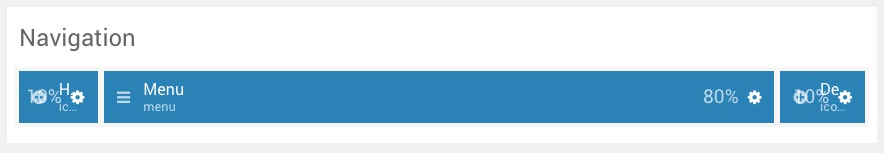
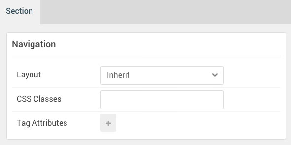
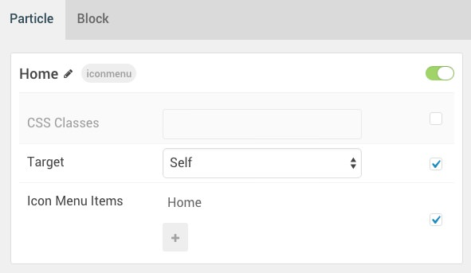
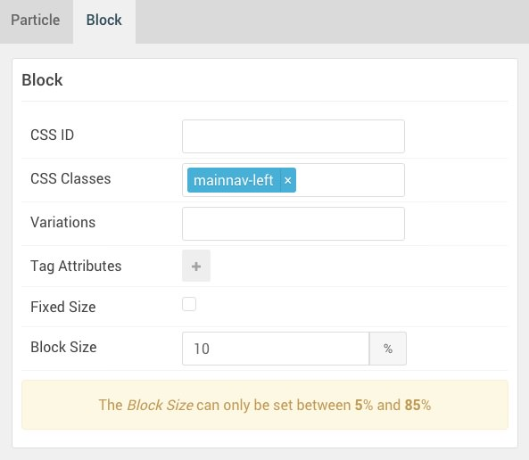
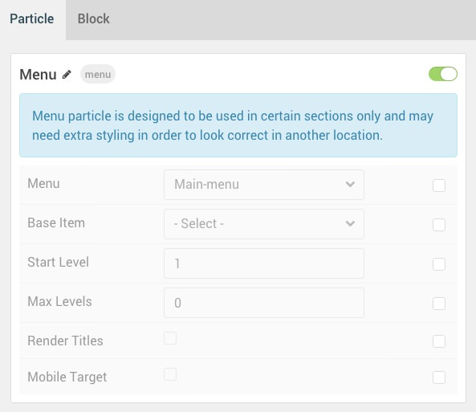
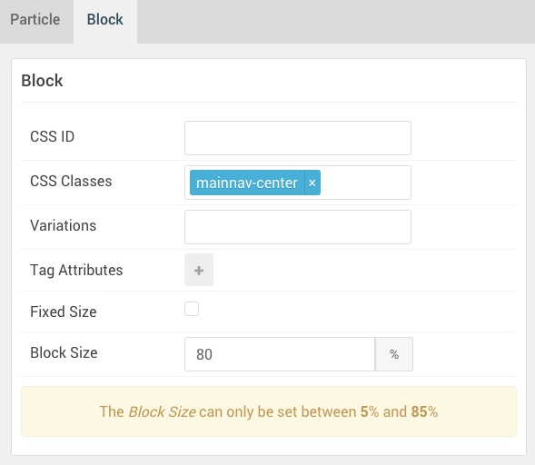
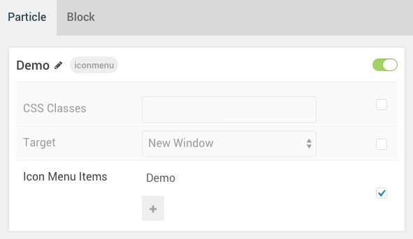

## Introduction

The **Navigation** section includes three particles, **Icon Menu**, **Men**, and another **Icon Menu**. 

Here is a breakdown of the widget(s) and particle(s) that appear in this section:

* [Icon Menu (particle)](#gantry-5-particle-(icon-menu))
* [Menu](#menu-(particle))
* [Icon Menu (particle)](#gantry-5-particle-(icon-menu)-2)

## Section Settings

| Option         | Setting |
| :-----         | :-----  |
| Layout         | Inherit |
| CSS Classes    | Blank   |
| Tag Attributes | Blank   |

## Icon Menu (Particle)

#### Particle Settings

| Option      | Setting            |
| :-----      | :-----             |
| CSS Classes | Blank              |
| Target      | Self               |
| Item 1 Name | Home               |
| Item 1 Icon | `fa fa-home fa-fw` |
| Item 1 Text | Blank              |
| Item 1 Link | Blank              |

#### Block Settings

| Option         | Setting        |
| :-----         | :-----         |
| CSS ID         | Blank          |
| CSS Classes    | `mainnav-left` |
| Variations     | Blank          |
| Tag Attributes | Blank          |
| Fixed Size     | Unchecked      |
| Block Size     | `10%`          |

## Menu (Particle)

#### Particle Settings

| Option        | Setting       |
| :-----        | :-----        |
| Menu          | Main Menu     |
| Base Item     | None Selected |
| Start Level   | 1             |
| Max Levels    | Blank         |
| Render Titles | Unchecked     |
| Mobile Target | Unchecked     |

#### Block Settings

| Option         | Setting          |
| :-----         | :-----           |
| CSS ID         | Blank            |
| CSS Classes    | `mainnav-center` |
| Variations     | Blank            |
| Tag Attributes | Blank            |
| Fixed Size     | Unchecked        |
| Block Size     | `80%`            |

## Icon Menu (Particle) 2

#### Particle Settings

| Option      | Setting              |
| :-----      | :-----               |
| CSS Classes | Blank                |
| Target      | Self                 |
| Item 1 Name | `Demo`               |
| Item 1 Icon | `fa fa-rocket fa-fw` |
| Item 1 Text | Blank                |
| Item 1 Link | Custom               |

#### Block Settings

| Option         | Setting         |
| :-----         | :-----          |
| CSS ID         | Blank           |
| CSS Classes    | `mainnav-right` |
| Variations     | Blank           |
| Tag Attributes | Blank           |
| Fixed Size     | Unchecked       |
| Block Size     | `10%`           |