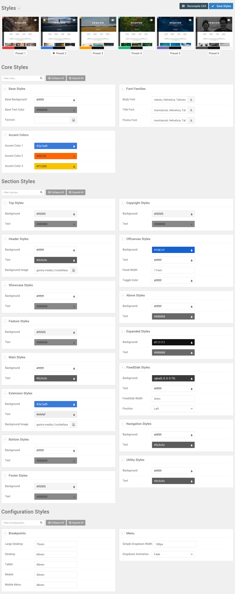

Theme Style Settings
-----

One of the most important aspects of any Gantry theme is its ability to be easily customized using the settings present in the Theme Settings page. These settings can be adjusted by navigating to **Administration -> Components -> Gantry 5 Themes -> Requiem**. To replicate the demo, the styling changes are being made in the **Styles** tab.

This table will break down the various settings you may need to adjust in order to recreate the demo. Most of the settings under **Styles** are adjusted automatically with the selection of a theme preset. You can set presets using the **Presets** options located at the top of the **Styles** admin panel.

Once you have selected a Preset, these options can be further adjusted to match the demo. Keep in mind that the Style indicated here relates to the theme Style in this menu. More information about how Styles work can be found in our [Gantry documentation](http://docs.gantry.org/gantry5/configure/styles).

### Core Styles

| Outline      | Category      | Option          | Setting                                                    |
| :-----       | :-----        | :-----          |                                                            |
| Base Outline | Base Styles   | Base Background | `#ffffff`                                                  |
| Base Outline | Base Styles   | Base Text Color | `#888888`                                                  |
| Base Outline | Base Styles   | Favicoon        | Blank                                                      |
| Base Outline | Font Families | Body Font       | `roboto, Helvetica, Tahoma, Geneva, Arial, sans-serif`     |
| Base Outline | Font Families | Title Font      | `montserrat, Helvetica, Tahoma, Geneva, Arial, sans-serif` |
| Base Outline | Font Families | Promo Font      | `montserrat, Helvetica, Tahoma, Geneva, Arial, sans-serif` |
| Base Outline | Accent Colors | Accent Color 1  | `#3a7ad9`                                                  |
| Base Outline | Accent Colors | Accent Color 2  | `#ff6705`                                                  |
| Base Outline | Accent Colors | Accent Color 3  | `#f7c500`                                                  |

### Section Styles

| Outline      | Category          | Option           | Setting               |
| :-----       | :-----            | :-----           |                       |
| Base Outline | Top Styles        | Background       | `#f5f5f5`             |
| Base Outline | Top Styles        | Text             | `#888888`             |
| Base Outline | Header Styles     | Background       | `#ffffff`             |
| Base Outline | Header Styles     | Text             | `#5c5c5c`             |
| Base Outline | Header Styles     | Background Image | Custom                |
| Base Outline | Slideshow Styles  | Background       | `#ffffff`             |
| Base Outline | Slideshow Styles  | Text             | `#888888`             |
| Base Outline | Showcase Styles   | Background       | `#ffffff`             |
| Base Outline | Showcase Styles   | Text             | `#888888`             |
| Base Outline | Feature Styles    | Background       | `#f5f5f5`             |
| Base Outline | Feature Styles    | Text             | `#888888`             |
| Base Outline | Main Styles       | Background       | `#ffffff`             |
| Base Outline | Main Styles       | Text             | `#5c5c5c`             |
| Base Outline | Plugin Styles  | Background       | `#3a7ad9`             |
| Base Outline | Plugin Styles  | Text             | `#efefef`             |
| Base Outline | Plugin Styles  | Background Image | Custom                |
| Base Outline | Bottom Styles     | Background       | `#ffffff`             |
| Base Outline | Bottom Styles     | Text             | `#888888`             |
| Base Outline | Footer Styles     | Background       | `#f5f5f5`             |
| Base Outline | Footer Styles     | Text             | `#888888`             |
| Base Outline | Copyright Styles  | Background       | `#f5f5f5`             |
| Base Outline | Copyright Styles  | Text             | `#888888`             |
| Base Outline | Offcanvas Section | Background       | `#1661cf`             |
| Base Outline | Offcanvas Section | Text             | `#ffffff`             |
| Base Outline | Offcanvas Section | Panel Width      | `17rem`               |
| Base Outline | Offcanvas Section | Toggle Color     | `#ffffff`             |
| Base Outline | Above Styles      | Background       | `#ffffff`             |
| Base Outline | Above Styles      | Text             | `#686868`             |
| Base Outline | Expanded Styles   | Background       | `#111111`             |
| Base Outline | Expanded Styles   | Text             | `#686868`             |
| Base Outline | FixedSide Styles  | Background       | `rgba(0, 0, 0, 0.75)` |
| Base Outline | FixedSide Section | Text             | `#ffffff`             |
| Base Outline | FixedSide Section | FixedSide Width  | `4rem`                |
| Base Outline | FixedSide Section | Position         | Left                  |
| Base Outline | Navigation Colors | Background       | `#ffffff`             |
| Base Outline | Navigation Colors | Text             | `#5c5c5c`             |
| Base Outline | Utility Styles    | Background       | `#111111`             |
| Base Outline | Utility Styles    | Text             | `#5c5c5c`             |

### Configuration Styles

| Outline      | Category    | Option             | Setting |
| :-----       | :-----      | :-----             |         |
| Base Outline | Breakpoints | Large Desktop      | `75rem` |
| Base Outline | Breakpoints | Desktop            | `60rem` |
| Base Outline | Breakpoints | Tablet             | `48rem` |
| Base Outline | Breakpoints | Mobile             | `30rem` |
| Base Outline | Breakpoints | Mobile Menu        | `48rem` |
| Base Outline | Menu        | Dropdown Widths    | `180px` |
| Base Outline | Menu        | Dropdown Animation | Fade    |
