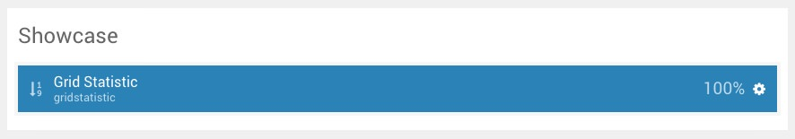
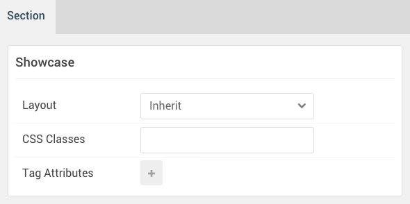
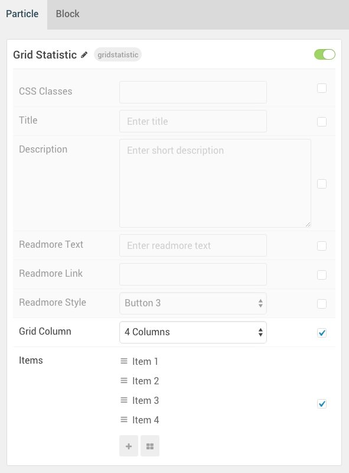
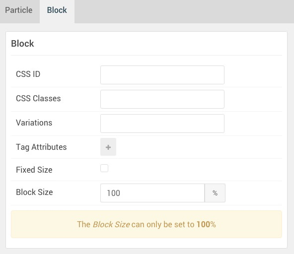

## Introduction

The **Showcase** section includes a single **Grid Statistic** particle. 

Here is a breakdown of the widget(s) and particle(s) that appear in this section:

* [Grid Statistic (particle)](#grid-statistic-(particle))

## Section Settings

| Option         | Setting |
| :-----         | :-----  |
| Layout         | Inherit |
| CSS Classes    | Blank   |
| Tag Attributes | Blank   |

## Grid Statistic (Particle)

#### Particle Settings

| Option                                 | Setting                                                                |
| :-----                                 | :-----                                                                 |
| CSS Classes                            | Blank                                                                  |
| Title                                  | Blank                                                                  |
| Description                            | Blank                                                                  |
| Promo Text                             | `An excellent design with a fresh approach for the ever-changing Web.` |
| Readmore Text                          | Blank                                                                  |
| Readmore Link                          | Blank                                                                  |
| Readmore Style                         | Button 3                                                               |
| Grid Column                            | 4 Columns                                                              |
| Grid Statistic Item 1 Name             | `Item 1`                                                               |
| Grid Statistic Item 1 Statistic Number | `9576`                                                                 |
| Grid Statistic Item 1 Statistic Text   | `Miles Travelled`                                                      |

#### Block Settings

| Option         | Setting   |
| :-----         | :-----    |
| CSS ID         | Blank     |
| CSS Classes    | Blank     |
| Variations     | Blank     |
| Tag Attributes | Blank     |
| Fixed Size     | Unchecked |
| Block Size     | `100%`    |
