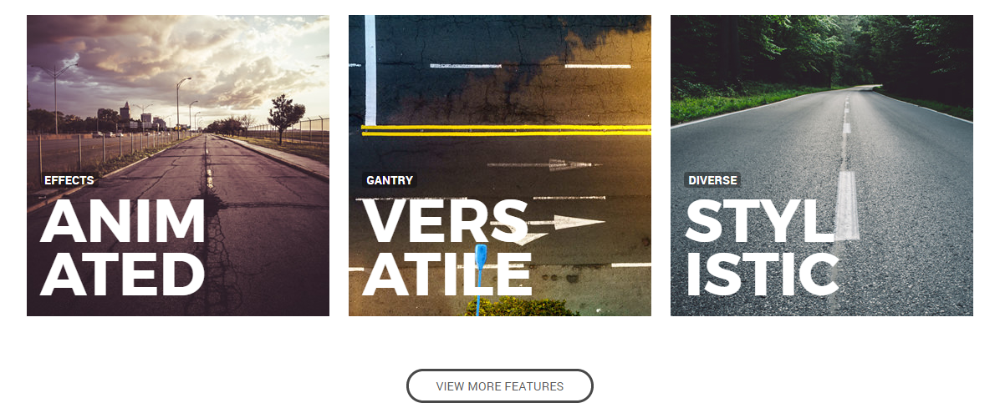
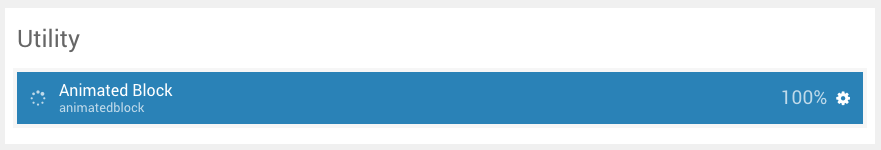
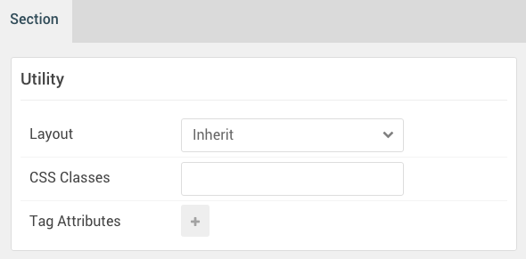
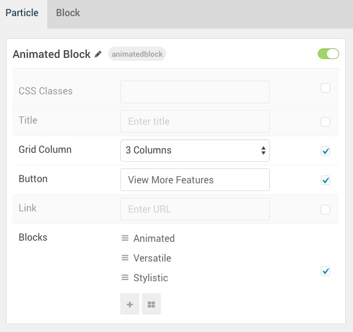
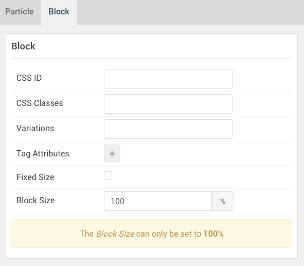

## Introduction

The **Utility** section includes a single **Animated Block** particle.

Here is a breakdown of the widget(s) and particle(s) that appear in this section:

* [Animated Block (particle)](#animated-block-(particle))

## Section Settings

| Option         | Setting |
| :-----         | :-----  |
| Layout         | Inherit |
| CSS Classes    | Blank   |
| Tag Attributes | Blank   |

## Animated Block (Particle)

#### Particle Settings

| Option                    | Setting                                                                                                    |
| :-----                    | :-----                                                                                                     |
| CSS Classes               | Blank                                                                                                      |
| Title                     | Blank                                                                                                      |
| Grid Column               | 3 Columns                                                                                                  |
| Button                    | View More Features                                                                                         |
| Blocks Item 1 Name        | `Animated`                                                                                                 |
| Blocks Item 1 Image       | Custom                                                                                                     |
| Blocks Item 1 Headline    | `Anim ated`                                                                                           |
| Blocks Item 1 Tag         | `Effects`                                                                                                  |
| Blocks Item 1 Description | `Rich CSS animations to enhance appeal without detracting from content` |
| Blocks Item 1 Read More   | `Read More`                                                                                                |
| Blocks Item 1 Link        | `#`                                                                                                        |

#### Block Settings

| Option         | Setting   |
| :-----         | :-----    |
| CSS ID         | Blank     |
| CSS Classes    | Blank     |
| Variations     | Blank     |
| Tag Attributes | Blank     |
| Fixed Size     | Unchecked |
| Block Size     | `100%`    |