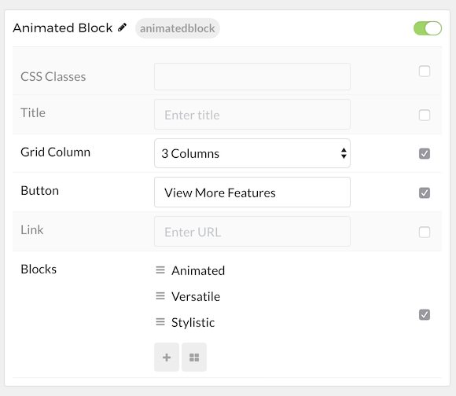
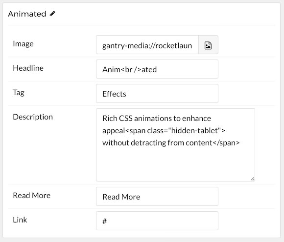

## Introduction

The **Animated Block** particle is a great way to create a beautifully-animated area of blocked images.

Here are the topics covered in this guide:

* [Configuration](#configuration)
    - [Main Options](#main-options)
    - [Item Options](#item-options)

## Configuration

### Main Options 

These options affect the main area of the particle, and not the individual items within. For example, if you want to display content that includes a title, headline, image, and link you can do so here, but if you want to display numerous individual items, each with their own text, images, and/or links, you can do so using the **Blocks** collection feature.

| Option         | Description                                                                                                                                              |
| :-----         | :-----                                                                                                                                                   |
| CSS Classes    | Enter the CSS class(es) you want to use in the content of the particle.                                                                                  |
| Title          | Enter the title of the particle, as it will appear on the front end.                                                                                     |
| Grid Column    | Select the number of columns you wish to have displayed.                                                                                                 |
| Button         | Customize the text you want to have appear in the link button.                                                                                           |
| Link           | Customize the link you want the link button to go to.                                                                                                    |

### Item Options

These items make up the individual featured items in the particle. They sit apart from the particle's title, headline, image, and description. Each item can have its own properties, including images and written content.

| Option      | Description                                                                          |
| :-----      | :-----                                                                               |
| Image       | Select the image you would like to have displayed with the item.                     |
| Headline    | Enter the title for the block item.                                                  |
| Tag         | Add Tag(s) for the item.                                                             |
| Description | Enter any descriptive text you want to have appear in the item.                      |
| Icon        | Select the icon you would like to have appear with the title area in the block item. |
| Read More   | Enter any text you want to become the readmore link.                                 |
| Link        | Enter the link for the readmore.                                                     |

