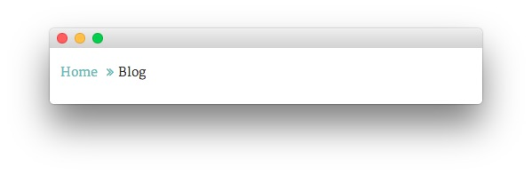
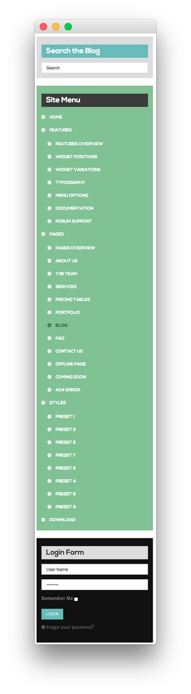
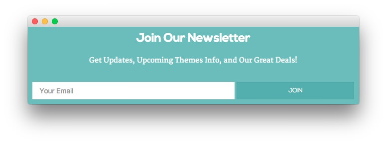
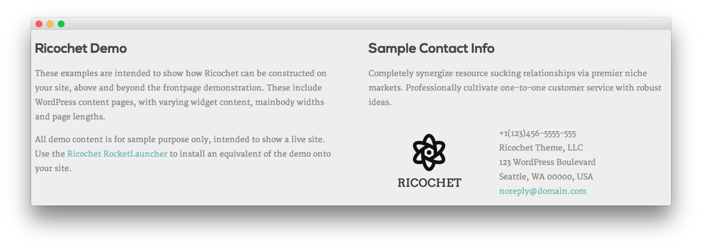

Introduction
-----

The **Blog** example page demonstrates how you can create a beautiful page with the Ricochet theme. Here is some information to help you replicate this page as it appears in the demo.

Theme Override Options
-----

The **Blog** page is a regular **Page**. To recreate the layout the way it appears in our demo, enter `menu-blog` in the **Page Suffix** field in the **Gizmos** page inside the **Ricochet** theme settings. This suffix is tied to a class in the demo.less file that sets the page up so it appears the way it does in the demo.

In order for this to work, you should have the **Page Suffix** option set to **On** in **Admin > Ricochet > Gizmos**. You will likely need to create a theme override specifically for the page before assigning that suffix to it. For more information on creating theme overrides, visit our [Gantry Documentation][gantrydocs]

Mainbody
-----

The page's content body is set to display posts in the **Blog** category. The first post is the **Powered by Gantry Framework** post. You will find the content used in the post below.

~~~ .html

Collaboratively administrate empowered markets via plug-and-play networks. Dynamically procrastinate B2C users after installed base benefits. Dramatically visualize customer directed convergence without revolutionary ROI.

Efficiently unleash cross-media information without cross-media value. Quickly maximize timely deliverables for real-time schemas. Dramatically maintain clicks-and-mortar solutions without functional solutions.

~~~

Widgets
-----

Below is a brief rundown of the widgets used to make up the demo page. ricochet

:   1. **Feature - Text** [9%, 45%, se]
    2. **Breadcrumbs** [13%, 19%, se]
    3. **Sidebar - RokAjaxSearch** [14%, 80%, sw]
    4. **Sidebar - Gantry Menu** [19%, 80%, sw]
    5. **Sidebar - Gantry Login Form** [53%, 80%, sw]
    6. **Bottom - Text** [78%, 40%, se]
    7. **Footer - Text** [82%, 19%, se]
    8. **Footer - Text** [82%, 50%, se]
    9. **Blog** [16%, 19%, se]

1. [Feature - Text](blog.md#showcase-section)
2. [Breadcrumbs](blog.md#breadcrumbs-section)
3. [Sidebar - RokAjaxSearch](blog.md#sidebar-section)
4. [Sidebar - Gantry Menu](blog.md#sidebar-section)
5. [Sidebar - Gantry Login Form](blog.md#sidebar-section)
6. [Bottom - Text](blog.md#extension-section)
7. [Footer - Text](blog.md#footer-section)
8. [Footer - Text](blog.md#footer-section)
9. [Blog](blog.md#mainbody)

Feature Section
-----

Here is the widget breakdown for the Feature section:

#### Text

This section of the page is a standard text widget. You will need to enter the following in the main text field.

~~~ .html
&nbsp;
~~~

Here is a breakdown of options changes you will want to make to match the demo.

* Set the **Title** to `Blog[span class="rt-title-tag"]Read the Latest News[/span]`.
* Switch the **Widget Variations** option to **RT-Center, No Margin All**.
* Enter `rt-title-large rt-nomodulecontent rt-top-large-padding` in the **Custom Variations** field.
* Leaving everything else at its default setting, select **Save**.

Breadcrumbs Section
-----

#### Gantry Breadcrumbs

The **Gantry Breadcrumbs** widget gives you the ability to present page-aware breadcrumbs on the page. All you need to do to add them is to drag the **Gantry Breadcrumbs** widget from the **Available Widgets** area to the **Breadcrumbs** widget position.

Sidebar Section
-----

:   1. **RokAjaxSearch** [6%, 18%, se]
    2. **Gantry Menu** [13%, 18%, se]
    3. **Gantry Login Form** [77%, 18%, se]

Here is the widget breakdown for the Breadcrumbs section:

* RokAjaxSearch
* Gantry Menu
* Gantry Login Form

#### RokAjaxSearch

The RokAjaxSearch widget allows users to search your site for interesting content. Here is a breakdown of the options you will want to change to match the demo.

* Enter `Search the Blog` in the **Title** field.
* Set the **Widget Variations** to **Box 3, Title 1**.
* Leaving everything else at its default setting, select **Save**.

#### Gantry Menu

The Gantry Menu widget should be set to match your site's main menu as it serves as the primary menu widget for the entire site. You can customize this menu by navigating to **Administration -> Appearance -> Menus** and creating or modifying your selected menu there.

Here is a breakdown of the widget options for this menu widget. Any options not present in this breakdown are left at default and should not be adjusted.

| Option            | Setting        |
| :----------       | :----------    |
| Title             | `Site Menu`    |
| Menu              | Main Menu      |
| Menu Theme        | Split-Menu     |
| SplitMenu Style   | Sidebar Menu   |
| Limit Levels      | Yes            |
| Start Level       | 0              |
| End Level         | 1              |
| Show All Children | Yes            |
| Show Empty Menu   | No             |
| Maximum Depth     | 10             |
| Widget Variations | Box 2, Title 3 |

#### Gantry Login Form

The login form located in this area of the page is actually a **Gantry Login Form** widget. Here are the widget options you will need to change in order to match the demo.

| Option            | Setting        |
| :----------       | :----------    |
| Title             | `Login Form`   |
| User Greeting     | `Hi,`          |
| Pre-text          | Blank          |
| Post-text         | Blank          |
| Widget Variations | Box 4, Title 4 |

Bottom Section
-----

Here is the widget breakdown for the Bottom section:

#### Text

This section of the page is a standard text widget. You will need to enter the following in the main text field.

~~~ .html

    

        

            
Get Updates, Upcoming Themes Info, and Our Great Deals!

            <form class="rt-blog-form largemargintop largepaddingtop" action="http://feedburner.google.com/fb/a/mailverify" method="post" target="popupwindow" onsubmit="window.open('http://feedburner.google.com/fb/a/mailverify?uri=rocketthemeblog', 'popupwindow', 'scrollbars=yes,width=550,height=520');return true">
                <input type="text" placeholder="Your Email" alt="Your Email" class="inputbox" name="email">
                <input type="hidden" value="rocketthemeblog" name="uri" />
                <input type="hidden" name="loc" value="en_US" />
                <input type="submit" name="Submit" class="readon" value="Join" />
            </form>
        

    

~~~

Here is a breakdown of options changes you will want to make to match the demo.

* Set the **Title** to `Join Our Newsletter`.
* Switch the **Widget Variations** option to **RT-Center**.
* Leaving everything else at its default setting, select **Save**.

Footer Section
-----

:   1. **Text 1** [20%, 5%, se]
    2. **Text 2** [20%, 52%, se]

#### Text 1

This section of the page is a standard text widget. You will need to enter the following in the main text field.

~~~ .html

These examples are intended to show how Ricochet can be constructed on your site, above and beyond the frontpage demonstration. These include WordPress content with varying widgetized content, mainbody widths and page lengths.

All demo content is for sample purpose only, intended to show a live site. Use the <a href="http://www.rockettheme.com/wordpress/themes/ricochet">Ricochet RocketLauncher</a> to install an equivalent of the demo onto your site.

~~~

Here is a breakdown of options changes you will want to make to match the demo.

* Set the **Title** to `Ricochet Demo`.
* Enter `rt-phone-center` in the **Custom Variations** field.
* Leaving everything else at its default setting, select **Save**.

#### Text 2

This section of the page is a standard text widget. You will need to enter the following in the main text field.

~~~ .html

Completely synergize resource sucking relationships via premier niche markets. Professionally cultivate one-to-one customer service with robust ideas.

    

        

            
        
  
    

    

        

            +1(123)456-5555-555 
            Ricochet Theme, LLC 
            123 WordPress Boulevard 
            Seattle, WA 00000, USA 
            <a href="#">noreply@domain.com</a>
        

    

~~~

Here is a breakdown of options changes you will want to make to match the demo.

* Set the **Title** to `Sample Contact Info`.
* Enter `rt-phone-center` in the **Custom Variations** field.
* Leaving everything else at its default setting, select **Save**.

[blog]: assets/page_blog.jpeg
[blog2]: assets/page_blog_2.jpeg
[blog3]: assets/page_blog_3.jpeg
[blog4]: assets/page_blog_4.jpeg
[blog5]: assets/page_blog_5.jpeg
[blog6]: assets/page_blog_6.jpeg
[blog7]: assets/page_blog_7.jpeg
[blog8]: assets/page_blog_8.jpg
[blog9]: assets/page_blog_9.jpeg
[blog10]: assets/page_blog_10.jpeg
[blog11]: assets/page_blog_11.jpeg
[blog12]: assets/page_blog_12.jpeg
[blog13]: assets/page_blog_13.jpeg
[blog14]: assets/page_blog_14.jpg
[footer]: assets/page_footer_11.jpg
[blogpage7]: assets/page_blog_8.jpeg
[blogmenu]: assets/page_blog_menu.jpeg
[header]: demo_header.md
[top]: demo_top.md
[copyright]: demo_copyright.md
[gantrydocs]: http://docs.gantry.org/gantry4/configure
