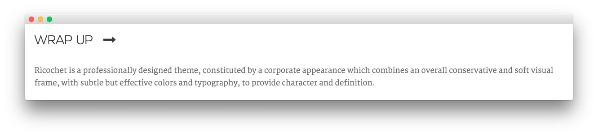

Addition Bottom Section
-----

Here is the widget breakdown for the Addition Bottom section:

#### Text

This section of the page is a standard text widget. You will need to enter the following in the main text field.

~~~ .html
<h6>Ricochet is a professionally designed theme, constituted by a corporate appearance which combines an overall conservative and soft visual frame, with subtle but effective colors and typography, to provide character and definition.</h6>
~~~

Here is a breakdown of options changes you will want to make to match the demo.

* Set the **Title** to `Wrap Up`.
* Enter `fp-additionbottom title5` in the **Custom Variations** field.
* Leaving everything else at its default setting, select **Save**.