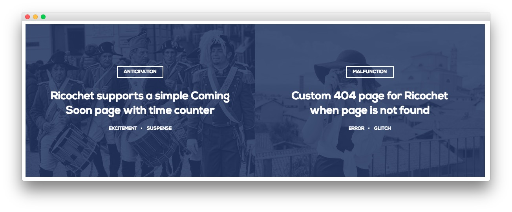

Bottom Section
-----

Here is the widget breakdown for the Bottom section:

#### Text

This section of the page is a standard text widget. You will need to enter the following in the main text field.

~~~ .html

  

    

      

        

          
        

        

          

            Anticipation
            <h2 class="title">Ricochet supports a simple Coming Soon page with time counter</h2>
            <ul class="rt-tags">
              <li>Excitement</li>
              <li>Suspense</li>
            </ul>           
          

        
      
      

    
  
    

      

        

          
        

        

          

            Malfunction
            <h2 class="title">Custom 404 page for Ricochet when page is not found</h2>
            <ul class="rt-tags">
              <li>Error</li>
              <li>Glitch</li>
            </ul>           
          

        
      
      

    
      
  

~~~

Here is a breakdown of options changes you will want to make to match the demo.

* Enter `fp-bottom` in the **Custom Variations** field.
* Leaving everything else at its default setting, select **Save**.
