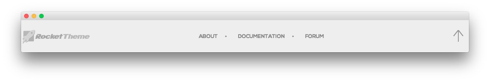

Copyright Section
-----

:   1. **Gantry Branding** [30%, 5%, se]
    2. **Custom Menu** [30%, 41%, se]
    3. **Gantry To Top** [30%, 90%, se]

Here is the widget breakdown for the Footer section:

* Gantry Branding
* Gantry Divider
* Custom Menu
* Gantry Divider
* Gantry To Top

#### Gantry Branding

The Gantry Branding widget does little more than display our logo at the bottom of the page. Simply click and drag the **Gantry Branding** widget into the widget section for this to appear.

#### Custom Menu

The **Custom Menu** widget allows us to add an extra menu somewhere on the page. This menu was created separately from the main menu linked in the header, and can be configured by going to **Administration -> Appearance -> Menus**.

Here is a breakdown of what you will need to change in the widget options to match the demo.

* Set the **Select Menu** option to match the name of the menu you wish to appear in this area.
* Set the **Custom Variations** field to `fp-horizmenu rt-horizmenu`.
* Leaving all other options at their default settings, click **Save**. 

#### Gantry Divider

This widget tells WordPress to start a new widget column beginning with the widget placed directly below the divider in the section.

#### Gantry To Top

The Gantry To Top widget is a simple indicator which allows users to jump to the top of a page with a single click. Just click and drag this widget into the section to activate it.

