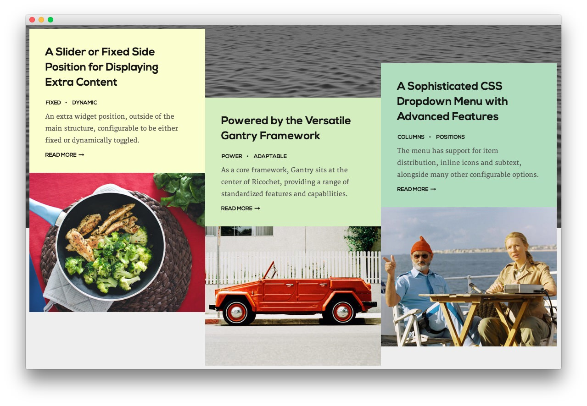

Feature Section
-----

Here is the widget breakdown for the Feature section:

#### Text

This section of the page is a standard text widget. You will need to enter the following in the main text field.

~~~ .html

    

        

            

                

                    <h2>A Slider or Fixed Side Position for Displaying Extra Content</h2>
                    <ul class="rt-tags">
                        <li>Fixed</li>
                        <li>Dynamic</li>
                    </ul>
                    
An extra widget position, outside of the main structure, configurable to be either fixed or dynamically toggled.

                    <a href="http://demo.rockettheme.com/live/wordpress/ricochet/features-overview/" class="readon2">Read More</a>              
                

            

            

                
            

        

        

            

                

                    <h2>Powered by the Versatile Gantry Framework</h2>
                    <ul class="rt-tags">
                        <li>Power</li>
                        <li>Adaptable</li>
                    </ul>                   
                    
As a core framework, Gantry sits at the center of Ricochet, providing a range of standardized features and capabilities.

                    <a href="http://demo.rockettheme.com/live/wordpress/ricochet/features-overview/" class="readon2">Read More</a>  
                
  
            

            

                
            

        

        

            

                

                    <h2>A Sophisticated CSS Dropdown Menu with Advanced Features</h2>
                    <ul class="rt-tags">
                        <li>Columns</li>
                        <li>Positions</li>
                    </ul>                   
                    
The menu has support for item distribution, inline icons and subtext, alongside many other configurable options.

                    <a href="http://demo.rockettheme.com/live/wordpress/ricochet/menu-options/" class="readon2">Read More</a>
                
  
            

            

                
            

        
      
    
  

~~~

Here is a breakdown of options changes you will want to make to match the demo.

* Enter `fp-feature` in the **Custom Variations** field.
* Leaving everything else at its default setting, select **Save**.
