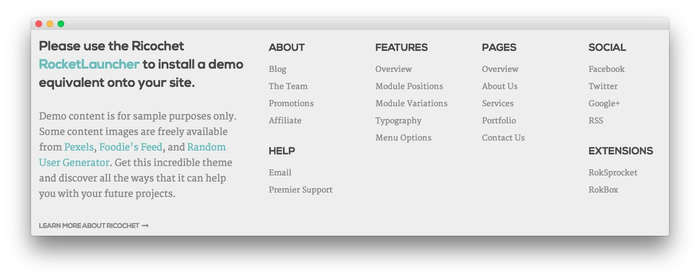

Footer Section
-----

:   1. **Text 1** [18%, 5%, se]
    2. **Text 2** [18%, 37%, se]

Here is the widget breakdown for the Footer section:

* Text
* Gantry Divider
* Text

#### Text 1

This section of the page is a standard text widget. You will need to enter the following in the main text field.

~~~ .html
<h2 class="title">Please use the Ricochet <a href="http://www.rockettheme.com/wordpress/themes/ricochet">RocketLauncher</a> to install a demo equivalent onto your site.</h2>

<h6 class="largemargintop largepaddingtop largemarginbottom largepaddingbottom">Demo content is for sample purposes only. Some content images are freely available from <a href="http://www.pexels.com/">Pexels</a>, <a href="http://foodiesfeed.com/">Foodie's Feed</a>, and <a href="http://randomuser.me/photos.html">Random User Generator</a>. Get this incredible theme and discover all the ways that it can help you with your future projects.</h6>

<a href="http://www.rockettheme.com/wordpress/themes/ricochet" class="readon2">Learn More About Ricochet</a>
~~~

Here is a breakdown of options changes you will want to make to match the demo.

* Enter `fp-footer-a` in the **Custom Variations** field.
* Leaving everything else at its default setting, select **Save**.

#### Gantry Divider

This widget tells WordPress to start a new widget column beginning with the widget placed directly below the divider in the section.

#### Text 2

This section of the page is a standard text widget. You will need to enter the following in the main text field.

~~~ .html

    

        

            

                <h5>About</h5>
                <ul class="rt-noliststyle">
                    <li><a href="http://www.rockettheme.com/blog">Blog</a></li>
                    <li><a href="http://www.rockettheme.com/the-team">The Team</a></li>
                    <li><a href="http://www.rockettheme.com/promotions">Promotions</a></li>
                    <li><a href="http://www.shareasale.com/shareasale.cfm?merchantID=30300">Affiliate</a></li>
                </ul>   
                <h5 class="lmedmargintop largepaddingtop">Help</h5>
                <ul class="rt-noliststyle">
                    <li><a href="http://www.rockettheme.com/contact-us">Email</a></li>
                    <li><a href="http://www.rockettheme.com/purchase-premier-support">Premier Support</a></li>
                </ul>                       
            

        

    

    

        

            

                <h5>Features</h5>
                <ul class="rt-noliststyle">
                <li><a href="index.php?option=com_content&amp;view=article&amp;id=1&amp;Itemid=111">Overview</a></li>
                    <li><a href="index.php?option=com_content&amp;view=article&amp;id=2&amp;Itemid=112">Module Positions</a></li>
                    <li><a href="index.php?option=com_content&amp;view=article&amp;id=3&amp;Itemid=113">Module Variations</a></li>
                    <li><a href="index.php?option=com_content&amp;view=article&amp;id=4&amp;Itemid=114">Typography</a></li>
                    <li><a href="index.php?option=com_content&amp;view=article&amp;id=5&amp;Itemid=115">Menu Options</a></li>
                </ul>       
            

        

    

    

        

            

                <h5>Pages</h5>
                <ul class="rt-noliststyle">
                    <li><a href="index.php?option=com_content&amp;view=article&amp;id=6&amp;Itemid=118">Overview</a></li>
                    <li><a href="index.php?option=com_content&amp;view=article&amp;id=7&amp;Itemid=119">About Us</a></li>
                    <li><a href="index.php?option=com_content&amp;view=article&amp;id=9&amp;Itemid=121">Services</a></li>
                    <li><a href="index.php?option=com_content&amp;view=article&amp;id=11&amp;Itemid=123">Portfolio</a></li>
                    <li><a href="index.php?option=com_contact&amp;view=contact&amp;id=1&amp;Itemid=126">Contact Us</a></li>
                </ul>       
            

        

    
  
    

        

            

                <h5>Social</h5>
                <ul class="rt-noliststyle">
                    <li><a href="https://www.facebook.com/RocketTheme">Facebook</a></li>
                    <li><a href="https://twitter.com/rockettheme">Twitter</a></li>
                    <li><a href="https://plus.google.com/+rockettheme/posts">Google+</a></li>
                    <li><a href="http://www.rockettheme.com/product-updates?rss">RSS</a></li>
                </ul>       
                <h5 class="lmedmargintop largepaddingtop">Extensions</h5>
                <ul class="rt-noliststyle">
                    <li><a href="http://www.rockettheme.com/wordpress/plugins/roksprocket">RokSprocket</a></li>
                    <li><a href="http://www.rockettheme.com/wordpress/plugins/rokbox">RokBox</a></li>
                </ul>   
            

        

    
              

  
~~~

Here is a breakdown of options changes you will want to make to match the demo.

* Enter `fp-footer-b hidden-phone` in the **Custom Variations** field.
* Leaving everything else at its default setting, select **Save**.
