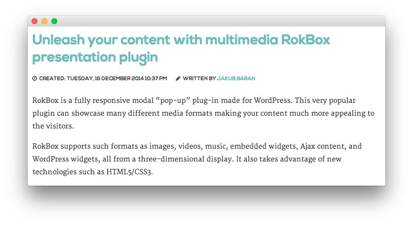
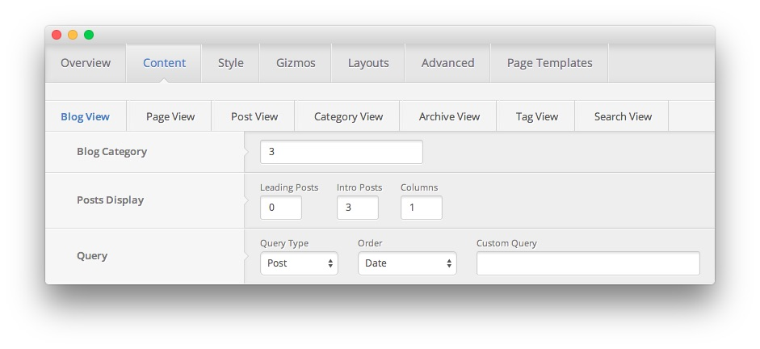

MainBody Section
-----

This area of the front page is the mainbody. It allows you to display featured articles on the front page. There are a couple things that have to be in order in order to see these articles populated in the MainBody section of the page.

First, you will need to have the **Display Mainbody** option set to **On** in your template settings. You can find this option by navigating to **Admin -> Modulus Theme -> Advanced -> Display Mainbody**. You will also want to make sure that the posts you want to display are set in the published status.

By default, WordPress displays the most recent articles in this area of the page. You can assign specific categories to the blog view by navigating to **Admin -> Modulus Theme -> Content -> Blog View -> Blog Category** and entering (comma separated) category IDs. If the field is left blank, the most recent posts will appear.

Below, we have listed the settings of the post titled **Unleash your content with multimedia RokBox presentation plugin**.

|     Option     |                              Settings                             |
| :------------- | :---------------------------------------------------------------- |
| Title          | `Unleash your content with multimedia RokBox presentation plugin` |
| Status         | Published                                                         |
| Tags           | Blank                                                             |
| Featured Image | Blank                                                             |

Most of the magic takes place in the article content:

~~~ .html

RokBox is a fully responsive modal "pop-up" plug-in made for WordPress. This very popular plugin can showcase many different media formats making your content much more appealing to the visitors.

RokBox supports such formats as images, videos, music, embedded widgets, Ajax content, and WordPress widgets, all from a three-dimensional display. It also takes advantage of new technologies such as HTML5/CSS3.

~~~

The settings used to create the layout of this area of the page can be found in **Admin > Modulus Theme > Content > Blog View**. This is where the **Blog Category** is set, telling WordPress which category to place on the front page. The **Post Count** sets the amount of posts showed. The **Leading Posts** sets the amount of posts that are shown in larger, single column layouts, ahead of the two-column post display for the others.
