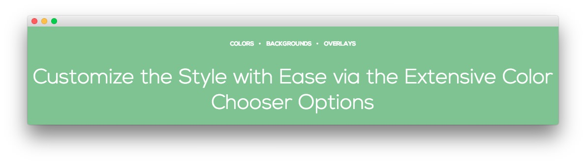

Main Bottom Section
-----

Here is the widget breakdown for the Main Bottom section:

#### Text

This section of the page is a standard text widget. You will need to enter the following in the main text field.

~~~ .html
<ul class="rt-tags">
    <li>Colors</li>
    <li>Backgrounds</li>
    <li>Overlays</li>
</ul>
Customize the Style with Ease via the Extensive Color Chooser Options
~~~

Here is a breakdown of options changes you will want to make to match the demo.

* Switch the **Widget Variations** setting to **RT-Center**.
* Enter `fp-mainbottom` in the **Custom Variations** field.
* Leaving everything else at its default setting, select **Save**.