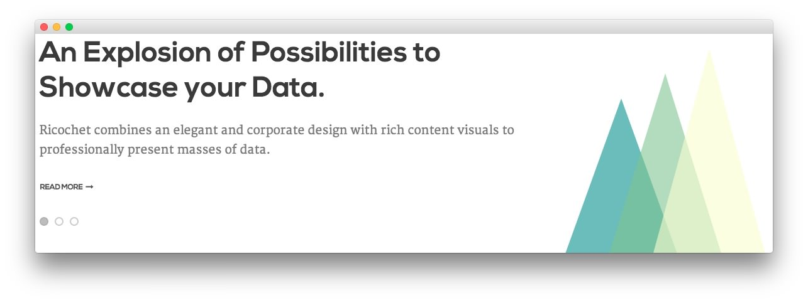

Showcase Section
-----

Here is the widget breakdown for the Showcase section:

#### RokSprocket (Features)

This area of the demo is a RokSprocket widget. You will need to do two things to prepare this widget so that it looks similar to the one in the demo.

First, you will need to create the RokSprocket Widget. You can do this by navigating to **Administration -> RokSprocket Admin** and creating a new **Features** widget.

You can find out more about RokSprocket and how to set up and modify widgets by visiting our [RokSprocket documentation](../../plugins/roksprocket).

##### Simple Provider

We used the **Simple Provider** to enable us to create custom RokSprocket content without having to create separate articles or pages to do so. Here are the details of one of the **Simple Items** in the **Featured Article List**.

| Option |                        Setting                         |
| :----- | :----------------------------------------------------- |
| Title  | `An Explosion of Possibilities to Showcase your Data.` |
| Image  | Custom                                                 |
| Link   | `#`                                                    |

**Description**

~~~ .html

    

        

            
Ricochet combines an elegant and corporate design with rich
            content visuals to professionally present masses of data.

        

        

            
Ricochet combines an elegant and corporate design with rich
            content visuals to professionally present masses of data.

        

    

    

        

            

                

                

                

            

        

    

~~~

Here is a look at the **Features Layout Options** for this widget.

|      Option      |    Setting    |
| :--------------- | :------------ |
| Display Limit    | ∞             |
| Theme            | Showcase      |
| Article Titles   | Show          |
| Article Text     | Show          |
| Preview Length   | ∞             |
| Strip HTML Tags  | No            |
| Arrow Navigation | Show on Hover |
| Pagination       | Show          |
| Animation        | Bottom to Top |
| Autoplay         | Disable       |
| Autoplay Delay   | 5             |
| Image Resize     | Disable       |

You can set the RokSprocket filters to include any category, specific articles, or otherwise you would like to have featured in this widget.

Once you have created this widget, you can add it via the Widgets menu by clicking **RokSprocket** and dragging it to the appropriate section. When you have done this, you will need to complete the following.

* Select your RokSprocket Featured widget in the **Choose Widget** field.
* Enter `fp-roksprocket-features-showcase` in the **Custom Variations** field.
* Leaving everything else at its default setting, select **Save**.

The widget should now be created and ready for use on the front page of your WordPress site.
