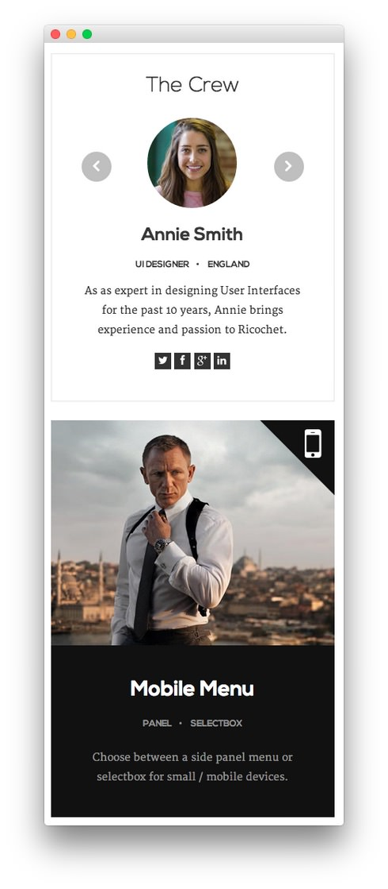

Sidebar Section
-----

:   1. **RokSprocket (Strips)** [8%, 13%, se]
    2. **Text** [49%, 13%, se]

Here is the widget breakdown for the Sidebar section:

* RokSprocket (Strips)
* Text

#### RokSprocket (Strips)

This area of the demo is a RokSprocket widget. You will need to do two things to prepare this widget so that it looks similar to the one in the demo.

First, you will need to create the RokSprocket Widget. You can do this by navigating to **Administration -> RokSprocket Admin** and creating a new **Strips** widget.

You can find out more about RokSprocket and how to set up and modify widgets by visiting our [RokSprocket documentation][roksprocket].

##### Simple Provider

We used the **Simple Provider** to enable us to create custom headline text without having to create separate posts or pages to do so. Here are the details of one of the items in the **Featured Article List**.

| Option | Setting |
| :----- | :------ |
| Title  | None    |
| Image  | Custom  |
| Link   | None    |

**Description**

~~~ .html
<h2 class="title nomarginall">Annie Smith</h2>

<ul class="rt-tags">
    <li>UI Designer</li>

    <li>England</li>
</ul>

As as expert in designing User Interfaces for the
past 10 years, Annie brings experience and passion to Ricochet.

    <a class="social-button" href="#" target="_blank"></a> <a class="social-button" href="#" target=
    "_blank"></a> <a class="social-button"
    href="#" target="_blank"></a>
    <a class="social-button" href="#" target="_blank"></a>

~~~

Here is a look at the **Strips Layout Options** for this widget.

| Option            | Setting      |
| :----------       | :----------  |
| Theme             | Default      |
| Display Limit     | ∞            |
| Preview Length    | ∞            |
| Strip HTML Tags   | No           |
| Previews Per Page | 1            |
| Items Per Row     | 1            |
| Arrow Navigation  | Show         |
| Pagination        | Hide         |
| Animation         | Fade Delayed |
| Autoplay          | Disable      |
| Autoplay Delay    | 5            |
| Image Resize      | Disable      |

You can set the RokSprocket filters to include any category, specific posts, or otherwise you would like to have featured in this widget.

Once you have created this widget, you can add it via the Widgets menu by clicking **RokSprocket** and dragging it to the appropriate section. When you have done this, you will need to complete the following.

* Select your RokSprocket Featured widget in the **Choose Widget** field.
* Enter `The Crew` in the **Title** field.
* Set the **Widget Variations** to **RT-Center**.
* Enter `fp-roksprocket-strips-sidebar title6 box6` in the **Custom Variations** field.
* Leaving everything else at its default setting, select **Save**.

The widget should now be created and ready for use on the front page of your WordPress site.

#### Text

This section of the page is a standard text widget. You will need to enter the following in the main text field.

~~~ .html

    
    

    

        <h2 class="title">Mobile Menu</h2>
        <ul class="rt-tags">
            <li>Panel</li>
            <li>SelectBox</li>
        </ul>
        
Choose between a side panel menu or selectbox for small / mobile devices.
             
    

~~~

Here is a breakdown of options changes you will want to make to match the demo.

* Switch the **Widget Variations** option to **Box 4, RT-Center, No Padding All**.
* Enter `fp-sidebar` in the **Custom Variations** field.
* Leaving everything else at its default setting, select **Save**.
