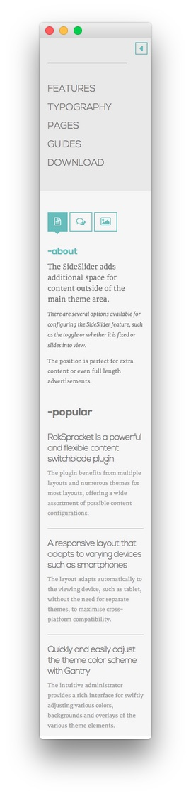

SideSlider Section
-----

:   1. **SideSlider - Search** [5%, 21%, se]
    2. **SideSlider - Menu** [9%, 21%, se]
    3. **SideSlider - RokSprocket (Tabs)** [26%, 21%, se]
    4. **Text** [51%, 21%, se]

The **SideSlider** widget position enables you to add widgets to the page that get out of the way of the content, but are available to visitors with a simple click. We used four widgets in our demo, all of which are listed below along with their details.

1. [Search](demo_sideslider.md#search)
2. [Menu](demo_sideslider.md#menu)
3. [RokSprocket (Tabs)](demo_sideslider.md#roksprocket-(tabs))
4. [Text](demo_sideslider.md#text)

#### Search

The first part of our SideSlider is a simple **Search** widget. Here are the options used in our demo.

|       Option      |    Setting    |
| :---------------- | :------------ |
| Title             | Blank         |
| Widget Variations | None Selected |
| Custom Chrome     | -             |
| Custom Variations | `fp-search`   |

#### Custom Menu

The **Custom Menu** widget allows us to add an extra menu somewhere on the page. This menu was created separately from the main menu linked in the header, and can be configured by going to **Administration -> Appearance -> Menus**.

Here is a breakdown of what you will need to change in the widget options to match the demo.

* Set the **Select Menu** option to match the name of the menu you wish to appear in this area.
* Set the **Custom Variations** field to `fp-menu`.
* Leaving all other options at their default settings, click **Save**.

#### RokSprocket (Tabs)

You will need to do two things to prepare this widget so that it looks similar to the one in the demo.

First, you will need to create the RokSprocket Widget. You can do this by navigating to **Administration -> RokSprocket Admin** and creating a new **Tabs** widget.

You can find out more about RokSprocket and how to set up and modify widgets by visiting our [RokSprocket documentation](../../plugins/roksprocket).

**Simple Content Provider**

We used the **Simple** Content Provider to allow us to make custom tabs without having to build posts on the back-end. In this case, the **Tab Label**, **Link**, and **Description** are custom, while the other options are left at default or **None** settings. You will find the settings used in one of these items below.

*Tab Label*

~~~ .html

~~~

*Description*

~~~ .html
<h2 class="title"><a href="#">-about</a></h2>

<h5>The SideSlider adds additional space for content outside of the main theme
area.</h5>

<em>There are several options available for configuring the SideSlider
feature, such as the toggle or whether it is fixed or slides into
view.</em>

The position is perfect for extra content or even full length
advertisements.

~~~

Here is a look at the **Tabs Layout Options** for this widget.

| Option          | Setting        |
| :-------------- | :------------  |
| Theme           | Default        |
| Display Limit   | ∞              |
| Tabs Position   | Top            |
| Animation       | Slide and Fade |
| Autoplay        | Disable        |
| Autoplay Delay  | 5              |
| Image Resize    | Disable        |
| Preview Length  | 0              |
| Strip HTML Tags | No             |

You can set the RokSprocket filters to include any category, specific posts, or otherwise you would like to have featured in this widget.

Once you have created this widget, you can add it via the Widgets menu by clicking **RokSprocket** and dragging it to the appropriate section. When you have done this, you will need to complete the following.

* Select your RokSprocket Tabs widget in the **Choose Widget** field.
* Enter `fp-roksprocket-tabs-sideslider` in the **Custom Variations** field.
* Leaving everything else at its default setting, select **Save**.

The widget should now be created and ready for use on the front page of your WordPress site.

#### Text

This section of the page is a standard text widget. You will need to enter the following in the main text field.

~~~ .html

 
    <h3 class="newsflash-titlefp-newsflash">
        <a href="#">
        RokSprocket is a powerful and flexible content switchblade plugin</a>
    </h3>
    The plugin benefits from multiple layouts and numerous themes for most layouts, offering a wide assortment of possible content configurations.      
    <h3 class="newsflash-titlefp-newsflash">
        <a href="#">
        A responsive layout that adapts to varying devices such as smartphones</a>
    </h3>
    The layout adapts automatically to the viewing device, such as tablet, without the need for separate themes, to maximise cross-platform compatibility.      
    <h3 class="newsflash-titlefp-newsflash">
        <a href="#">
        Quickly and easily adjust the theme color scheme with Gantry</a>
    </h3>
    The intuitive administrator provides a rich interface for swiftly adjusting various colors, backgrounds and overlays of the various theme elements.

~~~

Here is a breakdown of options changes you will want to make to match the demo.

* Set the **Title** to `-popular`.
* Enter `fp-newsflash` in the **Custom Variations** field.
* Leaving everything else at its default setting, select **Save**.
