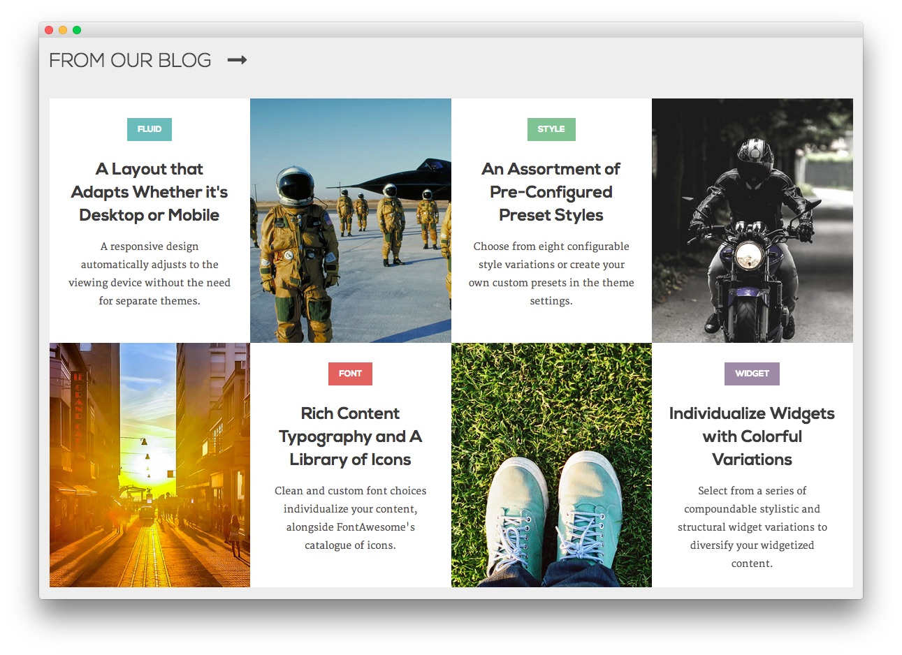

Utility Section
-----

Here is the widget breakdown for the Utility section:

#### RokSprocket (Grids)

This area of the demo is a RokSprocket widget. You will need to do two things to prepare this widget so that it looks similar to the one in the demo.

First, you will need to create the RokSprocket Widget. You can do this by navigating to **Administration -> RokSprocket Admin** and creating a new **Grids** widget.

You can find out more about RokSprocket and how to set up and modify widgets by visiting our [RokSprocket documentation](../../plugins/roksprocket).

**Simple Content Provider**

In this instance, we used the **Simple** content provider in order to allow us to create custom items, without having to create posts to connect them to. The **Title** and **Description** fields of these items are custom, with custom images set, as well. Any tags set appear below the description on the frontend.

**Title**

~~~ .html
Fluid A Layout that Adapts Whether it's Desktop or Mobile
~~~

**Description**

~~~ .html
A responsive design automatically adjusts to the viewing device without the need for separate themes.
~~~

Here is a look at the **Grids Layout Options** for this widget.

|      Option     |           Setting            |
| :-------------- | :--------------------------- |
| Theme           | Basic                        |
| Display Limit   | ∞                            |
| Columns         | 4                            |
| Preview Length  | 20                           |
| Strip HTML Tags | No                           |
| Block Animation | Fade, Scale, Rotate          |
| Ordering        | Default, Title, Date, Random |
| Image Resize    | Disable                      |

Once you have created this widget, you can add it via the Widgets menu by clicking **RokSprocket** and dragging it to the appropriate section. When you have done this, you will need to complete the following.

* Select your RokSprocket Grids widget in the **Choose Widget** field.
* Enter `From Our Blog` in the **Title** field.
* Enter `fp-roksprocket-grids-utility title5` in the **Custom Variations** field.
* Leaving everything else at its default setting, select **Save**.

The widget should now be created and ready for use on the front page of your WordPress site.