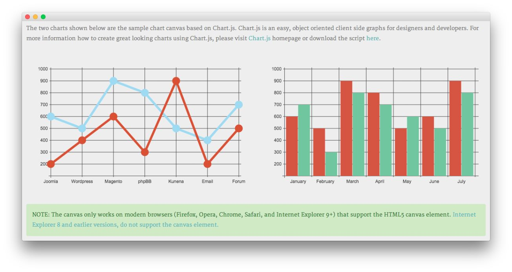
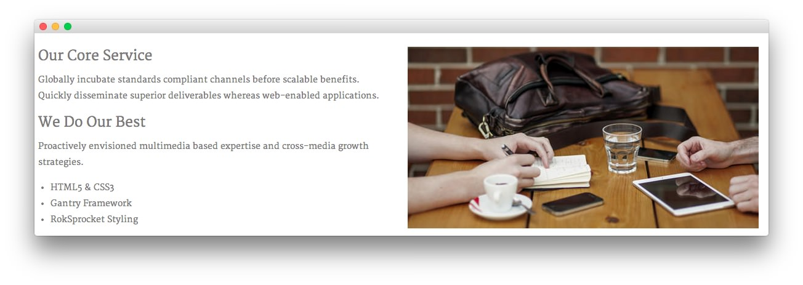
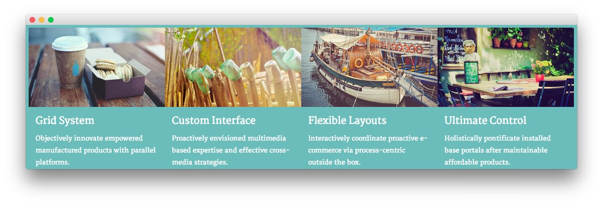
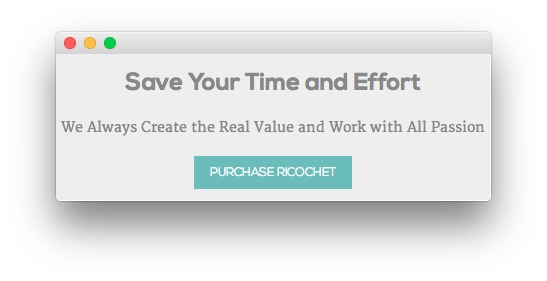

Introduction
-----

The **Services** example page demonstrates how you can create a beautiful page with the Ricochet theme. Here is some information to help you replicate this page as it appears in the demo.

Theme Override Options
-----

The **Services** page is a regular **Page**. To recreate the layout the way it appears in our demo, enter `menu-services` in the **Page Suffix** field in the **Gizmos** page inside the **Ricochet** theme settings. This suffix is tied to a class in the demo.less file that sets the page up so it appears the way it does in the demo.

In order for this to work, you should have the **Page Suffix** option set to **On** in **Admin > Ricochet > Gizmos**. You will likely need to create a theme override specifically for the page before assigning that suffix to it. For more information on creating theme overrides, visit our [Gantry Documentation][gantrydocs]

Mainbody
-----

The page's content body is set in the **Services** page. You will find the content used in the page below.

~~~ .html
<h3>Why Should You Choose Us?</h3>

Efficiently unleash cross-media information without cross-media value. Quickly maximize timely deliverables for real-time schemas. Dramatically maintain clicks-and-mortar solutions without functional solutions.

Completely synergize resource sucking relationships via premier niche markets. Professionally cultivate one-to-one customer service with robust ideas. Dynamically innovate resource-leveling customer service for state of the art customer service.

<a href="http://www.rockettheme.com/wordpress-themes/ricochet" class="readon">Learn More</a>

~~~

Widgets
-----

Below is a brief rundown of the widgets used to make up the demo page. ricochet

:   1. **Feature - Text** [10%, 45%, se]
    2. **Breadcrumbs** [16%, 16%, se]
    3. **Utility - Text** [19%, 16%, se]
    4. **Expanded Top - Text** [38%, 16%, se]
    5. **Main Top - Text** [50%, 16%, se]
    6. **Extension - Text** [62%, 35%, se]
    7. **Mainbody** [68%, 16%, se]
    8. **Footer - Text** [80%, 16%, se]
    9. **Footer - Text** [80%, 52%, se]

1. [Feature - Text](services.md#showcase-section)
2. [Breadcrumbs](services.md#breadcrumbs-section)
3. [Utility - Text](services.md#feature-section)
4. [Expanded Top](services.md#expanded-top-section)
5. [Main Top - Text](services.md#main-top-section)
6. [Extension - Text](services.md#extension-section)
7. [Mainbody](services.md#mainbody)
8. [Footer - Text](services.md#footer-section)
9. [Footer - Text](services.md#footer-section)

Feature Section
-----

Here is the widget breakdown for the Feature section:

#### Text

This section of the page is a standard text widget. You will need to enter the following in the main text field.

~~~ .html
&nbsp;
~~~

Here is a breakdown of options changes you will want to make to match the demo.

* Set the **Title** to `Services[span class="rt-title-tag"]What We Can Do[/span]`.
* Switch the **Widget Variations** option to **RT-Center, No Margin All**.
* Enter `rt-title-large rt-nomodulecontent rt-top-large-padding` in the **Custom Variations** field.
* Leaving everything else at its default setting, select **Save**.

Breadcrumbs Section
-----

#### Gantry Breadcrumbs

The **Gantry Breadcrumbs** widget gives you the ability to present page-aware breadcrumbs on the page. All you need to do to add them is to drag the **Gantry Breadcrumbs** widget from the **Available Widgets** area to the **Breadcrumbs** widget position.

Utility Section
-----

Here is the widget breakdown for the Utility section:

#### Text

This section of the page is a standard text widget. You will need to enter the following in the main text field.

~~~ .html

The two charts shown below are the sample chart canvas based on Chart.js. Chart.js is an easy, object oriented client side graphs for designers and developers. For more information how to create great looking charts using Chart.js, please visit <a href="http://www.chartjs.org/">Chart.js</a> homepage or download the script <a href="https://github.com/nnnick/Chart.js">here</a>.

 

    

    

        

            <canvas id="myChart-a" width="600" height="320"></canvas>

            
        

    

    

        

            <canvas id="myChart-b" width="600" height="320"></canvas>

            
        

    

 

NOTE: The canvas only works on modern browsers (Firefox, Opera, Chrome, Safari, and Internet Explorer 9+) that support the HTML5 canvas element. <a target="_blank" href="http://www.w3schools.com/html/html5_canvas.asp">Internet Explorer 8 and earlier versions, do not support the canvas element.</a>

~~~

Here is a breakdown of options changes you will want to make to match the demo.

* Switch the **Widget Variations** option to **Box 4, No Margin All**.
* Leaving everything else at its default setting, select **Save**.

Expanded Top Section
-----

Here is a breakdown for the **Expanded Top** section:

#### Text 1

This section of the page is a standard text widget. You will need to enter the following in the main text field.

~~~ .html

    

    

        

            <h3>Our Core Service</h3>
            
Globally incubate standards compliant channels before scalable benefits. Quickly disseminate superior deliverables whereas web-enabled applications.

            

                <h3>We Do Our Best</h3>
                
Proactively envisioned multimedia based expertise and cross-media growth strategies.

                <ul>
                    <li>HTML5 &amp; CSS3</li>
                    <li>Gantry Framework</li>
                    <li>RokSprocket Styling</li>
                </ul>
            

        

    

    

        

            
        

    
  

~~~

Here is a breakdown of options changes you will want to make to match the demo.

* Enter `rt-title-center` in the **Custom Variations** field.
* Leaving everything else at its default setting, select **Save**.

Main Top Section
-----

Here is a breakdown for the **Main Top** section:

#### Text

This section of the page is a standard text widget. You will need to enter the following in the main text field.

~~~ .html

    

    
    

        <h4>Grid System</h4>
        
Objectively innovate empowered manufactured products with parallel platforms.

    

        
    

        <h4>Custom Interface</h4>
        
Proactively envisioned multimedia based expertise and effective cross-media strategies.

    

    
    

        <h4>Flexible Layouts</h4>
        
Interactively coordinate proactive e-commerce via process-centric outside the box.

    

    
    

        <h4>Ultimate Control</h4>
        
Holistically pontificate installed base portals after maintainable affordable products.

    

~~~

Here is a breakdown of options changes you will want to make to match the demo.

* Set the **Widget Variations** option to **No Padding All**.
* Leaving everything else at its default setting, select **Save**.

Extension Section
-----

Here is a breakdown for the **Extension** section:

#### Text

This section of the page is a standard text widget. You will need to enter the following in the main text field.

~~~ .html

We Always Create the Real Value and Work with All Passion

<a href="www.rockettheme.com/wordpress-themes/ricochet" class="readon">Purchase Ricochet</a>

~~~

Here is a breakdown of options changes you will want to make to match the demo.

* Set the **Title** to `Save Your Time and Effort`.
* Set the **Widget Variations** option to **RT-Center**.
* Leaving everything else at its default setting, select **Save**.

Footer Section
-----

:   1. **Text 1** [20%, 5%, se]
    2. **Text 2** [20%, 52%, se]

#### Text 1

This section of the page is a standard text widget. You will need to enter the following in the main text field.

~~~ .html

These examples are intended to show how Ricochet can be constructed on your site, above and beyond the frontpage demonstration. These include WordPress content with varying widgetized content, mainbody widths and page lengths.

All demo content is for sample purpose only, intended to show a live site. Use the <a href="http://www.rockettheme.com/wordpress/themes/ricochet">Ricochet RocketLauncher</a> to install an equivalent of the demo onto your site.

~~~

Here is a breakdown of options changes you will want to make to match the demo.

* Set the **Title** to `Ricochet Demo`.
* Enter `rt-phone-center` in the **Custom Variations** field.
* Leaving everything else at its default setting, select **Save**.

#### Text 2

This section of the page is a standard text widget. You will need to enter the following in the main text field.

~~~ .html

Completely synergize resource sucking relationships via premier niche markets. Professionally cultivate one-to-one customer service with robust ideas.

    

        

            
        
  
    

    

        

            +1(123)456-5555-555 
            Ricochet Theme, LLC 
            123 WordPress Boulevard 
            Seattle, WA 00000, USA 
            <a href="#">noreply@domain.com</a>
        

    

~~~

Here is a breakdown of options changes you will want to make to match the demo.

* Set the **Title** to `Sample Contact Info`.
* Enter `rt-phone-center` in the **Custom Variations** field.
* Leaving everything else at its default setting, select **Save**.

[servicesmenu]: assets/page_services_menu.jpeg
[header]: demo_header.md
[top]: demo_top.md
[copyright]: demo_copyright.md
[gantrydocs]: http://docs.gantry.org/gantry4/configure
