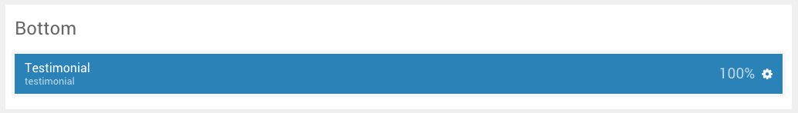

## Introduction

The **Bottom** section includes a single **Testimonial** particle.

Here is a breakdown of the widget(s) and particle(s) that appear in this section:

* [Testimonial (particle)](#testimonial-(particle))

## Section Settings

| Option         | Setting   |
| :-----         | :-----    |
| Layout         | Fullwidth |
| CSS Classes    | Blank     |
| Tag Attributes | Blank     |

## Testimonial (Particle)

We used a **Testimonial** particle to make up this area of the front page.

You will find the particle settings used in this particle below:

### Particle Settings

| Option                      | Setting                                                                                                                                                                                                                                     |
| :-----                      | :-----                                                                                                                                                                                                                                      |
| Particle Name               | `Testimonial`                                                                                                                                                                                                                               |
| CSS Classes                 | Blank                                                                                                                                                                                                                                       |
| Title                       | `Testimonial`                                                                                                                                                                                                                               |
| Intro                       | Blank                                                                                                                                                                                                                                       |
| Grid Column                 | 1 Column                                                                                                                                                                                                                                    |
| Testimonials Item 1 Name    | `Eddie Lobanovsky`                                                                                                                                                                                                                          |
| Testimonials Item 1 Content | `The Gantry 5 Framework is an ideal platform for users of all levels, whether beginners or web professionals. The administrative interface is both simple to use, intuitive and highly flexible, allowing for swift and extensive changes.` |
| Testimonials Item 1 Author  | `Eddie Lobanovsky`                                                                                                                                                                                                                          |
| Testimonials Item 1 Company | `Super Corporation`                                                                                                                                                                                                                         |
| Testimonials Item 1 Link    | `#`                                                                                                                                                                                                                                         |

### Block Settings

| Option         | Setting   |
| :-----         | :-----    |
| CSS ID         | Blank     |
| CSS Classes    | Blank     |
| Variations     | `Title 1` |
| Tag Attributes | Blank     |
| Fixed Size     | Unchecked |
| Block Size     | `100%`    |
