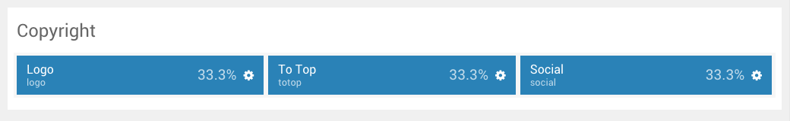
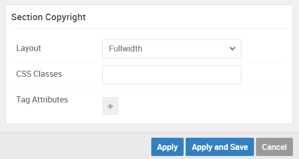

## Introduction

:	1. **Logo (Particle)** [20%, 3%, se]
	2. **To Top (Particle)** [20%, 20%, se]
	3. **Social (Particle)** [20%, 87%, se]

The **Copyright** section includes three particles, `Logo`, `To Top`, and `Social`. 

Here is a breakdown of the widget(s) and particle(s) that appear in this section:

* [Logo (particle)](#logo-(particle))
* [To Top (particle)](#to-top-(particle))
* [Social (particle)](#social-(particle))

## Section Settings

| Option         | Setting   |
| :-----         | :-----    |
| Layout         | Fullwidth |
| CSS Classes    | Blank     |
| Tag Attributes | Blank     |

## Logo (Particle)

We used a **Logo** particle to make up this area of the front page.

You will find the particle settings used in this particle below:

### Particle Settings

| Option      | Setting         |
| :-----      | :-----          |
| URL         | Blank           |
| Rel         | `home`          |
| Image       | Custom          |
| Alt         | `salient`       |
| Text        | Blank           |
| CSS Classes | `g-footer-logo` |

### Block Settings

| Option         | Setting   |
| :-----         | :-----    |
| CSS ID         | Blank     |
| CSS Classes    | Blank     |
| Variations     | Blank     |
| Tag Attributes | Blank     |
| Fixed Size     | Unchecked |
| Block Size     | `33.3%`   |

## To Top (Particle)

We used a **To Top** particle to make up this area of the front page.

You will find the particle settings used in this particle below:

### Particle Settings

| Option      | Setting                                      |
| :-----      | :-----                                       |
| CSS Classes | `totop`                                      |
| Icon        | Blank                                        |
| Text        | `` |

### Block Settings

| Option         | Setting   |
| :-----         | :-----    |
| CSS ID         | Blank     |
| CSS Classes    | Blank     |
| Variations     | Blank     |
| Tag Attributes | Blank     |
| Fixed Size     | Unchecked |
| Block Size     | `33.3%`   |

## Social (Particle)

We used a **Social** particle to make up this area of the front page.

You will find the particle settings used in this particle below:

### Particle Settings

| Option             | Setting                          |
| :-----             | :-----                           |
| CSS Classes        | `social-items`                   |
| Title              | Blank                            |
| Target             | New Window                       |
| Social Item 1 Name | `Twitter`                        |
| Social Item 1 Icon | `fa fa-twitter fa-fw`            |
| Social Item 1 Text | Blank                            |
| Social Item 1 Link | `http://twitter.com/rockettheme` |

### Block Settings

| Option         | Setting   |
| :-----         | :-----    |
| CSS ID         | Blank     |
| CSS Classes    | Blank     |
| Variations     | Blank     |
| Tag Attributes | Blank     |
| Fixed Size     | Unchecked |
| Block Size     | `33.3%`   |