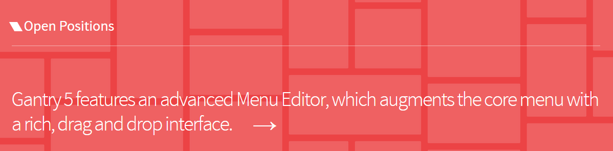
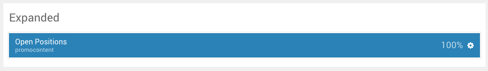
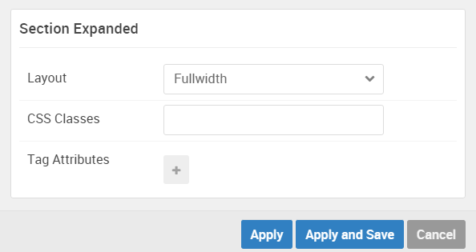

## Introduction

The **Expanded** section includes a single **Promo Content** particle. 

Here is a breakdown of the widget(s) and particle(s) that appear in this section:

* [Promo Content (particle)](#promo-content-(particle))

## Section Settings

| Option         | Setting   |
| :-----         | :-----    |
| Layout         | Fullwidth |
| CSS Classes    | Blank     |
| Tag Attributes | Blank     |

## Promo Content (Particle)

We used a **Promo Content** particle to make up this area of the front page.

You will find the particle settings used in this particle below:

### Particle Settings

| Option           | Setting                                                                                                          |
| :-----           | :-----                                                                                                           |
| Particle Name    | `Open Positions`                                                                                                 |
| CSS Classes      | Blank                                                                                                            |
| Title            | `Open Positions`                                                                                                 |
| Promo Style      | Sub Promo                                                                                                        |
| Promo Text       | `Gantry 5 features an advanced Menu Editor, which augments the core menu with a rich, drag and drop interface. ` |
| Description      | Blank                                                                                                            |
| Readmore Text    | `&rarr;`                                                                                                         |
| Readmore Classes | `button-arrow`                                                                                                   |
| Link             | `#`                                                                                                              |
| Readmore Style   | Inline                                                                                                           |
| Tags             | Blank                                                                                                            |

### Block Settings

| Option         | Setting   |
| :-----         | :-----    |
| CSS ID         | Blank     |
| CSS Classes    | Blank     |
| Variations     | `Title 1` |
| Tag Attributes | Blank     |
| Fixed Size     | Unchecked |
| Block Size     | `100%`    |
