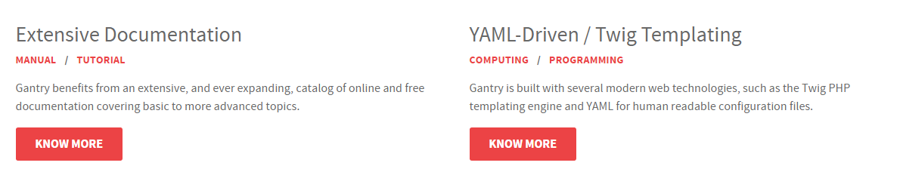
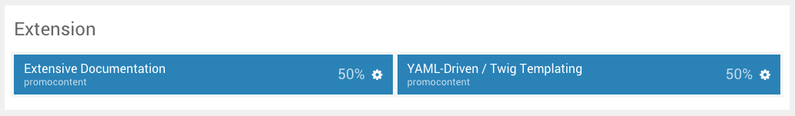
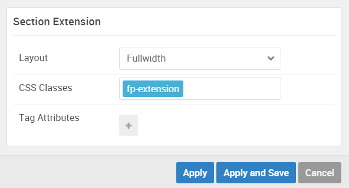

## Introduction

The **Extension** section includes two **Promo Content** particles.

Here is a breakdown of the widget(s) and particle(s) that appear in this section:

* [Promo Content (particle)](#promo-content-(particle)-1)
* [Promo Content (particle)](#promo-content-(particle)-2)

## Section Settings

| Option         | Setting   |
| :-----         | :-----    |
| Layout         | Fullwidth |
| CSS Classes    | Blank     |
| Tag Attributes | Blank     |

## Promo Content (Particle) 1

We used a **Promo Content** particle to make up this area of the front page.

You will find the particle settings used in this particle below:

### Particle Settings

| Option           | Setting                                                                                                                                          |
| :-----           | :-----                                                                                                                                           |
| Particle Name    | `Extensive Documentation`                                                                                                                        |
| CSS Classes      | Blank                                                                                                                                            |
| Title            | `Extensive Documentation`                                                                                                                        |
| Promo Style      | Standard                                                                                                                                         |
| Promo Text       | Blank                                                                                                                                            |
| Description      | `
Gantry benefits from an extensive, and ever expanding, catalog of online and free documentation covering basic to more advanced topics.
` |
| Readmore Text    | `Know More`                                                                                                                                      |
| Readmore Classes | Blank                                                                                                                                            |
| Link             | `#`                                                                                                                                              |
| Readmore Style   | Block                                                                                                                                            |
| Tag Item 1 Name  | `Manual`                                                                                                                                         |
| Tag Item 1 Icon  | Blank                                                                                                                                            |
| Tag Item 1 Title | `Manual`                                                                                                                                         |
| Tag Item 1 Link  | `#`                                                                                                                                              |

### Block Settings

| Option         | Setting   |
| :-----         | :-----    |
| CSS ID         | Blank     |
| CSS Classes    | Blank     |
| Variations     | Blank     |
| Tag Attributes | Blank     |
| Fixed Size     | Unchecked |
| Block Size     | `50%`    |

## Promo Content (Particle) 2

We used a **Promo Content** particle to make up this area of the front page.

You will find the particle settings used in this particle below:

### Particle Settings

| Option           | Setting                                                                                                                                                |
| :-----           | :-----                                                                                                                                                 |
| Particle Name    | `YAML-Driven / Twig Templating`                                                                                                                        |
| CSS Classes      | Blank                                                                                                                                                  |
| Title            | `YAML-Driven / Twig Templating`                                                                                                                        |
| Promo Style      | Promo                                                                                                                                                  |
| Promo Text       | Blank                                                                                                                                                  |
| Description      | `
Gantry is built with several modern web technologies, such as the Twig PHP templating engine and YAML for human readable configuration files.
` |
| Readmore Text    | `Know More`                                                                                                                                            |
| Readmore Classes | Blank                                                                                                                                                  |
| Link             | `#`                                                                                                                                                    |
| Readmore Style   | Block                                                                                                                                                  |
| Tag Item 1 Name  | `Computing`                                                                                                                                            |
| Tag Item 1 Icon  | Blank                                                                                                                                                  |
| Tag Item 1 Title | `Computing`                                                                                                                                            |
| Tag Item 1 Link  | `#`                                                                                                                                                    |

### Block Settings

| Option         | Setting   |
| :-----         | :-----    |
| CSS ID         | Blank     |
| CSS Classes    | Blank     |
| Variations     | Blank     |
| Tag Attributes | Blank     |
| Fixed Size     | Unchecked |
| Block Size     | `50%`     |
