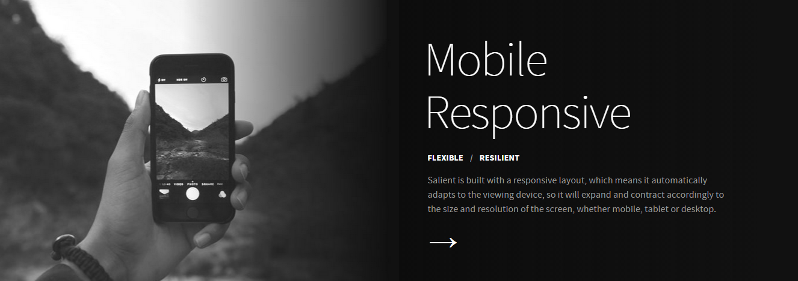
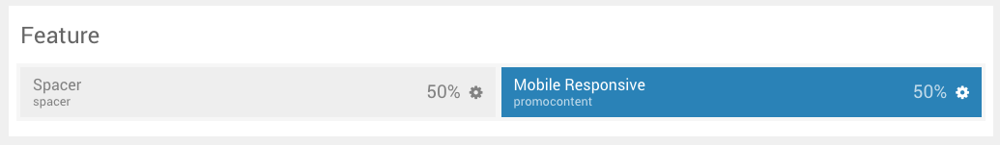
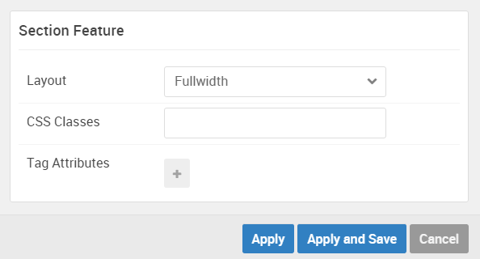

## Introduction

The **Feature** section includes one **Promo Content** particle. It also includes a spacer, set at 50% width to the left of the widget position. Both the spacer and the widget position can be set up using the **Layout Manager**.

Here is a breakdown of the widget(s) and particle(s) that appear in this section:

* [Spacer (position)](#spacer-(positions-particle))
* [Promo Content (particle)](#promo-content-(particle))

## Section Settings

| Option         | Setting   |
| :-----         | :-----    |
| Layout         | Fullwidth |
| CSS Classes    | Blank     |
| Tag Attributes | Blank     |

## Background Image

The background image seen to the right of the content area of the section is set in the **Styles** tab within the Gantry administrator.

## Spacer (positions particle)

#### Particle Settings

#### Block Settings

| Option         | Setting |
| :-----         | :-----  |
| CSS ID         | Blank   |
| CSS Classes    | Blank   |
| Variations     | Blank   |
| Tag Attributes | Blank   |
| Block Size     | `50%`   |

## Promo Content (Particle)

We used a **Promo Content** particle to make up this area of the front page.

You will find the particle settings used in this particle below:

### Particle Settings

| Option           | Setting                                                                                                                                                                                                                    |
| :-----           | :-----                                                                                                                                                                                                                     |
| Particle Name    | `Mobile Responsive`                                                                                                                                                                                                   |
| CSS Classes      | Blank                                                                                                                                                                                                                      |
| Title            | Blank                                                                                                                                                                                                                      |
| Promo Style      | Super Promo                                                                                                                                                                                                                |
| Promo Text       | `Mobile  Responsive` |
| Description      | `
Salient is built with a responsive layout, which means it automatically adapts to the viewing device, so it will expand and contract accordingly to the size and resolution of the screen, whether mobile, tablet or desktop.
`                                                                                                                                                                                                                      |
| Readmore Text    | `&rarr;`                                                                                                                                                                                                                   |
| Readmore Classes | `button-arrow` `nopaddingall`                                                                                                                                                                                              |
| Link             | `#`                                                                                                                                                                                                                        |
| Readmore Style   | Aside                                                                                                                                                                                                                      |
| Tag Item 1 Name  | `Flexible`                                                                                                                                                                                                                |
| Tag Item 1 Icon  | Blank                                                                                                                                                                                                                      |
| Tag Item 1 Text  | `Flexible`                                                                                                                                                                                                                |
| Tag Item 1 Link  | `#`                                                                                                                                                                                                                        |

### Block Settings

| Option         | Setting   |
| :-----         | :-----    |
| CSS ID         | Blank     |
| CSS Classes    | Blank     |
| Variations     | Blank     |
| Tag Attributes | Blank     |
| Fixed Size     | Unchecked |
| Block Size     | `50%`     |