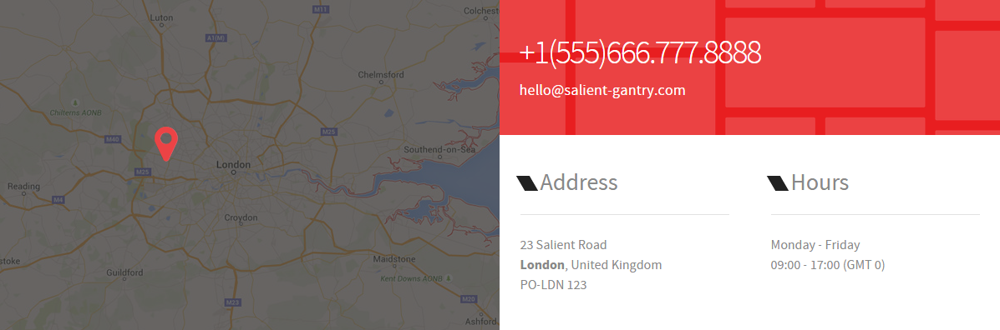
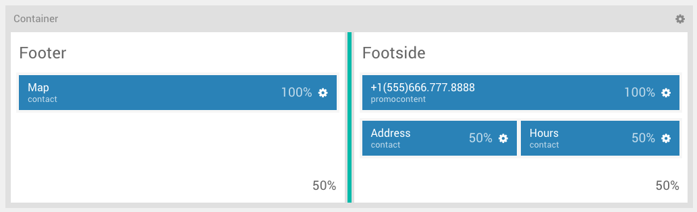
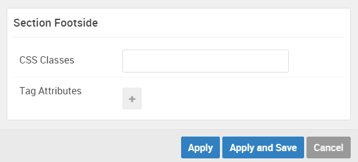

## Introduction

The **Footer / Footside** sections include four particles.

Here is a breakdown of the widget(s) and particle(s) that appear in this section:

* [Contact (particle)](#gantry-5-particle-(contact)-1)
* [Promo Content (particle)](#gantry-5-particle-(promo-content))
* [Contact (particle)](#gantry-5-particle-(contact)-2)
* [Contact (particle)](#gantry-5-particle-(contact)-3)

## Section Settings

| Option         | Setting   |
| :-----         | :-----    |
| Section Width  | `50%`     |
| Layout         | Fullwidth |
| CSS Classes    | Blank     |
| Tag Attributes | Blank     |

| Option         | Setting   |
| :-----         | :-----    |
| Section Width  | `50%`     |
| Layout         | Fullwidth |
| CSS Classes    | Blank     |
| Tag Attributes | Blank     |

## Contact (Particle) 1

This area of the page is made up of a **Contact** particle.

You will find the particle settings used in this particle below:

### Particle Settings

| Option                     | Setting                  |
| :-----                     | :-----                   |
| CSS Classes                | Blank                    |
| Title                      | Blank                    |
| Contact Items              | Blank                    |
| Map Position               | Top                      |
| Maps Item 1 Name           | London                   |
| Maps Item 1 Image          | Custom                   |
| Maps Item 1 Enable Overlay | Enabled                  |
| Maps Item 1 Enable Marker  | Enabled                  |
| Maps Item 1 Marker Icon    | `fa fa-map-marker fa-fw` |
| Maps Item 1 Map Min-Height | `400px`                  |
| Maps Item 1 Top Position   | `140px`                  |
| Maps Item 1 Left Position  | `170px`                  |

### Block Settings

| Option         | Setting                  |
| :-----         | :-----                   |
| CSS ID         | Blank                    |
| CSS Classes    | Blank                    |
| Variations     | `No Margin` `No Padding` |
| Tag Attributes | Blank                    |
| Block Size     | `100%`                   |

## Promo Content (Particle)

This area of the page is made up of a **Promo Content** particle.

You will find the particle settings used in this particle below:

### Particle Settings

| Option           | Setting                           |
| :-----           | :-----                            |
| CSS Classes      | Blank                             |
| Title            | `+1(555)666.777.8888`             |
| Promo Style      | Sub Promo                         |
| Promo Text       | Blank                             |
| Description      | `
hello@salient-gantry.com
` |
| Readmore Text    | Blank                             |
| Readmore Classes | Blank                             |
| Link             | Blank                             |
| Readmore Style   | Block                             |
| Tags             | Blank                             |

### Block Settings

| Option         | Setting                  |
| :-----         | :-----                   |
| CSS ID         | Blank                    |
| CSS Classes    | Blank                    |
| Variations     | `No Margin` `No Padding` |
| Tag Attributes | Blank                    |
| Block Size     | `100%`                   |

## Contact (Particle) 2

This area of the page is made up of a **Contact** particle.

You will find the particle settings used in this particle below:

##### Particle Settings

| Option               | Setting             |
| :-----               | :-----              |
| CSS Classes          | `g-contact-compact` |
| Title                | Blank               |
| Contact Item 1 Name  | `23 Salient Road`   |
| Contact Item 1 Icon  | Blank               |
| Contact Item 1 Value | `23 Salient Road`   |
| Map Position         | Top                 |
| Maps                 | Blank               |

### Block Settings

| Option         | Setting   |
| :-----         | :-----    |
| CSS ID         | Blank     |
| CSS Classes    | Blank     |
| Variations     | `Title 1` |
| Tag Attributes | Blank     |
| Block Size     | `50%`     |

## Contact (Particle) 3

This area of the page is made up of a **Contact** particle.

You will find the particle settings used in this particle below:

##### Particle Settings

| Option               | Setting             |
| :-----               | :-----              |
| CSS Classes          | `g-contact-compact` |
| Title                | `Hours`             |
| Contact Item 1 Name  | `Monday - Friday`   |
| Contact Item 1 Icon  | Blank               |
| Contact Item 1 Value | `Monday - Friday`   |
| Map Position         | Top                 |
| Maps                 | Blank               |

### Block Settings

| Option         | Setting   |
| :-----         | :-----    |
| CSS ID         | Blank     |
| CSS Classes    | Blank     |
| Variations     | `Title 1` |
| Tag Attributes | Blank     |
| Block Size     | `50%`     |