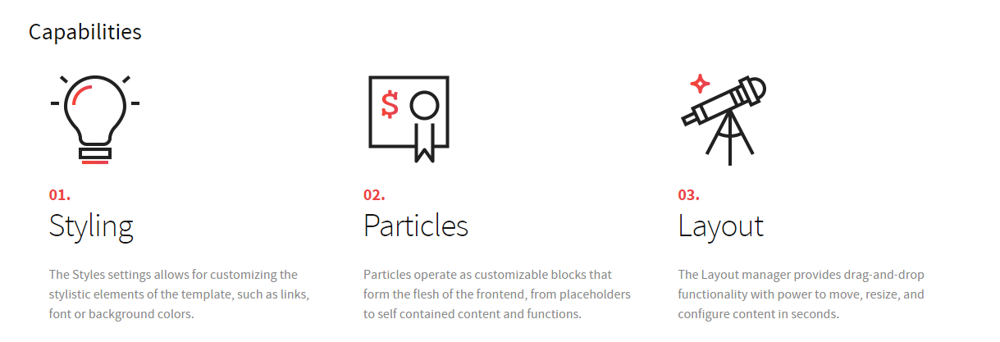
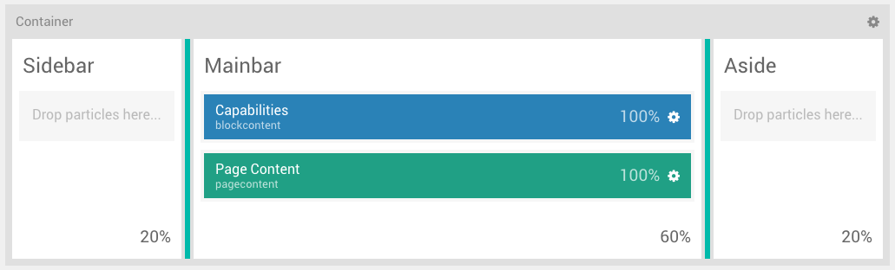
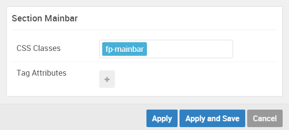
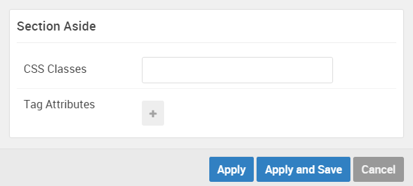

## Introduction

The **Sidebar / Mainbar / Aside** sections include two items, a **Block Content** particle and a **Page Content** position.

The **Page Content** section in particular is a simple **Page Content** positions particle, adding any content assigned to the page to be rendered on the front end.

Here is a breakdown of the widget(s) and particle(s) that appear in this section:

* [Block Content (particle)](#gantry-5-particle-(block-content))
* [Pagecontent (position)](#page-content)

## Section Settings

| Option         | Setting   |
| :-----         | :-----    |
| Section Width  | `20%`     |
| Layout         | Fullwidth |
| CSS Classes    | Blank     |
| Tag Attributes | Blank     |

| Option         | Setting   |
| :-----         | :-----    |
| Section Width  | `60%`     |
| Layout         | Fullwidth |
| CSS Classes    | Blank     |
| Tag Attributes | Blank     |

| Option         | Setting   |
| :-----         | :-----    |
| Section Width  | `20%`     |
| Layout         | Fullwidth |
| CSS Classes    | Blank     |
| Tag Attributes | Blank     |

## Block Content (Particle)

We used a **Block Content** particle to make up this part of the page.

You will find the particle settings used in this particle below:

##### Particle Settings

| Option                     | Setting                                                                                                                        |
| :-----                     | :-----                                                                                                                         |
| Particle Name              | `Capabilities`                                                                                                                 |
| Image                      | Blank                                                                                                                          |
| Headline                   | `Capabilities`                                                                                                                          |
| Description                | Blank                                                                                                                          |
| Link                       | Blank                                                                                                                          |
| Link Text                  | Blank                                                                                                                          |
| Content Item 1 Name        | `Styling`                                                                                                                      |
| Content Item 1 Title       | `Styling`                                                                                                                      |
| Content Item 1 Icon        | Blank                                                                                                                          |
| Content Item 1 Image       | Custom                                                                                                                         |
| Content Item 1 Sub Title   | `<a href="#">01.</a>`                                                                                                          |
| Content Item 1 Description | `The Styles settings allows for customizing the stylistic elements of the template, such as links, font or background colors.` |
| Content Item 1 Variations  | Blank                                                                                                                          |

#### Block Settings

| Option         | Setting   |
| :-----         | :-----    |
| CSS ID         | Blank     |
| CSS Classes    | Blank     |
| Variations     | Blank     |
| Tag Attributes | Blank     |
| Fixed Size     | Unchecked |
| Block Size     | `100%`    |

## Page Content

#### Particle Settings

#### Block Settings

| Option         | Setting |
| :-----         | :-----  |
| CSS ID         | Blank   |
| CSS Classes    | Blank   |
| Variations     | Blank   |
| Tag Attributes | Blank   |
| Block Size     | `100%`  |