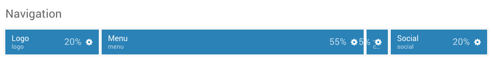
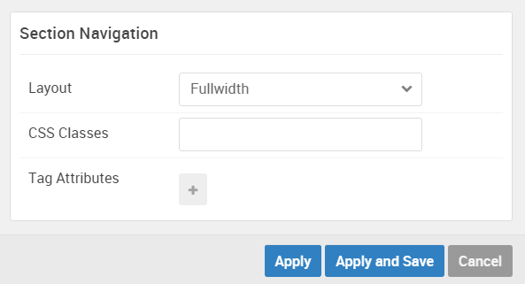

## Introduction

:	1. **Logo (Particle)** [20%, 3%, se]
	2. **Menu (Particle)** [20%, 20%, se]
	3. **Custom HTML (Particle)** [20%, 80%, se]
	4. **Social (Particle)** [20%, 87%, se]

The **Navigation** section includes four particles, `Logo`, `Menu`, `Custom HTML`, and `Social`. 

Here is a breakdown of the widget(s) and particle(s) that appear in this section:

* [Logo (particle)](#logo-(particle))
* [Menu (particle)](#menu-(particle))
* [Custom HTML (particle)](#custom-html-(particle))
* [Social (particle)](#social-(particle))

## Section Settings

| Option         | Setting   |
| :-----         | :-----    |
| Layout         | Fullwidth |
| CSS Classes    | Blank     |
| Tag Attributes | Blank     |

## Logo (Particle)

We used a **Logo** particle to make up this area of the front page.

You will find the particle settings used in this particle below:

### Particle Settings

| Option      | Setting   |
| :-----      | :-----    |
| URL         | Blank     |
| Rel         | `home`    |
| Image       | Custom    |
| Alt         | `salient` |
| Text        | Blank     |
| CSS Classes | `g-logo`  |

### Block Settings

| Option         | Setting   |
| :-----         | :-----    |
| CSS ID         | Blank     |
| CSS Classes    | Blank     |
| Variations     | Blank     |
| Tag Attributes | Blank     |
| Fixed Size     | Unchecked |
| Block Size     | `20%`     |

## Menu (Particle)

We used a **Menu** particle to make up this area of the front page.

You will find the particle settings used in this particle below:

### Particle Settings

| Option        | Setting     |
| :-----        | :-----      |
| Menu          | `Main-menu` |
| Base Item     | Unselected  |
| Start Level   | `1`         |
| Max Levels    | `0`         |
| Render Titles | Unchecked   |
| Mobile Target | Unchecked   |

### Block Settings

| Option         | Setting   |
| :-----         | :-----    |
| CSS ID         | Blank     |
| CSS Classes    | Blank     |
| Variations     | Blank     |
| Tag Attributes | Blank     |
| Fixed Size     | Unchecked |
| Block Size     | `55%`     |

#### Custom HTML (Particle)

We used a **Custom HTML** particle to make up this area of the front page.

You will find the settings used in this widget below:

### Widget Settings

| Option             | Setting             |
| :-----             | :-----              |
| Particle Name      | `Off Canvas Toggle` |
| Process Shortcodes | Unchecked           |

### Custom HTML

~~~ .html

  <i class="fa fa-fw fa-indent"></i>

~~~

### Block Settings

| Option         | Setting   |
| :-----         | :-----    |
| CSS ID         | Blank     |
| CSS Classes    | Blank     |
| Variations     | Blank     |
| Tag Attributes | Blank     |
| Fixed Size     | Unchecked |
| Block Size     | `5%`      |

## Social (Particle)

We used a **Social** particle to make up this area of the front page.

You will find the particle settings used in this particle below:

### Particle Settings

| Option             | Setting                          |
| :-----             | :-----                           |
| CSS Classes        | `social-items`                   |
| Title              | Blank                            |
| Target             | New Window                       |
| Social Item 1 Name | `Twitter`                        |
| Social Item 1 Icon | `fa fa-twitter fa-fw`            |
| Social Item 1 Text | Blank                            |
| Social Item 1 Link | `http://twitter.com/rockettheme` |

### Block Settings

| Option         | Setting   |
| :-----         | :-----    |
| CSS ID         | Blank     |
| CSS Classes    | Blank     |
| Variations     | Blank     |
| Tag Attributes | Blank     |
| Fixed Size     | Unchecked |
| Block Size     | `20%`     |