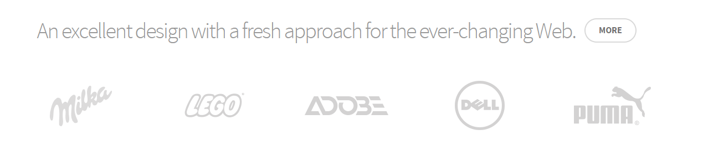
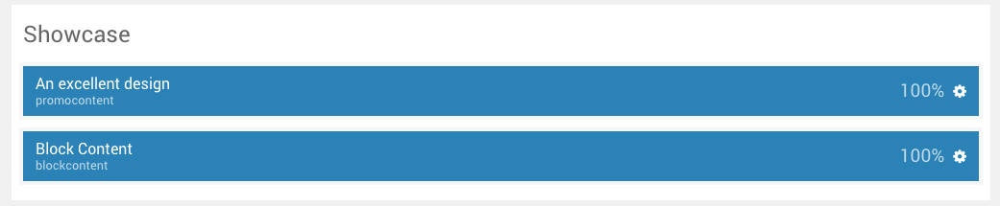
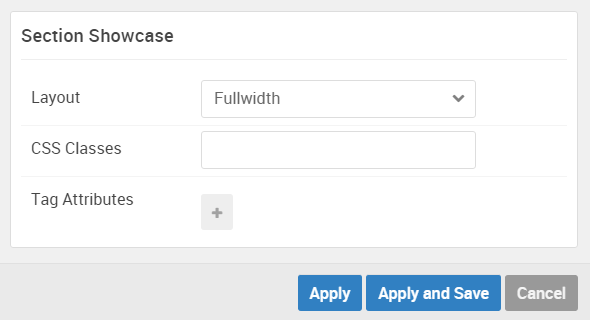

## Introduction

The **Showcase** section includes two particles: **Promo Content** and **Block Content**.

Here is a breakdown of the widget(s) and particle(s) that appear in this section:

* [Promo Content (particle)](#promo-content-(particle))
* [Block Content (particle)](#block-content-(particle))

## Section Settings

| Option         | Setting   |
| :-----         | :-----    |
| Layout         | Fullwidth |
| CSS Classes    | Blank     |
| Tag Attributes | Blank     |

## Promo Content (Particle)

We used a **Promo Content** particle to make up this area of the front page.

You will find the particle settings used in this particle below:

### Particle Settings

| Option           | Setting                                                                |
| :-----           | :-----                                                                 |
| Particle Name    | `An excellent design`                                                  |
| CSS Classes      | Blank                                                                  |
| Title            | Blank                                                                  |
| Promo Style      | Sub Promo                                                              |
| Promo Text       | `An excellent design with a fresh approach for the ever-changing Web.` |
| Description      | Blank                                                                  |
| Readmore Text    | `More`                                                                 |
| Readmore Classes | `button-3`                                                             |
| Link             | `#`                                                                    |
| Readmore Style   | Aside                                                                  |
| Tags             | Blank                                                                  |

### Block Settings

| Option         | Setting   |
| :-----         | :-----    |
| CSS ID         | Blank     |
| CSS Classes    | Blank     |
| Variations     | Blank     |
| Tag Attributes | Blank     |
| Fixed Size     | Unchecked |
| Block Size     | `100%`    |

## Block Content (Particle)

We used a **Block Content** particle to make up this area of the front page.

You will find the particle settings used in this particle below:

### Particle Settings

| Option             | Setting         |
| :-----             | :-----          |
| Particle Name      | `Block Content` |
| Image              | Blank           |
| Headline           | Blank           |
| Description        | Blank           |
| Headline Link      | Blank           |
| Headline Link Text | Blank           |
| Item 1 Title       | Blank           |
| Item 1 Icon        | Blank           |
| Item 1 Image       | Custom          |
| Item 1 Sub Title   | Blank           |
| Item 1 Description | Blank           |
| Item 1 Item Link   | Blank           |
| Item 1 Variations  | Blank           |

### Block Settings

| Option         | Setting   |
| :-----         | :-----    |
| CSS ID         | Blank     |
| CSS Classes    | Blank     |
| Variations     | Blank     |
| Tag Attributes | Blank     |
| Fixed Size     | Unchecked |
| Block Size     | `100%`    |
